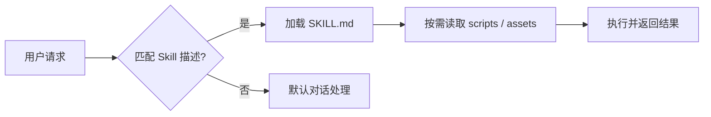
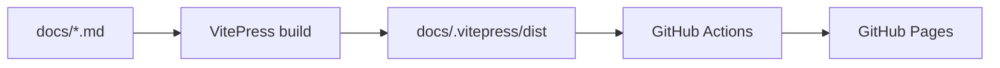

# GitHub 主页整理与开源产出提升 实施计划

> **For agentic workers:** REQUIRED SUB-SKILL: Use superpowers:subagent-driven-development (recommended) or superpowers:executing-plans to implement this plan task-by-task. Steps use checkbox (`- [ ]`) syntax for tracking.

**Goal:** 把 `github.com/cvenwu` 从 79 个混杂仓库整理为「干净整洁、聚焦 AI + Go 后端、有开源产出」的专业主页。

**Architecture:** 四阶段流水线（清理优先）——① 归档/合并噪音仓 → ② 重写主页 README → ③ 深度打磨 AiFlow/AiKnowledge → ④ 重组 Star Lists。全程零删除（仅 archive/merge，可逆）。仓库操作用 `gh` CLI 自动化；Pinned 与 Star Lists 走网页 UI（无 API）。

**Tech Stack:** `gh` CLI（GitHub 官方，用于 archive/edit/create/push）、git、Markdown、GitHub 网页 UI、`github-readme-stats`（主页动态卡片）、Mermaid（README 架构图）。

## Global Constraints

- **零删除**：所有仓库一律 `archive` 或合并归档，**绝不 `gh repo delete`**。全程可逆。
- **每次批量操作前先 dry-run**：打印待操作清单，用户确认后再执行。
- **作用域卫生**：本地改动只 `git add` 任务相关文件，禁止 `git add .`；每个仓库独立提交。
- **鉴权前置**：所有 `gh repo` 写操作依赖 Phase 0 完成 `gh auth login`（当前机器无 `gh`）。
- **中文主导**：主页与 README 中文为主，关键技术术语保留英文（AI Agent、Tool Calling、LLM、RAG）。
- **中文写作规范**：直角引号「」，CJK 与 Latin/数字间留空格（如 `AI 面试题`），术语统一 `LLM` / `RAG` / `GitHub`。
- **定位口径**：写「能同时胜任 Go 后端 & AI 工程」的双栈工程师，**不写「转型」**。
- **不删除任何仓库、不重写 `AiFlowScript` README、不打磨 AiFlow/AiKnowledge 以外的旗舰**（YAGNI）。
- **账号**：`cvenwu`（显示名 `cven`）；远程用 SSH（`git@github.com:cvenwu/<repo>.git`）。

---

## 目标仓库清单（供各任务引用）

**📌 PIN（3）**：AiFlowScript · AiFlow · AiKnowledge

**✅ KEEP（13）**：cvenwu · OpenPresetBFF · DistributedFileServer · GraduationProject · OnlineDocuments · PersonalResume · CheatSheetCollection · SimpleERP · GetLinksFromSoBooks · AlgoBook · ImageEntropy · BooksMark · DistributedFileSystem

**🔀 MERGE → study-notes（25）**：GoDemo · OldBoyGolang · GoInAction · GinFrameworkDemo · Gin_vue · GoWorkFlow · GoAppTemplate · gin_blog · GithubWebhookGo · LeetCodeSolutions · AlgoSolutions · CppLibrary · CppTemplates · PythonNote · PythonCodeHelper · MySqlCookbook · ML_AndrewNg · BasicCompu · CrawlDoubanMovie · BaiduMapSpider · CrawlITBooks · GitCommandDemo · GitBook · Wiki · LearningRecord

**📦 ARCHIVE 噪音仓（21）**：VuePressPlumeTheme · stellar_blog · YiBlog · sivanWu0222.github.io · sivanWu0222.github.io.sourcecode · sivanWu0222.github.io2 · sivanWu0222 · sivan0222.cn · love.sivanWu0222.github.io · resume.sivanWu0222.github.io · UpicGallery · UpicImageHosting · ImageHosting · MaterialDocTemplate · DocsifyTemplate · GithubApiVi · ResourceManage · ApplyMaster · LoveTimeLine · ChooseCourse · DiplomaProject

**📦 ARCHIVE fork（17）**：ohmyzsh · Cloudreve · new-pac · LeetCode-Go · EasyLeetCode · prometheus-book · go-stress-testing · ego-kit · photo2cartoon · ZSH_Config · gin-cloud-storage · practice-in-go · books · interview-baguwen · geektime-books · os-guide-cn · rhzl-Agentic-Design-Patterns-cn

> 合计 3+13+25+21+17 = 79 ✓。工作目录：`/Users/bytedance/Documents/workspace/personal_workspace/github_workspace`（下称 `$WS`）。

---

## Phase 0：环境与安全网

### Task 0.1：安装并登录 gh CLI

**Files:** 无（环境操作）

- [ ] **Step 1: 检查 gh 是否已安装**

Run: `command -v gh && gh --version || echo "NOT INSTALLED"`
Expected: 输出 `NOT INSTALLED`（预期未装）。

- [ ] **Step 2: 安装 gh**

Run: `brew install gh`
Expected: 安装成功；`gh --version` 打印版本号。
（若无 Homebrew，改用 `https://cli.github.com/` 下载 pkg 安装。）

- [ ] **Step 3: 登录 GitHub（用户交互）**

Run: `gh auth login --hostname github.com --git-protocol ssh --web`
说明：按提示在浏览器完成授权，账号选 `cvenwu`。**此步需用户本人操作**（输入一次性码）。

- [ ] **Step 4: 验证登录身份与权限**

Run: `gh api user --jq .login && gh auth status`
Expected: 输出 `cvenwu`；`gh auth status` 显示已登录、含 `repo` scope。
⚠️ 若 login 不是 `cvenwu`，停止并重新登录正确账号。

### Task 0.2：快照当前全量仓库状态（回滚基线）

**Files:**
- Create: `$WS/.github-cleanup/repos-snapshot-2026-07-04.json`
- Create: `$WS/.github-cleanup/repos-snapshot-2026-07-04.tsv`

**Interfaces:**
- Produces: `repos-snapshot-*.json`（含每个 repo 的 `name,isArchived,isFork,description,repositoryTopics,stargazerCount,isPrivate`），供后续任务核对与回滚参考。

- [ ] **Step 1: 建目录**

Run: `mkdir -p $WS/.github-cleanup`

- [ ] **Step 2: 拉取全量仓库 JSON 快照**

Run:
```bash
gh repo list cvenwu --limit 200 --json name,isArchived,isFork,description,repositoryTopics,stargazerCount,isPrivate,url \
  > $WS/.github-cleanup/repos-snapshot-2026-07-04.json
```
Expected: 文件生成。

- [ ] **Step 3: 验证快照数量 = 79**

Run: `jq 'length' $WS/.github-cleanup/repos-snapshot-2026-07-04.json`
Expected: 输出 `79`。
⚠️ 若不是 79，核对是否有新建/私有仓，更新「目标仓库清单」后再继续。

- [ ] **Step 4: 生成人类可读 TSV（便于核对）**

Run:
```bash
jq -r '.[] | [.name, (.isArchived|tostring), (.isFork|tostring), (.stargazerCount|tostring)] | @tsv' \
  $WS/.github-cleanup/repos-snapshot-2026-07-04.json | sort > $WS/.github-cleanup/repos-snapshot-2026-07-04.tsv`
Expected: 79 行，字段为 `name  isArchived  isFork  stars`。

- [ ] **Step 5: 提交快照到 AiFlowScript（留痕）**

```bash
cd $WS/AiFlowScript
mkdir -p docs/superpowers/artifacts
cp $WS/.github-cleanup/repos-snapshot-2026-07-04.tsv docs/superpowers/artifacts/
git add docs/superpowers/artifacts/repos-snapshot-2026-07-04.tsv
git commit -m "chore: snapshot cvenwu repo inventory before cleanup (rollback baseline)"
```

---

## Phase 1：仓库清理

> ⚠️ **CHECKPOINT before Phase 1**：向用户展示本阶段将对 63 个仓库执行 archive/merge，确认后再执行。每个 Task 内先 dry-run。

### Task 1.1：优化 PIN + KEEP 仓库的 description 与 topics

**Files:**
- Create: `$WS/.github-cleanup/meta-updates.sh`

**Interfaces:**
- Consumes: Task 0.1 的 `gh` 登录。
- Produces: 16 个仓库（3 PIN + 13 KEEP）的 description/topics 更新。

- [ ] **Step 1: 写元数据更新脚本**

Create `$WS/.github-cleanup/meta-updates.sh`（`--dry-run` 时只打印）：
```bash
#!/usr/bin/env bash
set -euo pipefail
DRY="${1:-run}"   # 传 dry-run 只打印
edit() {
  local repo="$1" desc="$2"; shift 2
  local topics=""; for t in "$@"; do topics="$topics --add-topic $t"; done
  if [ "$DRY" = "dry-run" ]; then
    echo "gh repo edit cvenwu/$repo --description \"$desc\"$topics"
  else
    gh repo edit "cvenwu/$repo" --description "$desc" $topics
    echo "✓ $repo"
  fi
}
# --- PIN (3) ---
edit AiFlowScript  "项目驱动的 AI Agent 开发学习与实战仓库：Agent Loop / Tool Calling / 上下文管理 / 评测" ai-agent llm agent-loop python learning
edit AiFlow        "通用 AI Agent Skill 合集：103 个可公开使用的 Skill + 一键安装脚本" ai-agent skills claude-code codex agent-skills
edit AiKnowledge   "AI 学习知识库（VitePress）：AI 面试题、分类学习资料与资源导航" ai llm interview knowledge-base vitepress
# --- KEEP (13) ---
edit OpenPresetBFF "Go 实现的 BFF 服务示例" go bff backend
edit DistributedFileServer "基于 Go 的分布式文件上传服务" go distributed-systems file-server
edit GraduationProject "基于 CNN 与词向量的句子相似度度量（NLP）" nlp cnn deep-learning python
edit SimpleERP     "完整的简易 ERP 管理系统（采购/销售/库存/货损）" java erp management-system
edit GetLinksFromSoBooks "批量爬取 SoBooks Kindle 电子书网盘链接" python crawler
edit DistributedFileSystem "分布式企业存储实践" go distributed-systems storage
edit AlgoBook      "算法刷题文档" algorithm leetcode notes
edit ImageEntropy  "图像熵计算" python image-processing
edit BooksMark     "书签与书单整理" bookmark
edit PersonalResume "个人简历站点（Astro）" resume astro
edit CheatSheetCollection "各类速查表合集" cheatsheet reference
edit OnlineDocuments "在线文档汇总" docs
# cvenwu(profile repo) 在 Phase 2 处理，此处不动 description
```

- [ ] **Step 2: dry-run 预览**

Run: `bash $WS/.github-cleanup/meta-updates.sh dry-run`
Expected: 打印 15 条 `gh repo edit ...` 命令（cvenwu 除外），无报错。
**向用户展示这 15 条，确认后继续。**

- [ ] **Step 3: 执行**

Run: `bash $WS/.github-cleanup/meta-updates.sh run`
Expected: 逐行 `✓ <repo>`，共 15 个。

- [ ] **Step 4: 抽样验证**

Run: `gh repo view cvenwu/AiFlow --json description,repositoryTopics --jq '{d:.description, t:[.repositoryTopics[].name]}'`
Expected: description 为新文案，topics 含 `ai-agent skills` 等。

### Task 1.2：创建 study-notes 聚合仓并迁移 25 个学习仓

**Files:**
- Create: `$WS/study-notes/`（新本地仓）
- Create: `$WS/study-notes/README.md`
- Create: `$WS/.github-cleanup/merge-map.tsv`
- Create: `$WS/.github-cleanup/migrate.sh`

**Interfaces:**
- Consumes: Task 0.1 登录。
- Produces: 远程 `cvenwu/study-notes`，含 25 个学习仓内容（按目录）+ 导航 README。原仓在 Task 1.3 归档。

- [ ] **Step 1: 写映射表**

Create `$WS/.github-cleanup/merge-map.tsv`（`目录<TAB>仓库名`）：
```
go	GoDemo
go	OldBoyGolang
go	GoInAction
go	GinFrameworkDemo
go	Gin_vue
go	GoWorkFlow
go	GoAppTemplate
go	gin_blog
go	GithubWebhookGo
algorithm	LeetCodeSolutions
algorithm	AlgoSolutions
cpp	CppLibrary
cpp	CppTemplates
python	PythonNote
python	PythonCodeHelper
database	MySqlCookbook
ml	ML_AndrewNg
interview	BasicCompu
crawler	CrawlDoubanMovie
crawler	BaiduMapSpider
crawler	CrawlITBooks
git	GitCommandDemo
notes	GitBook
notes	Wiki
notes	LearningRecord
```

- [ ] **Step 2: 本地初始化 study-notes**

Run:
```bash
cd $WS && mkdir study-notes && cd study-notes && git init -b main
```
Expected: 空仓初始化。

- [ ] **Step 3: 写迁移脚本（克隆→拷贝内容到子目录→记录来源）**

Create `$WS/.github-cleanup/migrate.sh`：
```bash
#!/usr/bin/env bash
set -euo pipefail
WS="/Users/bytedance/Documents/workspace/personal_workspace/github_workspace"
DEST="$WS/study-notes"; TMP="$WS/.github-cleanup/_clones"
mkdir -p "$TMP"
while IFS=$'\t' read -r cat repo; do
  [ -z "$cat" ] && continue
  echo "=== $repo -> $cat/$repo ==="
  rm -rf "$TMP/$repo"
  git clone --depth 1 "git@github.com:cvenwu/$repo.git" "$TMP/$repo"
  mkdir -p "$DEST/$cat/$repo"
  # 拷贝内容但排除 .git（历史保留在原归档仓）
  rsync -a --exclude='.git' "$TMP/$repo/" "$DEST/$cat/$repo/"
  echo "> 来源：https://github.com/cvenwu/$repo （原仓已归档，历史保留）" > "$DEST/$cat/$repo/_SOURCE.md"
done < "$WS/.github-cleanup/merge-map.tsv"
echo "DONE"
```

- [ ] **Step 4: dry-run（只列将克隆的仓）**

Run: `cut -f2 $WS/.github-cleanup/merge-map.tsv | sed 's#^#git@github.com:cvenwu/#; s#$#.git#'`
Expected: 打印 25 个 SSH 地址。**向用户确认后继续。**

- [ ] **Step 5: 执行迁移**

Run: `bash $WS/.github-cleanup/migrate.sh`
Expected: 25 个 `=== ...` 块，末尾 `DONE`；`$WS/study-notes` 下出现 8 个分类目录。

- [ ] **Step 6: 验证目录结构与仓库数**

Run: `find $WS/study-notes -maxdepth 2 -mindepth 2 -type d | wc -l`
Expected: 输出 `25`（25 个 `<cat>/<repo>` 子目录）。

- [ ] **Step 7: 写 study-notes/README.md**

Create `$WS/study-notes/README.md`：
```markdown
# study-notes

> 历史学习笔记归档仓：整合早期分散在多个独立仓库的学习记录，按主题归类。原始仓库均已归档（read-only）保留完整历史，可在各子目录 `_SOURCE.md` 找到来源链接。

## 目录导航

| 目录 | 主题 | 内容来源 |
|------|------|----------|
| [`go/`](go/) | Go 语言与 Web 框架 | GoDemo, OldBoyGolang, GoInAction, GinFrameworkDemo, Gin_vue, GoWorkFlow, GoAppTemplate, gin_blog, GithubWebhookGo |
| [`algorithm/`](algorithm/) | 算法与刷题 | LeetCodeSolutions, AlgoSolutions |
| [`cpp/`](cpp/) | C / C++ | CppLibrary, CppTemplates |
| [`python/`](python/) | Python 笔记 | PythonNote, PythonCodeHelper |
| [`database/`](database/) | 数据库 | MySqlCookbook |
| [`ml/`](ml/) | 机器学习 | ML_AndrewNg |
| [`interview/`](interview/) | 面试基础 | BasicCompu |
| [`crawler/`](crawler/) | 爬虫实践 | CrawlDoubanMovie, BaiduMapSpider, CrawlITBooks |
| [`git/`](git/) | Git 命令 | GitCommandDemo |
| [`notes/`](notes/) | 综合笔记 | GitBook, Wiki, LearningRecord |

## 说明

本仓为个人学习历程归档，非活跃维护项目。当前重点项目见主页 [Pinned](https://github.com/cvenwu)。
```

- [ ] **Step 8: 首次提交并创建远程仓**

Run:
```bash
cd $WS/study-notes
git add -A
git commit -m "chore: aggregate 25 archived learning repos into study-notes"
gh repo create cvenwu/study-notes --public --source=. --remote=origin \
  --description "历史学习笔记归档：Go / 算法 / C++ / Python / 数据库 / ML / 爬虫等" --push
```
Expected: 远程仓创建并推送成功。

- [ ] **Step 9: 加 topics + 验证**

Run:
```bash
gh repo edit cvenwu/study-notes --add-topic notes --add-topic learning --add-topic archive
gh repo view cvenwu/study-notes --json name,visibility,defaultBranchRef --jq '{n:.name,v:.visibility}'
```
Expected: `{"n":"study-notes","v":"PUBLIC"}`。

### Task 1.3：归档 25 个已合并的源仓

**Files:**
- Create: `$WS/.github-cleanup/archive-merged.sh`

**Interfaces:**
- Consumes: Task 1.2 完成（内容已安全迁移）。

- [ ] **Step 1: 写归档脚本**

Create `$WS/.github-cleanup/archive-merged.sh`：
```bash
#!/usr/bin/env bash
set -euo pipefail
DRY="${1:-run}"
while IFS=$'\t' read -r cat repo; do
  [ -z "$repo" ] && continue
  if [ "$DRY" = "dry-run" ]; then echo "gh repo archive cvenwu/$repo --yes";
  else gh repo archive "cvenwu/$repo" --yes && echo "✓ archived $repo"; fi
done < "$(dirname "$0")/merge-map.tsv"
```

- [ ] **Step 2: dry-run**

Run: `bash $WS/.github-cleanup/archive-merged.sh dry-run`
Expected: 25 条 `gh repo archive ...`。**向用户确认后继续。**

- [ ] **Step 3: 执行归档**

Run: `bash $WS/.github-cleanup/archive-merged.sh run`
Expected: 25 行 `✓ archived <repo>`。

- [ ] **Step 4: 验证已归档**

Run: `gh repo view cvenwu/GoDemo --json isArchived --jq .isArchived`
Expected: `true`。

### Task 1.4：归档 21 个噪音仓

**Files:**
- Create: `$WS/.github-cleanup/archive-noise.sh`

- [ ] **Step 1: 写脚本（内含 21 个仓名）**

Create `$WS/.github-cleanup/archive-noise.sh`：
```bash
#!/usr/bin/env bash
set -euo pipefail
DRY="${1:-run}"
REPOS=(VuePressPlumeTheme stellar_blog YiBlog sivanWu0222.github.io \
sivanWu0222.github.io.sourcecode sivanWu0222.github.io2 sivanWu0222 sivan0222.cn \
love.sivanWu0222.github.io resume.sivanWu0222.github.io UpicGallery UpicImageHosting \
ImageHosting MaterialDocTemplate DocsifyTemplate GithubApiVi ResourceManage \
ApplyMaster LoveTimeLine ChooseCourse DiplomaProject)
echo "count=${#REPOS[@]}"
for r in "${REPOS[@]}"; do
  if [ "$DRY" = "dry-run" ]; then echo "gh repo archive cvenwu/$r --yes";
  else gh repo archive "cvenwu/$r" --yes && echo "✓ $r"; fi
done
```

- [ ] **Step 2: dry-run + 校验计数**

Run: `bash $WS/.github-cleanup/archive-noise.sh dry-run`
Expected: 首行 `count=21`，随后 21 条命令。**向用户确认后继续。**

- [ ] **Step 3: 执行**

Run: `bash $WS/.github-cleanup/archive-noise.sh run`
Expected: 21 行 `✓ <repo>`。

- [ ] **Step 4: 验证抽样**

Run: `gh repo view cvenwu/stellar_blog --json isArchived --jq .isArchived`
Expected: `true`。

### Task 1.5：归档 17 个 fork

**Files:**
- Create: `$WS/.github-cleanup/archive-forks.sh`

- [ ] **Step 1: 写脚本（内含 17 个 fork 仓名）**

Create `$WS/.github-cleanup/archive-forks.sh`：
```bash
#!/usr/bin/env bash
set -euo pipefail
DRY="${1:-run}"
REPOS=(ohmyzsh Cloudreve new-pac LeetCode-Go EasyLeetCode prometheus-book \
go-stress-testing ego-kit photo2cartoon ZSH_Config gin-cloud-storage \
practice-in-go books interview-baguwen geektime-books os-guide-cn \
rhzl-Agentic-Design-Patterns-cn)
echo "count=${#REPOS[@]}"
for r in "${REPOS[@]}"; do
  if [ "$DRY" = "dry-run" ]; then echo "gh repo archive cvenwu/$r --yes";
  else gh repo archive "cvenwu/$r" --yes && echo "✓ $r"; fi
done
```

- [ ] **Step 2: dry-run + 校验**

Run: `bash $WS/.github-cleanup/archive-forks.sh dry-run`
Expected: 首行 `count=17`，随后 17 条命令。**向用户确认后继续。**

- [ ] **Step 3: 执行**

Run: `bash $WS/.github-cleanup/archive-forks.sh run`
Expected: 17 行 `✓ <repo>`。

- [ ] **Step 4: Phase 1 总验收——统计未归档的非 fork 仓应为 17**

Run:
```bash
gh repo list cvenwu --limit 200 --json name,isArchived,isFork \
 | jq '[.[] | select(.isArchived==false)] | length'`
Expected: `17`（= 3 PIN + 13 KEEP + 1 study-notes）。
⚠️ 若不是 17，用 `jq '[.[]|select(.isArchived==false)|.name]'` 列出核对。

---

## Phase 2：主页 README（cvenwu/cvenwu）

> ⚠️ **CHECKPOINT before Phase 2**：确认 Phase 1 验收通过（未归档非 fork = 17）。

### Task 2.1：编写并推送主页 README

**Files:**
- Create: `$WS/cvenwu/README.md`（克隆或新建后）

**Interfaces:**
- Consumes: Task 1.1 的仓库 description（供项目表引用）。
- Produces: `cvenwu/cvenwu` 主页 README，GitHub 渲染在 profile 顶部。

- [ ] **Step 1: 克隆或创建 profile 仓**

Run:
```bash
cd $WS
if gh repo view cvenwu/cvenwu >/dev/null 2>&1; then
  git clone git@github.com:cvenwu/cvenwu.git
else
  mkdir cvenwu && cd cvenwu && git init -b main && cd ..
fi
ls cvenwu
```
Expected: 本地存在 `cvenwu/` 目录（已知远程存在，应走 clone 分支）。

- [ ] **Step 2: 写 README.md（完整内容，中文主导）**

Create/overwrite `$WS/cvenwu/README.md`：
```markdown
<div align="center">

# 你好，我是 cven 👋

**Go 服务端研发 & AI Agent 应用 / Harness 工程师**

*既能写高并发分布式后端，也能讲清 Agent Loop 的底层机制*

[](https://yirufeng.top)
[](https://github.com/cvenwu)

</div>

---

## 🧑‍💻 关于我

- 🧩 **双栈工程师**：既能做 **Go 服务端研发**（高并发、分布式、微服务治理），也能做 **AI Agent 应用 & Harness 工程**（Agent Loop、Tool Calling、上下文管理、评测）
- 🏗️ 有大规模后端系统经验：主导过 10w+ QPS 量级的营销/延迟收益系统，处理过 30 亿+ 量级数据的一致性与对账
- 🔬 偏好从**第一性原理**讲清底层机制，不止会用框架——正在系统沉淀 AI Agent / Harness 的原理与实战
- 📫 博客 [yirufeng.top](https://yirufeng.top)

## 🚀 精选项目

| 项目 | 简介 | 技术栈 |
|------|------|--------|
| [**AiFlowScript**](https://github.com/cvenwu/AiFlowScript) | 项目驱动的 AI Agent 开发学习与实战：Agent Loop / Tool Calling / 上下文管理 / 评测 | `Python` `LLM` `Ollama` |
| [**AiFlow**](https://github.com/cvenwu/AiFlow) | 通用 AI Agent Skill 合集：103 个可公开 Skill + 一键安装 | `AI Agent` `Skills` |
| [**AiKnowledge**](https://github.com/cvenwu/AiKnowledge) | AI 学习知识库（VitePress）：面试题 + 分类学习 + 资源导航 | `VitePress` `LLM` `RAG` |

> 更多：Go 后端（[OpenPresetBFF](https://github.com/cvenwu/OpenPresetBFF)、[DistributedFileServer](https://github.com/cvenwu/DistributedFileServer)）、NLP（[GraduationProject](https://github.com/cvenwu/GraduationProject)）。

## 🛠️ 技术栈


## 📊 GitHub 数据

<div align="center">


</div>
```

- [ ] **Step 3: 本地预览检查（术语与留白）**

Run: `grep -nE "转型|AI面试|LLM面试" $WS/cvenwu/README.md || echo "OK: 无禁用词"`
Expected: `OK: 无禁用词`（确认未写「转型」、CJK/Latin 已留空格）。

- [ ] **Step 4: 提交并推送**

Run:
```bash
cd $WS/cvenwu
git add README.md
git commit -m "docs: rewrite profile README - dual-stack Go backend & AI engineer positioning"
git push -u origin main 2>/dev/null || git push
```
Expected: 推送成功。

- [ ] **Step 5: 验证线上渲染**

Run: `gh api repos/cvenwu/cvenwu/readme --jq .name`
Expected: `README.md`。之后请用户在浏览器打开 `https://github.com/cvenwu` 确认首屏效果。

---

## Phase 3：旗舰 README 深度打磨

### Task 3.1：AiFlow README 深度打磨

**Files:**
- Modify: `$WS/AiFlow/README.md`（在现有 skill 索引基础上增补头部与图示）

**Interfaces:**
- Consumes: 现有 `AiFlow/README.md`（已含「目录结构 / 一键安装 / Skill 索引」表格，共 103 skill）。
- Produces: 增补 badges + 一句话定位 + 徽章统计 + Mermaid 架构图 + 贡献指南；保留原有 Skill 索引表。

- [ ] **Step 1: 在文件顶部插入居中标题块与 badges**

在 `$WS/AiFlow/README.md` 第一行 `# AiFlow` 之前插入（并把原 `# AiFlow` 段落并入）：
```markdown
<div align="center">

# 🌊 AiFlow

**通用 AI Agent Skill 合集 —— 103 个开箱即用的 Skill，一条命令装进你的 Agent**

[](./LICENSE)

[](https://github.com/cvenwu/AiFlow/stargazers)
[](#-贡献)

[快速开始](#一键安装) · [Skill 索引](#skill-索引) · [工作原理](#-工作原理) · [贡献](#-贡献)

</div>

---
```

- [ ] **Step 2: 在「一键安装」之后插入 Mermaid 工作原理图**

在 `## Skill 索引` 标题之前插入：
```markdown
## 🧠 工作原理

Skill 遵循「渐进式披露」：Agent 先读 `SKILL.md` 描述决定是否加载，再按需展开脚本与资源。



---
```

- [ ] **Step 3: 在文件末尾追加贡献指南**

在 `$WS/AiFlow/README.md` 末尾追加：
```markdown

## 🤝 贡献

欢迎新增 Skill：

1. 在 `skills/<your-skill>/` 下创建目录，必须包含 `SKILL.md`（含 `name` 与 `description` frontmatter）。
2. 可选附 `scripts/`（可执行脚本）、`assets/`（模板/素材）。
3. 在 `skills/README.md` 与本 README 的 Skill 索引表补一行。
4. 提交 PR，说明 Skill 用途与触发场景。

> 约定：不收录依赖内部平台/鉴权/基础设施的 Skill。

## 📄 License

[Apache License 2.0](./LICENSE)
```

- [ ] **Step 4: 校验 Mermaid 与 badges 语法**

Run: `grep -c "img.shields.io" $WS/AiFlow/README.md && grep -c '```mermaid' $WS/AiFlow/README.md`
Expected: 分别输出 `4` 与 `1`。

- [ ] **Step 5: 提交并推送**

Run:
```bash
cd $WS/AiFlow
git add README.md
git commit -m "docs: polish README - badges, mermaid architecture, contributing guide"
git push
```
Expected: 推送成功。

### Task 3.2：AiKnowledge README 深度打磨

**Files:**
- Modify: `$WS/AiKnowledge/README.md`（当前极简，重写为完整版）

**Interfaces:**
- Consumes: 现有 `docs/{guide,interview,learning,resources,index.md}` 结构 + 本地开发命令（`npm run docs:dev/build`）。
- Produces: 完整 README（badges + 站点链接 + 内容地图 + Mermaid 部署图 + 本地开发）。

- [ ] **Step 1: 确认线上站点 URL**

Run: `gh api repos/cvenwu/AiKnowledge/pages --jq .html_url 2>/dev/null || echo "NO_PAGES"`
Expected: 返回 Pages URL（形如 `https://cvenwu.github.io/AiKnowledge/`）或 `NO_PAGES`。记下结果，Step 2 用真实 URL；若 `NO_PAGES` 则用 `https://cvenwu.github.io/AiKnowledge/` 作占位并在文中标注「部署中」。

- [ ] **Step 2: 重写 README.md（完整内容）**

Overwrite `$WS/AiKnowledge/README.md`（把 `<SITE_URL>` 替换为 Step 1 结果）：
```markdown
<div align="center">

# 📚 AiKnowledge

**AI 学习知识库 —— AI 面试题、分类学习资料与资源导航，一站式沉淀**

[](./LICENSE)
[](https://vitepress.dev/)
[](<SITE_URL>)

[在线访问](<SITE_URL>) · [面试题](#-内容地图) · [学习](#-内容地图) · [资源](#-内容地图)

</div>

---

## 📖 简介

**AiKnowledge** 是一个用 VitePress 构建的 AI 学习知识库，聚焦大模型与 AI Agent 方向，覆盖面试题、系统化学习资料与优质资源导航。

## 🗺️ 内容地图

| 板块 | 目录 | 内容 |
|------|------|------|
| 面试题 | [`docs/interview/`](docs/interview/) | AI / LLM / Agent 高频面试题与解析 |
| 学习 | [`docs/learning/`](docs/learning/) | 分类学习资料（原理、推理参数、RAG 等） |
| 资源 | [`docs/resources/`](docs/resources/) | 优质教程、仓库与工具导航 |
| 指南 | [`docs/guide/`](docs/guide/) | 使用与贡献说明 |

## 🏗️ 部署流程



## 💻 本地开发

```bash
npm install
npm run docs:dev     # 本地预览
npm run docs:build   # 构建检查
npm run docs:preview # 预览构建结果
```

## 📄 License

[Apache License 2.0](./LICENSE)
```

- [ ] **Step 3: 校验 badges 与 Mermaid**

Run: `grep -c "img.shields.io" $WS/AiKnowledge/README.md && grep -c '```mermaid' $WS/AiKnowledge/README.md`
Expected: `3` 与 `1`。

- [ ] **Step 4: 确认无 `<SITE_URL>` 占位残留**

Run: `grep -c "<SITE_URL>" $WS/AiKnowledge/README.md`
Expected: `0`。⚠️ 若非 0，回到 Step 2 替换真实 URL。

- [ ] **Step 5: 提交并推送**

Run:
```bash
cd $WS/AiKnowledge
git add README.md
git commit -m "docs: rewrite README - badges, site link, content map, deploy diagram"
git push
```
Expected: 推送成功。

---

## Phase 4：Star Lists 重组（网页 UI，无 API）

> Star Lists 无写 API，只能在网页操作。本阶段产出「可复制文案 + 逐步 UI 清单」，由用户在浏览器执行。

### Task 4.1：生成 11 类清单、描述文案与归位映射

**Files:**
- Create: `$WS/.github-cleanup/star-lists-guide.md`

**Interfaces:**
- Consumes: 设计文档 §7 的 11 类定义与未分类 star 示例。
- Produces: 用户照做的 UI 操作手册。

- [ ] **Step 1: 拉取当前全部 star（供归位核对）**

Run:
```bash
gh api "users/cvenwu/starred?per_page=100" --paginate --jq '.[].full_name' \
  > $WS/.github-cleanup/starred-all.txt
wc -l $WS/.github-cleanup/starred-all.txt
```
Expected: 打印 star 总数（约 100+）。

- [ ] **Step 2: 写 UI 操作手册**

Create `$WS/.github-cleanup/star-lists-guide.md`：
```markdown
# Star Lists 重组操作手册（11 类）

## 一、11 个目标列表（名称 + 描述，可直接复制）

| 列表名 | 描述 |
|--------|------|
| AI / Agent | AI Agent、多智能体、Agent 框架与实战 |
| LLM 基础 | 大模型原理、训练推理、提示工程 |
| Go / 后端 | Go 语言、Web 框架、后端工程 |
| 分布式 / 系统设计 | 分布式系统、系统设计、数据库、存储 |
| 算法 | 算法与数据结构、刷题 |
| 面试 / 八股 | 面试题库、八股、简历 |
| C / C++ | C、C++、汇编、Linux 内核 |
| Rust | Rust 语言与生态 |
| 云原生 / DevOps | K8s、Docker、监控、网络、Linux |
| 工具 / 效率 | CLI 工具、效率、前端、README、IoT |
| 软技能 / 职业 | 软技能、书籍、设计模式、操作系统 |

## 二、创建列表步骤（每个列表重复）

1. 打开 https://github.com/cvenwu?tab=stars
2. 右侧 `Lists` → `Create list`
3. 粘贴上表「列表名」与「描述」→ Create

## 三、旧列表归并映射（32 → 11）

- AI / Agent ← AIGC、项目（AI 部分）、未分类新 star
- LLM 基础 ← AIGC（模型/基础部分）
- Go / 后端 ← Go
- 分布式 / 系统设计 ← SystemDesign、Database、云原生、TSDB、Cloud Computing
- 算法 ← Algorithm
- 面试 / 八股 ← interview、Basic Knowledge 八股、resume
- C / C++ ← C++、C language、Assembly、Linux Kernel
- Rust ← Rust
- 云原生 / DevOps ← Devops、Docker、云原生、network、Linux
- 工具 / 效率 ← Tools、Font、README、frontend、IOT、游戏开发
- 软技能 / 职业 ← SoftSkills、Books、Design Pattern、OS

## 四、未分类新 star 归位（示例）

| 仓库 | 目标列表 |
|------|----------|
| obra/superpowers | AI / Agent |
| affaan-m/ECC | AI / Agent |
| datawhalechina/hello-agents | AI / Agent |
| FareedKhan-dev/all-agentic-architectures | AI / Agent |
| Kocoro-lab/ai-agent-book | AI / Agent |
| luhengshiwo/LLMForEverybody | LLM 基础 |
| liyupi/mianshiya | 面试 / 八股 |
| WeThinkIn/AIGC-Interview-Book | 面试 / 八股 |
| bcefghj/ai-agent-interview-guide | 面试 / 八股 |
| geekjourneyx/md2wechat-skill | 工具 / 效率 |
| op7418/guizang-social-card-skill | 工具 / 效率 |
| farion1231/cc-switch | 工具 / 效率 |
| Egonex-AI/Understand-Anything | 工具 / 效率 |

> 完整 star 清单见 `starred-all.txt`，逐个在其 `Star ▾` 菜单勾选目标列表（一个 star 可归多个列表）。旧列表可保留或清空，由你决定。
```

- [ ] **Step 3: 交付给用户**

向用户展示 `star-lists-guide.md` 路径与「一、11 个列表」表格，说明后续在浏览器按手册执行。

---

## Phase 5：设置 Pinned（网页 UI）

### Task 5.1：置顶 3 个 AI 项目

**Files:** 无（UI 操作）

- [ ] **Step 1: 引导用户设置 Pinned**

向用户说明：打开 `https://github.com/cvenwu` → 右上 `Customize your pins` → 勾选 **AiFlowScript、AiFlow、AiKnowledge** 三个 → Save。

- [ ] **Step 2: 验证**

Run: `gh api graphql -f query='{user(login:"cvenwu"){pinnedItems(first:6){nodes{... on Repository{name}}}}}' --jq '.data.user.pinnedItems.nodes[].name'`
Expected: 输出恰为 `AiFlowScript`、`AiFlow`、`AiKnowledge` 三行。

---

## 最终验收

- [ ] **A1: 未归档非 fork 仓 = 17**

Run: `gh repo list cvenwu --limit 200 --json isArchived,isFork | jq '[.[]|select(.isArchived==false)]|length'`
Expected: `17`。

- [ ] **A2: 主页 README 存在且为新版**

Run: `gh api repos/cvenwu/cvenwu/readme --jq .size`
Expected: 非零（新 README 已上线）。

- [ ] **A3: Pinned = 3 个 AI 项目**（见 Task 5.1 Step 2）

- [ ] **A4: AiFlow / AiKnowledge README 含 badges 与 Mermaid**

Run: `for r in AiFlow AiKnowledge; do echo -n "$r badges="; gh api repos/cvenwu/$r/readme --jq '.content' | base64 -d | grep -c img.shields.io; done`
Expected: 两者均 ≥ 3。

- [ ] **A5: study-notes 已上线且公开**（见 Task 1.2 Step 9）

- [ ] **A6: 浏览器人工确认** `https://github.com/cvenwu` 首屏干净、Pinned 正确、Star Lists 已归并。

---

## 回滚参考

| 动作 | 回滚命令 |
|------|----------|
| 归档某仓 | `gh repo unarchive cvenwu/<repo> --yes` |
| 批量取消归档 | 对 snapshot 中 `isArchived==false` 的仓循环 `gh repo unarchive` |
| README 改动 | `git revert <commit>` 或 `git reset --hard <old>` 后 `git push -f` |
| study-notes 误建 | 内容仍在各归档原仓；`gh repo archive cvenwu/study-notes` 即可（不删除） |
| Pinned / Star | 网页 UI 手动改回 |
