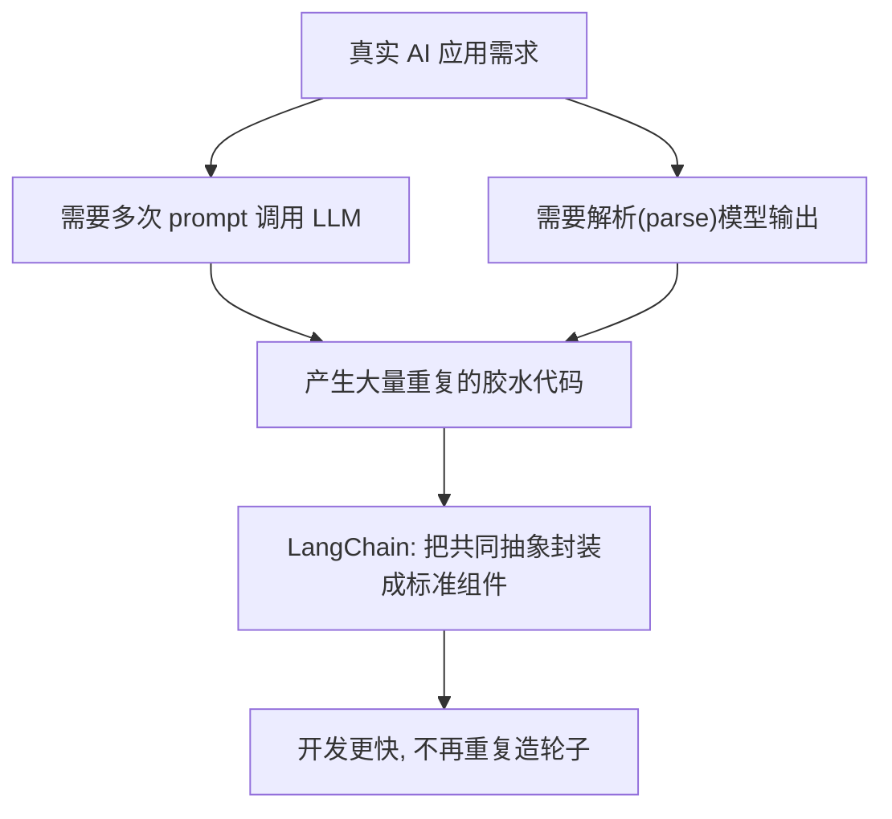
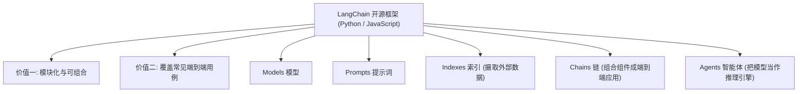

# 第1集：LangChain 课程导论与整体框架概览

## 元信息
- 集数: 1
- 时间范围: 00:00:00-03:01
- 核心主题: 认识 LangChain——一个用于构建大语言模型(LLM)应用的开源开发框架，并了解本课程将覆盖的核心组件
- 学习目标:
  - 理解 LangChain 是什么、由谁创建、要解决什么问题
  - 说清 LangChain 的两大核心价值（模块化组合、覆盖常见使用场景）
  - 记住本课程后续要讲的五大组件：Models、Prompts、Indexes、Chains、Agents

## 第一性原理拆解
- 底层本质: 只靠"给 LLM 写一句 prompt(提示词)"就能做出 AI 应用，但真实应用往往需要**多次调用 LLM**、并且要**解析(parse)模型输出**，这中间会产生大量重复、繁琐的"胶水代码(glue code)"。LangChain 的本质就是把这些重复劳动抽象成可复用的标准组件。
- 核心逻辑: 作者 Harrison Chase 在和很多做复杂 LLM 应用的开发者交流时，发现大家的开发方式里存在**共同的抽象模式**。既然模式相同，就可以把它封装成框架，让所有人不必各写各的、重复造轮子。
- 推导过程: 应用需要反复 prompt + 解析输出 → 产生大量胶水代码 → 不同开发者写的胶水代码高度相似（存在共同抽象）→ 把这些共同抽象封装成"可组合、可单独使用"的模块 → 再把模块组装成端到端的常见用例 → 这就是 LangChain。

## 核心知识点详解
- **LLM（Large Language Model，大语言模型）**：通过给它写 prompt(提示词) 就能驱动它工作的模型。它让开发 AI 应用比以往快得多。
- **Glue code（胶水代码）**：为了让"多次调用 LLM + 解析输出"这套流程跑通而必须手写的衔接性代码。LangChain 要做的就是替你省掉这部分繁琐工作。
- **LangChain 是什么**：一个用于构建 LLM 应用的**开源(open source)开发框架**，由 **Harrison Chase** 创建。
- **两种语言包**：LangChain 提供 **Python** 和 **JavaScript** 两个版本的包，你可以按自己熟悉的语言选用。
- **两大核心价值**：
  - **组合性与模块化(composition and modularity)**：由许多**独立组件(individual components)**构成，这些组件既可以**单独使用**，也可以**互相搭配组合使用**。
  - **覆盖常见用例(use cases)**：把这些模块化组件组合成更**端到端(end-to-end)**的应用，让你能很快上手常见场景。
- **本课程将覆盖的五大组件**（后续每集会展开）：
  - **Models（模型）**：底层调用的大语言模型。
  - **Prompts（提示词）**：让模型去做有用、有趣事情的方式，即如何组织给模型的输入。
  - **Indexes（索引）**：一种**摄取数据(ingest data)**的方式，让你把外部数据和模型结合起来使用。
  - **Chains（链）**：把模块化组件**组合成更端到端用例**的方式。
  - **Agents（智能体）**：一种非常令人兴奋的端到端用例，它把**模型当作"推理引擎(reasoning engine)"**来使用。
- **生态与社区**：LangChain 拥有大量用户，且有**数百名开源贡献者(hundreds of contributors)**，这是它能高速迭代、快速发布新功能的关键。
- **课程背后的人**：由 Harrison Chase 与 deeplearning.ai 合作打造；联合创始人 **Ankush Gola** 参与了材料设计；deeplearning.ai 一侧的 Jeff Ludwig、Eddie Shyu、Diala Ezzeddine 也参与了材料贡献。

## 实操步骤指南
本集为课程导论与概念介绍，无实操代码。字幕中仅点出后续将学习的组件（Models、Prompts、Indexes、Chains、Agents），具体代码会在后面的分集中出现。

## 配套可视化图（Mermaid）

图1：LangChain 要解决的核心问题（对应视频 00:00:14-00:00:30，讲"多次调用+解析输出=大量胶水代码"）

图2：本课程覆盖的 LangChain 五大组件与两大价值（对应视频 00:01:35-00:02:33）

## 常见踩坑与避坑
- **把 LangChain 当成模型本身（通用提示）**：LangChain 不是大模型，它是"框架/工具箱"，底层仍要接入某个 LLM（如 OpenAI 的模型）。它负责组织、编排，而不是自己"思考"。
- **搞混 Python 包和 JavaScript 包（通用提示）**：本课程演示以 Python 为主，初学者按课程环境用 Python 版本即可，不要混装两种语言包导致环境混乱。
- **急于跳过导论直接抄代码（通用提示）**：本集没有代码，但它建立了 Models/Prompts/Indexes/Chains/Agents 的整体地图。先建立框架认知，后面学分集时才不会"只见树木不见森林"。

## 课后练习
1. 用自己的话（3 句以内）向一个完全不懂技术的朋友解释：LangChain 到底帮开发者省掉了什么麻烦？（提示：从"多次调用 LLM + 解析输出 + 胶水代码"角度回答）
2. 凭记忆列出本课程将要学习的五大组件的英文名，并各配一句中文说明它是干什么用的。
