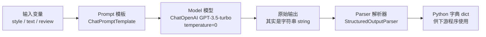
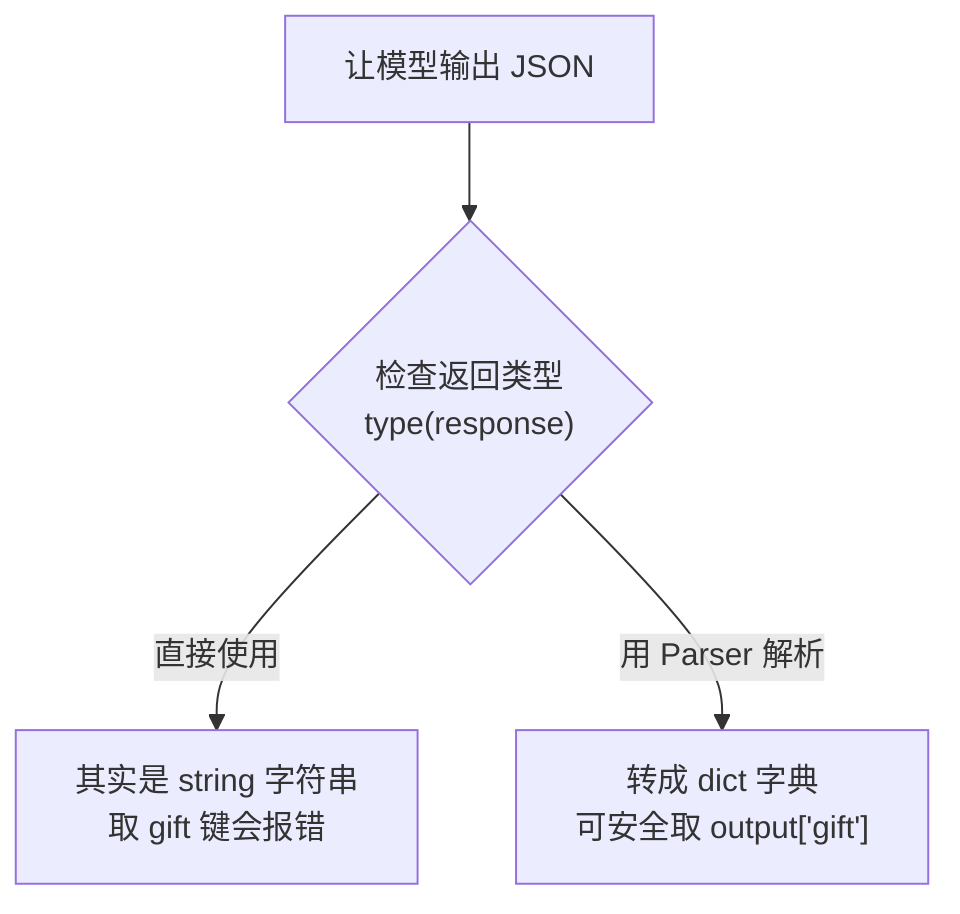

# 第2集：模型、提示词与解析器（Models, Prompts and Parsers）

## 元信息
- 集数: 2
- 时间范围: 00:00:00 - 00:18:18
- 核心主题: 用 LangChain 的三大抽象（Model 模型、Prompt 提示词模板、Parser 输出解析器）把「调用大模型」这件事变得可复用、可结构化。
- 学习目标:
  1. 理解为什么要用 LangChain 的 **PromptTemplate（提示词模板）** 代替原始的 Python f-string 拼字符串。
  2. 学会用 **ChatOpenAI** 调用 GPT-3.5-turbo，并掌握 `temperature`（温度）参数的作用。
  3. 学会用 **ResponseSchema + StructuredOutputParser** 把模型返回的文本解析成 Python 字典，方便后续程序处理。

## 第一性原理拆解
- 底层本质: 用大语言模型（LLM）构建应用时，我们反复在做同一件事——「构造输入（Prompt）→ 调用模型（Model）→ 处理输出（Parser）」。这个循环会被写很多遍，重复代码多、难维护。
- 核心逻辑: 既然是重复动作，就该把它抽象成可复用的组件。字幕原文说：LangChain "gives an easy set of abstractions to do this type of operation"（提供了一套简单的抽象来做这类操作）。
- 推导过程:
  1. 输入端：直接用 f-string 拼提示词，短的时候没问题；但真实应用里 prompt "can be quite long and detailed"（又长又复杂），拼字符串既难读又难复用 → 需要 **PromptTemplate**。
  2. 模型端：不同任务（翻译/总结/问答）都要调同一个模型，参数（如 temperature）需要统一控制 → 用 **ChatOpenAI** 封装。
  3. 输出端：模型返回的「看起来像 JSON」其实是一个**字符串**，不能直接取字段，会报错 → 需要 **Parser** 把它变成真正的字典。

## 核心知识点详解

### 1. 三大概念（视频开头 00:00-00:42）
- **Models（模型）**: 支撑一切的底层语言模型（本课用 GPT-3.5-turbo）。
- **Prompts（提示词）**: 构造传给模型的输入的「方式/风格」。
- **Parsers（解析器）**: 在另一端，把模型的输出「parse into a more structured format」（解析成更结构化的格式），方便下游程序继续使用。

### 2. 起步代码与 Helper 函数（00:42-01:30，画面 00:41）
- 需要 `import os`、`import openai`，并加载 OpenAI 的密钥（secret key）。
- 若本地没装 openai，需要先 `pip install openai`（视频里的 Jupyter 环境已预装）。
- 视频里写了一个 helper 函数 `get_completion`，内部调用 GPT-3.5-turbo。例如问 "what is one plus one" 就能拿到答案。

### 3. 动机案例：翻译顾客邮件（01:30-03:34）
- 场景：收到一封非英语（这里用「英语海盗腔」English Pirate）的顾客投诉邮件。
- 目标 style（风格）：`American English in a calm and respectful tone`（平静、礼貌的美式英语）。
- 原始做法：用 **f-string** 把「把三重反引号里的文字翻译成某种 style」的指令拼出来，再调用模型。
- 痛点：如果顾客用法语、德语、日语等**多种语言**写评论，就得为每种情况**重复生成一整套 prompt**，非常繁琐 → 引出 LangChain。

### 4. 用 ChatOpenAI 封装模型（03:34-04:20）
- `from langchain.chat_models import ChatOpenAI`，它是对 ChatGPT API 端点的封装。
- `chat = ChatOpenAI(temperature=0.0)`。
- **temperature（温度）**: 控制输出的随机性。默认约 0.7，设成 **0.0** 让输出**更确定、更少随机**（构建应用时常用做法）。

### 5. ChatPromptTemplate 提示词模板（04:20-06:57）
- 先写一个带占位符的 **template string（模板字符串）**，用花括号 `{style}`、`{text}` 表示变量。
- `from langchain.prompts import ChatPromptTemplate` → 用模板字符串创建模板对象。
- 模板对象能自动识别出它有两个 **input variables（输入变量）**：`style` 和 `text`。
- **可复用性是关键卖点**：同一个模板，第一次用于「把海盗腔翻译成礼貌美式英语」；第二次直接复用，把客服的「不礼貌回复」翻译成「礼貌的海盗腔」→ 换参数即可，不必重写 prompt。

### 6. 为什么用模板而不是 f-string（08:00-09:36，画面 08:20）
- 复杂应用里 prompt「又长又细」，模板是复用好 prompt 的实用抽象（例如给学生作业打分的长 prompt）。
- LangChain 还内置了常见任务的 prompt（总结、问答、连接 SQL 数据库、连接不同 API），能快速搭起应用，无需自己从零写 prompt。

### 7. 输出解析器的动机：ReAct 与关键字（09:36-11:02，画面 10:57）
- 复杂应用常要求模型按特定格式输出，比如使用特定关键字。
- 例子：**Chain of Thought（思维链）推理 + ReAct 框架**，用三个关键字：
  - **Thought（思考）**: 模型在想什么。给模型「思考空间」往往能得到更准确的结论。
  - **Action（行动）**: 要执行的具体动作。
  - **Observation（观察）**: 从行动中学到了什么。
- 有了固定关键字，就能配一个 **parser** 把带标签的文本抽取出来。

### 8. 结构化输出解析（11:02-17:24）
- 目标：从「商品评论」里抽取字段并输出 **JSON**，例如 `gift`（是否礼物）、`delivery_days`（送达天数）、`price_value`（价格评价）。
- **关键陷阱**：直接让模型输出 JSON，返回的 `response` 其实是**字符串（string）**，看起来像字典但不是，直接 `response.content.get('gift')` 会**报错**。
- 解决：
  - `from langchain.output_parsers import ResponseSchema, StructuredOutputParser`。
  - 为每个字段定义 **ResponseSchema**（含 name 名称 + description 描述，如 gift 的描述是「这件商品是否作为礼物购买，是填 true，否填 false，未知填 unknown」）。
  - `output_parser.get_format_instructions()` 能生成一段**精确的格式说明**，把它拼进 prompt 里，引导模型输出可被解析的格式。
  - 最后用 `output_parser.parse(response.content)` 得到真正的 **Python 字典（dictionary）**，就能正确取 `output['gift']` 等值用于下游处理。

## 实操步骤指南

以下代码基于字幕描述的流程还原（字段名/字符串以视频讲解为准，属于概念性还原）。

### 步骤一：基础调用（模型 + 温度）
```python
from langchain.chat_models import ChatOpenAI

# temperature=0.0 让输出更确定、更少随机（默认约 0.7）
chat = ChatOpenAI(temperature=0.0)
```

### 步骤二：创建可复用的提示词模板
```python
from langchain.prompts import ChatPromptTemplate

# 带占位符的模板字符串，{style} 和 {text} 是两个输入变量
template_string = """Translate the text \
that is delimited by triple backticks \
into a style that is {style}. \
text: ```{text}```
"""

prompt_template = ChatPromptTemplate.from_template(template_string)

# 模板会自动识别出输入变量 style 和 text
print(prompt_template.messages[0].prompt.input_variables)
```

### 步骤三：填入变量并调用模型（可复用）
```python
customer_style = "American English in a calm and respectful tone"
customer_email = "..."   # 那封海盗腔投诉邮件

# 用同一个模板生成具体消息
customer_messages = prompt_template.format_messages(
    style=customer_style,
    text=customer_email
)

customer_response = chat(customer_messages)
print(customer_response.content)

# 复用同一个模板处理客服回复：把礼貌回复翻成海盗腔
service_style_pirate = "a polite tone that speaks in English Pirate"
service_reply = "..."    # 客服那句不礼貌的回复
service_messages = prompt_template.format_messages(
    style=service_style_pirate,
    text=service_reply
)
service_response = chat(service_messages)
print(service_response.content)
```

### 步骤四：结构化输出解析
```python
from langchain.output_parsers import ResponseSchema, StructuredOutputParser

# 1) 为每个要抽取的字段定义 schema
gift_schema = ResponseSchema(
    name="gift",
    description="Was the item purchased as a gift for someone else? "
                "Answer True if yes, False if not or unknown."
)
delivery_days_schema = ResponseSchema(
    name="delivery_days",
    description="How many days did it take for the product to arrive?"
)
price_value_schema = ResponseSchema(
    name="price_value",
    description="Extract any sentences about the value or price."
)
response_schemas = [gift_schema, delivery_days_schema, price_value_schema]

# 2) 生成解析器和格式说明
output_parser = StructuredOutputParser.from_response_schemas(response_schemas)
format_instructions = output_parser.get_format_instructions()

# 3) 把格式说明拼进 review 模板，调用模型
prompt = ChatPromptTemplate.from_template(review_template_2)
messages = prompt.format_messages(text=customer_review,
                                  format_instructions=format_instructions)
response = chat(messages)

# 4) 解析成真正的 Python 字典
output_dict = output_parser.parse(response.content)
print(type(output_dict))        # <class 'dict'>
print(output_dict.get('gift'))  # 现在能正确取值，不会报错
```

## 配套可视化图（Mermaid）

图1：Model / Prompt / Parser 的数据流（对应视频 00:00-00:42 概念，17:24 总结）


图2：输出解析器解决的核心陷阱（对应视频 13:34-15:00）


## 常见踩坑与避坑
1. **把模型输出当字典用**：模型返回的「像 JSON 的东西」是**字符串**，直接 `.get('gift')` 会报错。必须用 `StructuredOutputParser.parse()` 转成真正的字典（视频 13:57-14:19）。
2. **用 f-string 拼长 prompt**：短 prompt 用 f-string 没问题，但复杂应用里 prompt 又长又细，f-string 难读难复用。改用 **PromptTemplate**，一次写好、多处复用（视频 08:23-08:36）。
3. **忘记控制随机性**：不设 `temperature` 时默认约 0.7，同样输入结果会飘。构建应用、需要可复现结果时应设 `temperature=0.0`（视频 03:58-04:20）。
4. **忘记把 format_instructions 拼进 prompt**：解析器能自动生成精确的格式说明，只有把它塞进 prompt，模型才会输出可被解析的格式（视频 15:19-15:57）。

## 课后练习
1. 用同一个翻译用的 `ChatPromptTemplate`，把一段中文（或法语、日语）顾客差评翻译成「平静、礼貌的美式英语」，再把一段礼貌的英文客服回复翻译成「英语海盗腔」，验证同一模板换参数即可复用（对应视频 01:30-08:00）。
2. 自定义 3-4 个 `ResponseSchema`（例如从一段商品评论中抽取 `product_name`、`rating`、`is_gift`、`delivery_days`），生成 `format_instructions` 并拼进 prompt，调用模型后用 `output_parser.parse()` 得到字典，最后用 `print(output.get('rating'))` 验证取值不报错（对应视频 11:02-17:24）。
