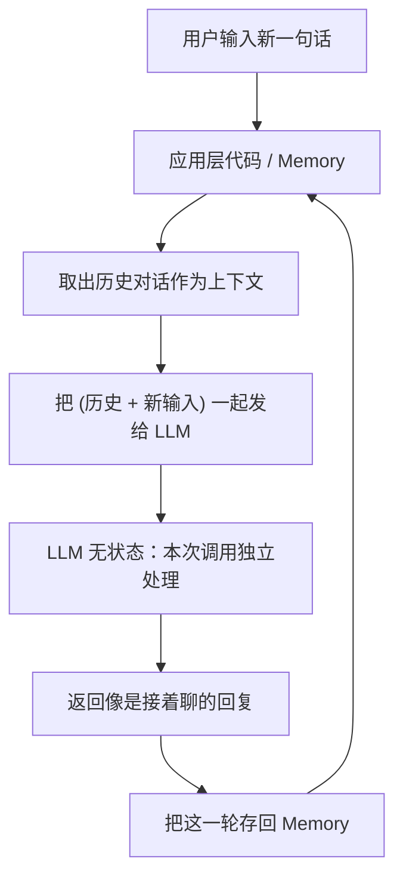
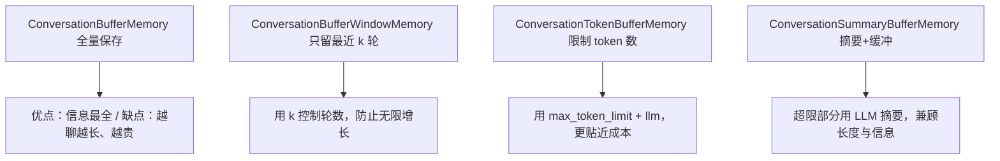

# 第3集：LangChain 记忆（Memory）——让大模型"记住"对话

## 元信息
- 集数: 3
- 时间范围: 00:00:00 --> 00:17:04
- 核心主题: 由于大语言模型本身是"无状态"的，LangChain 通过多种 Memory 组件把历史对话喂回模型，让聊天机器人拥有连贯的"记忆"。
- 学习目标:
  - 理解 LLM 本身不记忆、每次 API 调用相互独立的本质，明白"记忆"其实是把历史对话作为上下文再次传入。
  - 掌握 LangChain 四种对话记忆：ConversationBufferMemory、ConversationBufferWindowMemory、ConversationTokenBufferMemory、ConversationSummaryBufferMemory。
  - 学会用 `ConversationChain` 搭建对话，并用 `verbose=True` 观察 LangChain 实际生成的提示词。

## 第一性原理拆解
- 底层本质: 大语言模型是**无状态（stateless）**的。字幕原话："the large language model itself is actually stateless... each call to the API endpoint is independent"。模型不会自己记住上一句话，每一次调用 API 都是全新、独立的一次交易。
- 核心逻辑: 聊天机器人"看起来"有记忆，只是因为外层代码把**到目前为止的完整对话**作为上下文再次提供给模型（"chatbots appear to have memory only because there's usually rapid code that provides the full conversation... as context to the LM"）。Memory 组件就是负责"存储历史 + 每轮把历史拼进提示词"的这层代码。
- 推导过程:
  1. 模型无记忆 → 想要连贯对话，就必须每轮都把历史带上。
  2. 历史全带（Buffer）→ 对话越长，历史越长，发送给模型的 token 越多。
  3. token 越多 → 因为大多数 LLM 按 token 计费，成本随对话变长而持续升高（"the cost of sending a lot of tokens... will also become more expensive"）。
  4. 为控制成本与长度 → 衍生出"只留最近 N 轮（Window）""限制总 token（TokenBuffer）""超限部分用 LLM 生成摘要（SummaryBuffer）"三种优化策略。

## 核心知识点详解

- **LLM 无状态（stateless）**: 模型不记得之前说过什么，每次调用相互独立。"记忆"是应用层实现的，不是模型能力。

- **ConversationChain（对话链）**: 把一个 LLM 和一个 Memory 组合起来的链。用 `conversation.predict(input="...")` 来进行一轮对话。设置 `verbose=True` 可以看到 LangChain 实际拼出的提示词——开头是一段"The following is a friendly conversation between a human and an AI..."的系统性引导语，后面接上历史对话。

- **ConversationBufferMemory（缓冲区记忆）**: 最基础的记忆，**逐字保存全部对话历史**。
  - `memory.buffer`：打印当前存储的完整对话字符串。
  - `memory.load_memory_variables({})`：返回记忆内容（传入的空花括号 `{}` 是一个空字典，是高级功能的入口，本课不展开）。
  - `memory.save_context({"input": "..."}, {"output": "..."})`：手动往记忆里显式添加一组"输入/输出"。
  - 缺点：对话越长，记忆越长，token 成本越高。

- **ConversationBufferWindowMemory（窗口记忆）**: 只保留**最近 k 轮**对话（一轮 = 人说一句 + AI 回一句）。
  - 关键参数 `k`：`k=1` 表示只记住最近 1 轮。字幕演示中 `k=1` 时，问"我叫什么名字"，因为最早那轮已被丢弃，AI 回答"抱歉，我没有这个信息"。
  - 实战中通常把 k 设大一些（不会用 1），目的是**防止记忆无限增长**。

- **ConversationTokenBufferMemory（token 缓冲记忆）**: 按 **token 数量**（而非轮数）来限制记忆。
  - 关键参数 `max_token_limit`：保留最近对话，直到不超过该 token 上限，超出的最早部分被截断。
  - 必须传入 `llm`：因为**不同模型计算 token 的方式不同**，需要告诉它按当前模型（这里是 ChatOpenAI）的方式数 token。
  - 优点：更直接对应真实的调用成本。

- **ConversationSummaryBufferMemory（摘要缓冲记忆）**: 不靠固定轮数或固定 token 硬截断，而是**用 LLM 把较早的对话压缩成一段摘要**来当记忆。
  - 关键参数 `max_token_limit` + `llm`：显式保存最近对话直到接近 token 上限，超出的部分交给 LLM 生成摘要。
  - 字幕演示：`max_token_limit=400` 足够容纳全部文本时，记忆里是完整原文；把上限降到 100 时，LangChain 调用 OpenAI 生成摘要（如"human 与 AI 先寒暄，然后 AI 告知上午的会议安排……"），最近的对话保留原文，更早的变成摘要。

- **其他记忆类型（视频末尾提及，未演示代码）**:
  - **Vector data memory（向量数据记忆）**: 存储文本 embedding，检索最相关的文本块作为记忆（需了解 word/text embeddings）。
  - **Entity memory（实体记忆）**: 专门记住关于特定人物/实体的事实，例如朋友的信息。
  - 可以**多种记忆组合使用**（如"对话摘要 + 实体记忆"）；开发者也常把完整对话另存进传统数据库（键值存储或 SQL）用于审计和后续优化。

## 实操步骤指南

> 以下代码基于字幕描述与截图，还原 DeepLearning.AI 课程标准写法。API 名称严格来自字幕（ConversationChain / 各类 Memory / save_context / load_memory_variables / buffer / verbose 等）。

第 1 步：导入 API Key（截图 scene_001，00:38）
```python
import os
from dotenv import load_dotenv, find_dotenv
_ = load_dotenv(find_dotenv())  # read local .env file
```

第 2 步：ConversationBufferMemory + ConversationChain（00:54–02:56）
```python
from langchain.chat_models import ChatOpenAI
from langchain.chains import ConversationChain
from langchain.memory import ConversationBufferMemory

llm = ChatOpenAI(temperature=0.0)
memory = ConversationBufferMemory()
conversation = ConversationChain(
    llm=llm,
    memory=memory,
    verbose=True   # 设为 True 可看到 LangChain 实际生成的提示词
)

conversation.predict(input="Hi, my name is Andrew")
conversation.predict(input="What is 1+1?")
conversation.predict(input="What is my name?")  # 因为记住了历史，会答出 Andrew
```

第 3 步：查看与手动写入记忆（02:56–04:38）
```python
print(memory.buffer)                 # 打印目前存储的完整对话
memory.load_memory_variables({})     # 返回记忆内容（{} 是空字典占位）

# 显式往记忆里添加一组 输入/输出
memory.save_context({"input": "Hi"},
                    {"output": "What's up"})
memory.save_context({"input": "Not much, just hanging"},
                    {"output": "Cool"})
```

第 4 步：ConversationBufferWindowMemory（只记最近 k 轮，06:04–08:14）
```python
from langchain.memory import ConversationBufferWindowMemory

memory = ConversationBufferWindowMemory(k=1)   # 只保留最近 1 轮
memory.save_context({"input": "Hi"}, {"output": "What's up"})
memory.save_context({"input": "Not much, just hanging"}, {"output": "Cool"})
memory.load_memory_variables({})   # 只会剩最近一轮，"Hi/What's up" 被丢弃
```

第 5 步：ConversationTokenBufferMemory（按 token 限制，08:14–09:46）
```python
from langchain.memory import ConversationTokenBufferMemory

# 必须传 llm：不同模型的 token 计数方式不同
memory = ConversationTokenBufferMemory(llm=llm, max_token_limit=50)
memory.save_context({"input": "AI is what?!"}, {"output": "Amazing!"})
memory.save_context({"input": "Backpropagation is what?"}, {"output": "Beautiful!"})
memory.save_context({"input": "Chatbots are what?"}, {"output": "Charming!"})
memory.load_memory_variables({})   # 调大/调小 max_token_limit 会保留/截断更多历史
```

第 6 步：ConversationSummaryBufferMemory（超限部分自动摘要，09:46–14:40）
```python
from langchain.memory import ConversationSummaryBufferMemory

schedule = ("There is a meeting at 8am with your product team. "
            "You will need your powerpoint presentation prepared. "
            "... "
            "lunch at the italian restaurant with a customer, "
            "bring your laptop to show the latest LLM demo.")

memory = ConversationSummaryBufferMemory(llm=llm, max_token_limit=100)
memory.save_context({"input": "Hello"}, {"output": "What's up"})
memory.save_context({"input": "Not much, just hanging"}, {"output": "Cool"})
memory.save_context({"input": "What is on the schedule today?"},
                    {"output": f"{schedule}"})

memory.load_memory_variables({})   # 超过 100 token 的旧对话被 LLM 压缩成 summary

conversation = ConversationChain(llm=llm, memory=memory, verbose=True)
conversation.predict(input="What would be a good demo to show?")
```

## 配套可视化图（Mermaid）

图1：为什么需要 Memory —— LLM 无状态与"伪记忆"原理（对应 04:38–05:29）


图2：四种对话记忆的取舍（对应 03:40–14:40）


## 常见踩坑与避坑
- **误以为模型自己会记忆**：LLM 是无状态的，不带 Memory 时它永远"失忆"。想要连贯对话，必须由 Memory 每轮把历史拼进提示词。
- **无脑用 BufferMemory 导致费用飙升**：对话变长后 token 持续增加，成本随之升高。长对话应改用 Window / Token / Summary 记忆来控长度。
- **用 TokenBuffer / SummaryBuffer 忘记传 llm**：这两种记忆需要 `llm` 参数——TokenBuffer 用它按正确方式数 token，SummaryBuffer 用它生成摘要；不传会出错或计数不准。
- **k 设成 1 用于生产**：字幕明确说实战里 k 通常设更大值，`k=1` 只是演示，会立刻"忘掉"上一轮内容。

## 课后练习
- 练习1：分别用 `ConversationBufferMemory` 和 `ConversationBufferWindowMemory(k=1)` 跑同一段对话（先说"我叫 Andrew"，再问"1+1 等于几"，最后问"我叫什么名字"），并把 `verbose=True`。对比两种记忆下模型能否答出名字，并解释原因（提示：窗口只保留最近一轮）。
- 练习2：用 `ConversationSummaryBufferMemory` 存一段较长的日程文本，先设 `max_token_limit=400` 观察记忆内容，再把上限降到 `100`，打印 `memory.load_memory_variables({})`，观察哪部分被压缩成摘要、哪部分仍以原文保留，体会"显式保存 + 超限摘要"的机制。
