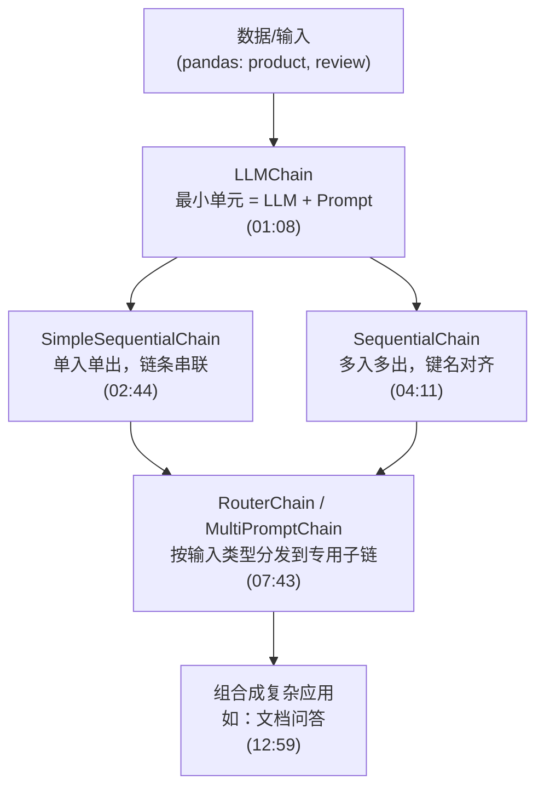
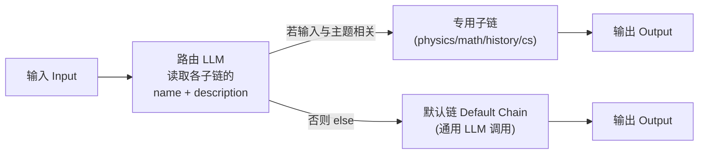

# 第4集：LangChain 链（Chains）——从最小单元到路由编排

## 元信息
- 集数: 4
- 时间范围: 00:00:00,000 --> 00:13:06,780
- 核心主题: 讲解 LangChain 最核心的构建块「链（Chain）」，从最基础的 LLM 链，到顺序链、路由链，逐步把简单模块组合成复杂应用。
- 学习目标:
  1. 理解「链 = LLM + 提示词（Prompt）」这一最基本组合，并学会用它批量处理数据。
  2. 掌握两种顺序链（SimpleSequentialChain / SequentialChain）如何把多个链串起来传递中间结果。
  3. 学会用路由链（Router Chain）根据输入内容自动分发到最合适的专用子链，并配置默认兜底链。

## 第一性原理拆解
- 底层本质: 「链」的本质是把「一次 LLM 调用」封装成一个可复用、可组合的函数单元——输入变量进去，格式化成提示词，喂给大模型，拿到输出。字幕原文：链「is just the combination of the LLM and the prompt」（就是 LLM 和提示词的组合）。
- 核心逻辑: 复杂能力不是靠单次超长提示词硬堆，而是靠「小单元 + 组合」。单个 LLM 链只做一件事；把多个 LLM 链的输出接到下一个链的输入上，就能完成一整套顺序操作（sequence of operations）。当分支变多时，再加一个「决策链」来做路由。
- 推导过程:
  1. 最小单元：一个链 = 一个 LLM + 一个 Prompt（LLMChain），可用 `chain.run(输入)` 跑一次。
  2. 线性组合：链 A 的输出 → 链 B 的输入，串成 SimpleSequentialChain（单入单出）。
  3. 多变量组合：当需要多个输入/多个输出、且中间结果要按名字精确对齐时，用 SequentialChain（靠 `input_variables` / `output_key` 命名管理数据流）。
  4. 条件组合：当输入类型不确定时，先用一个 LLM 做「路由决策」，把输入分发到对应的专用子链，配默认链兜底 → Router Chain（MultiPromptChain）。

## 核心知识点详解

- **链（Chain）**：LangChain 最重要的构建块。它把一个 LLM 和一个提示词打包在一起；还能把很多这样的构建块拼起来，对文本或其他数据执行「一连串操作」。

- **数据准备（pandas DataFrame）**：课程用一个 pandas 数据表加载演示数据，表里有 `product`（产品）列和 `review`（评论）列，每一行是一条数据。重点不是学 pandas，而是：**链的强大之处在于可以一次跑很多条输入**（run them over many inputs at a time）。

- **LLMChain（LLM 链）**：最基础、也最强大的一种链，是后面所有链的地基。构成三要素：
  1. **OpenAI 模型（LLM）**：用 `ChatOpenAI` 初始化，设置较高的 `temperature`（温度高 → 输出更有创意/更好玩）。
  2. **ChatPromptTemplate（提示词模板）**：接收一个变量 `product`，让模型「为生产该产品的公司起一个最贴切的名字」。
  3. **LLMChain**：把 LLM 和 Prompt 组合起来。调用 `chain.run("Queen Size Sheet Set")`，它会**在底层自动把变量填进提示词**，再整体喂给 LLM，返回一个假想公司名（视频里得到 "Royal Beddings"）。

- **SimpleSequentialChain（简单顺序链）**：适用于**每个子链都只有单一输入、单一输出**的场景。视频例子：
  - 链1：输入 product → 输出公司名；
  - 链2：输入公司名 → 输出该公司的 20 词描述；
  - 第一个链的输出（公司名）会**自动作为**第二个链的输入，串起来一次跑完。

- **SequentialChain（顺序链）**：适用于**多输入 / 多输出**的复杂场景。视频用 `review` 评论数据做了 4 条链：
  1. 把评论翻译成英文 → 输出 `English_Review`；
  2. 用英文评论生成一句话摘要 → 输出 `summary`；
  3. 检测原始评论的语言（用原始 `review` 变量）→ 输出 `language`；
  4. 综合 `summary` 和 `language` 两个输入，用检测出的语言写一段跟进回复。
  - **关键点（最容易出错）**：各子链的**输入键（input key）和输出键（output key）名字必须完全对齐**。前一个链的 `output_key`（如 `English_Review`）要和下一个链提示词里用的变量名一模一样，否则会报 key error。

- **Router Chain（路由链）/ MultiPromptChain（多提示词链）**：当一个操作可能属于不同类别时，先用一个链决定「该走哪条专用子链」，再分发过去。视频例子按学科路由：physics（物理）、math（数学）、history（历史）、computer science（计算机）。关键组件：
  - 每个专用 Prompt 都要配 **name（名字）+ description（描述）**，这些信息会传给路由链，供它决定何时使用该子链。
  - **MultiPromptChain**：在多个提示词模板间路由的专用链（但路由对象也可以是任意类型的链，不限于提示词）。
  - **LLMRouterChain**：用大模型本身来做路由决策，用到上面每个子链的 name 和 description。
  - **RouterOutputParser**：把 LLM 的路由输出解析成一个字典，告诉系统「走哪条链、输入是什么」。
  - **default chain（默认链）**：当路由器判断不出属于任何已知类别时（如问了个生物问题，返回 "None"）就走默认链——它只是对大模型的一次通用调用。

## 实操步骤指南

以下代码基于字幕描述还原，展示各类链的搭建流程（变量名、结构与视频讲解一致）。

**0. 加载环境变量与数据（对应截图 00:28 "Chains" 页面）**
```python
import os
from dotenv import load_dotenv, find_dotenv
_ = load_dotenv(find_dotenv())  # read local .env file

import pandas as pd
df = pd.read_csv("Data.csv")  # 含 product 列与 review 列，每行一条数据
```

**1. LLMChain（最基础的链）**
```python
from langchain.chat_models import ChatOpenAI
from langchain.prompts import ChatPromptTemplate
from langchain.chains import LLMChain

# 高 temperature，输出更有创意
llm = ChatOpenAI(temperature=0.9)

prompt = ChatPromptTemplate.from_template(
    "What is the best name to describe a company that makes {product}?"
)

chain = LLMChain(llm=llm, prompt=prompt)

# 底层自动格式化提示词并调用 LLM
product = "Queen Size Sheet Set"
chain.run(product)   # -> 例如 "Royal Beddings"
```

**2. SimpleSequentialChain（单入单出，串联）**
```python
from langchain.chains import SimpleSequentialChain

# 链1：产品 -> 公司名
first_prompt = ChatPromptTemplate.from_template(
    "What is the best name to describe a company that makes {product}?"
)
chain_one = LLMChain(llm=llm, prompt=first_prompt)

# 链2：公司名 -> 20词描述
second_prompt = ChatPromptTemplate.from_template(
    "Write a 20 words description for the following company: {company_name}"
)
chain_two = LLMChain(llm=llm, prompt=second_prompt)

overall_simple_chain = SimpleSequentialChain(
    chains=[chain_one, chain_two],
    verbose=True
)
overall_simple_chain.run(product)  # 先输出公司名，再输出该公司描述
```

**3. SequentialChain（多入多出，键名必须精确对齐）**
```python
from langchain.chains import SequentialChain

# 链1：评论 -> 英文翻译（output_key=English_Review）
first_prompt = ChatPromptTemplate.from_template(
    "Translate the following review to English:\n\n{Review}"
)
chain_one = LLMChain(llm=llm, prompt=first_prompt, output_key="English_Review")

# 链2：英文评论 -> 一句话摘要（output_key=summary）
second_prompt = ChatPromptTemplate.from_template(
    "Can you summarize the following review in 1 sentence:\n\n{English_Review}"
)
chain_two = LLMChain(llm=llm, prompt=second_prompt, output_key="summary")

# 链3：原始评论 -> 检测语言（output_key=language）
third_prompt = ChatPromptTemplate.from_template(
    "What language is the following review:\n\n{Review}"
)
chain_three = LLMChain(llm=llm, prompt=third_prompt, output_key="language")

# 链4：多输入(summary + language) -> 用指定语言写跟进回复
fourth_prompt = ChatPromptTemplate.from_template(
    "Write a follow up response to the following summary in the specified language:"
    "\n\nSummary: {summary}\n\nLanguage: {language}"
)
chain_four = LLMChain(llm=llm, prompt=fourth_prompt, output_key="followup_message")

overall_chain = SequentialChain(
    chains=[chain_one, chain_two, chain_three, chain_four],
    input_variables=["Review"],
    output_variables=["English_Review", "summary", "followup_message"],
    verbose=True
)
overall_chain(df.Review[5])  # 例：原文法语 -> 英译 -> 摘要 -> 法语跟进回复
```

**4. Router Chain（路由链，对应截图 07:46 "Router Chain" 图示）**
```python
from langchain.chains.router import MultiPromptChain
from langchain.chains.router.llm_router import LLMRouterChain, RouterOutputParser
from langchain.prompts import PromptTemplate

# 4.1 定义各学科专用提示词（physics / math / history / computer science）
# 4.2 为每个提示词提供 name + description
prompt_infos = [
    {"name": "physics", "description": "Good for answering questions about physics",
     "prompt_template": physics_template},
    # math / history / computer science ...
]

llm = ChatOpenAI(temperature=0)

# 4.3 destination chains：每条都是一个 LLMChain
destination_chains = {}
for p_info in prompt_infos:
    prompt = ChatPromptTemplate.from_template(p_info["prompt_template"])
    destination_chains[p_info["name"]] = LLMChain(llm=llm, prompt=prompt)

# 4.4 default chain：路由不出结果时兜底
default_chain = LLMChain(llm=llm, prompt=ChatPromptTemplate.from_template("{input}"))

# 4.5 用 destinations 格式化路由模板 + RouterOutputParser 解析
router_prompt = PromptTemplate(
    template=router_template,               # 含任务说明与输出格式要求
    input_variables=["input"],
    output_parser=RouterOutputParser(),
)
router_chain = LLMRouterChain.from_llm(llm, router_prompt)

# 4.6 组装总链
chain = MultiPromptChain(
    router_chain=router_chain,
    destination_chains=destination_chains,
    default_chain=default_chain,
    verbose=True
)

chain.run("What is black body radiation?")  # -> 路由到 physics 链
chain.run("what is 2 + 2")                   # -> 路由到 math 链
chain.run("Why does every cell in our body contain DNA?")  # 生物 -> None -> 走 default 链
```

## 配套可视化图（Mermaid）

图1：三种链的能力递进（对应全片主线 00:26 → 12:59）


图2：Router Chain 路由机制（对应截图 07:46 幻灯片）


## 常见踩坑与避坑
1. **SequentialChain 里键名对不上会直接报错**：前链 `output_key` 必须和后链提示词里的变量名逐字一致（如 `English_Review`、`summary`、`language`）。字幕特别强调：输入输出多而复杂，遇到 key error 时第一时间检查变量名是否对齐。
2. **用错顺序链类型**：SimpleSequentialChain 只支持「单入单出」；一旦某个链需要多个输入或产生多个中间输出，必须换成 SequentialChain，否则无法传递多变量。
3. **忘记配置默认链 / 忽略路由描述质量**：路由靠每个子链的 `description` 让 LLM 判断走哪条；描述写得含糊会路由错。同时必须提供 default chain，否则遇到不属于任何类别的问题（返回 "None"）就没有兜底出口。

## 课后练习
1. 用 LLMChain 换一个你自己的产品描述（如 "Wireless Earbuds"），跑一遍 `chain.run()` 看输出的公司名；再用 SimpleSequentialChain 让第二条链为这个公司名生成一段 20 词的公司简介。
2. 在 Router Chain 的 `prompt_infos` 里新增一个学科（如 English 或 Latin）的专用提示词与描述，然后分别输入：一个该新学科的问题、一个已有学科的问题、一个完全无关的问题，验证路由是否分别命中新子链、原子链和默认链。
