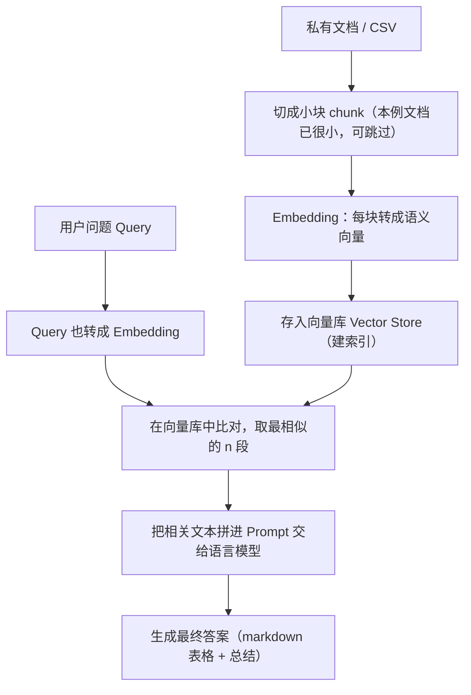
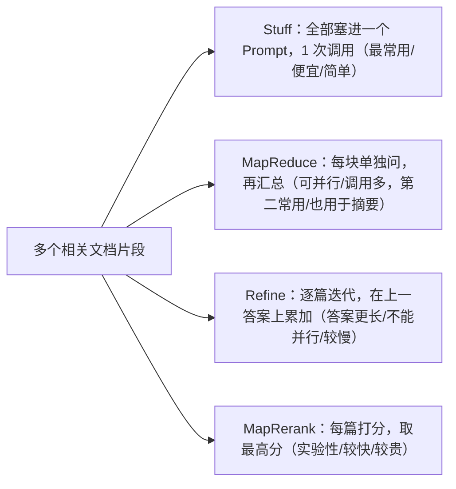

# 第5集：基于文档的问答（Q&A over Documents）

## 元信息
- 集数: 5
- 时间范围: 00:00:00 → 00:15:00
- 核心主题: 用 Embeddings（嵌入）和 Vector Store（向量库）把大语言模型和你自己的私有文档结合起来，实现"对文档提问、让模型回答"。
- 学习目标:
  - 理解为什么需要 Embeddings 和向量库（语言模型一次只能看几千字）。
  - 掌握用几行代码快速搭建文档问答链，以及"拆开手动做"的完整底层流程。
  - 了解 4 种文档合并方法（Stuff / MapReduce / Refine / MapRerank）的取舍。

## 第一性原理拆解
- 底层本质: 语言模型本身"没见过"你的私有数据，而且**单次只能处理几千个词**（受上下文窗口限制）。要让它回答关于一大堆文档的问题，本质问题是"如何从海量文本里，只挑出与问题最相关的一小段喂给模型"。
- 核心逻辑: 把文本变成能"比较相似度"的数字向量（Embedding），存进向量库；提问时把问题也变成向量，去库里找最接近的几段文本，再把这几段文本拼进 Prompt 交给模型生成答案。
- 推导过程:
  1. 文档太大 → 模型装不下 → 必须做"检索"，只送相关片段。
  2. 怎么判断"相关"？→ 把文本转成向量，**内容相似的文本向量也相似**（字幕例子：两句讲宠物的句子向量很接近，讲汽车的那句差很远）。
  3. 大文档先切成小块（chunk）→ 每块生成 Embedding → 存入向量库（这一步就是"建索引"）。
  4. 查询时：问题→Embedding→和库里所有向量比对→取前 n 个最相似→拼进 Prompt→模型给出最终答案。

## 核心知识点详解

- **Embeddings（嵌入）**：为一段文本创建**数字化表示（向量）**，这个向量捕捉的是文本的**语义含义**。内容相近的文本，向量也相近，因此可以在"向量空间"里比较文本之间的相似度。字幕演示中，对句子 "Hi, my name is Harrison" 做嵌入，得到一个**有一千多个元素**的数组，每个元素都是一个数值，合起来就是这段文本的整体数字表示。

- **Vector Store / Vector Database（向量库 / 向量数据库）**：用来**存储上一步生成的向量表示**的地方。建库过程：拿到大文档 → 切成小块 → 每块生成 Embedding → 连同向量一起存进库。查询时用问题向量在库中做相似度检索。本集用的是 **DocArrayInMemorySearch**，它是**内存型向量库，无需连接任何外部数据库**，最容易上手。

- **Document Loader（文档加载器）**：把外部私有数据读进来。本集用 **CSVLoader** 加载一份"户外服装"CSV，CSV 里每一行商品对应一个 Document。

- **Chunking（分块）**：把大文档切成比原文更小的片段，好处是能只把**最相关的小块**送给模型。本集的 CSV 每条记录本身就很小，所以**无需再分块**，可以直接生成 Embedding。

- **Retriever（检索器）**：一个**通用接口**——"输入一个查询，返回一批文档"。向量库+Embedding 只是实现检索的一种方式（还有很多别的方式，有的更简单有的更高级）。

- **RetrievalQA Chain（检索问答链）**：把"检索 + 基于检索到的文档做问答"整个流程封装成一条链。创建时需要传入：语言模型（负责最后生成答案）、chain_type（文档合并方式）、retriever（取文档的接口）、verbose。

- **VectorstoreIndexCreator（向量库索引创建器）**：帮你**几行代码**就完成"加载→切块→嵌入→建库"整套动作的封装工具，是"一行式"快速上手的入口。

- **四种文档合并方法（chain_type）**：
  - **Stuff（塞入）**：把所有文档**塞进一个 Prompt**，只调一次模型。简单、便宜、效果不错，是**最常用**的方法；缺点是文档太多会超出上下文。
  - **MapReduce（映射-归约）**：每个 chunk 分别连同问题送给模型得到中间答案，再用一次模型调用把所有中间答案**汇总**成最终答案。能处理任意数量文档、可并行，是**第二常用**；缺点是调用次数多、把文档当作彼此独立。也常用于**长文档摘要**。
  - **Refine（精炼）**：**迭代式**遍历文档，在上一篇文档的答案基础上不断累加、构建答案。适合逐步整合信息，答案通常更长；因调用相互依赖不能并行，速度较慢。
  - **MapRerank（映射-重排）**：对每篇文档单独调用一次模型，并让它**返回一个分数**，最后选分数最高的。较实验性，依赖模型正确打分（需在指令里说明"相关就给高分"）；调用独立可批量，较快但更贵。

## 实操步骤指南

### 方式一：一行式快速上手（先跑起来）

```python
# 1. 导入
from langchain.chains import RetrievalQA
from langchain.chat_models import ChatOpenAI
from langchain.document_loaders import CSVLoader
from langchain.vectorstores import DocArrayInMemorySearch
from IPython.display import display, Markdown

# 2. 用 CSVLoader 指定文件路径（一份户外服装 CSV）
file = 'OutdoorClothingCatalog_1000.csv'
loader = CSVLoader(file_path=file)

# 3. 导入索引创建器，几行代码建好向量库
from langchain.indexes import VectorstoreIndexCreator
index = VectorstoreIndexCreator(
    vectorstore_cls=DocArrayInMemorySearch   # 指定向量库类型
).from_loaders([loader])                     # 传入文档加载器列表

# 4. 提问并拿到 markdown 表格式回答
query = "Please list all your shirts with sun protection \
in a table in markdown and summarize each one."
response = index.query(query)
display(Markdown(response))
# 返回：一个含所有防晒衬衫名称与描述的 markdown 表格 + 一段总结
```

### 方式二：分步手动，看清底层发生了什么

```python
# 1. 加载文档：每个 document 对应 CSV 里的一件商品
loader = CSVLoader(file_path=file)
docs = loader.load()
docs[0]   # 查看单条文档

# 2. 创建 Embeddings（OpenAI 的嵌入类）
from langchain.embeddings import OpenAIEmbeddings
embeddings = OpenAIEmbeddings()

# 看看嵌入长什么样：得到一个含一千多个数值的向量
embed = embeddings.embed_query("Hi my name is Harrison")
print(len(embed))   # 1000+
print(embed[:5])    # 前几个数值

# 3. 把所有文档嵌入并存入向量库（本例文档很小，无需分块）
db = DocArrayInMemorySearch.from_documents(docs, embeddings)

# 4. 用相似度检索找相关文本
query = "Please suggest a shirt with sunblocking"
docs = db.similarity_search(query)   # 返回一个文档列表（本例返回 4 篇）
print(len(docs))   # 4
docs[0]            # 第一篇确实是关于防晒衬衫

# 5. 从向量库创建检索器
retriever = db.as_retriever()

# 6. 导入语言模型
llm = ChatOpenAI(temperature=0.0)

# （可选）纯手工做法：把检索到的文档拼成一大段文本，直接喂给模型
qdocs = "".join([docs[i].page_content for i in range(len(docs))])
response = llm.call_as_llm(f"{qdocs} Question: Please list all your \
shirts with sun protection in a table in markdown and summarize each one.")

# 7. 用 RetrievalQA 把上面所有步骤封装成一条链
qa_stuff = RetrievalQA.from_chain_type(
    llm=llm,
    chain_type="stuff",     # 最简单：全部塞进一个 Prompt，调一次模型
    retriever=retriever,
    verbose=True
)
query = "Please list all your shirts with sun protection in a table \
in markdown and summarize each one."
response = qa_stuff.run(query)
display(Markdown(response))
```

### 自定义索引（在一行式里也保留灵活性）

```python
# 建索引时同样可以指定 embedding，并可替换成不同的向量库
index = VectorstoreIndexCreator(
    vectorstore_cls=DocArrayInMemorySearch,
    embedding=embeddings,
).from_loaders([loader])
```

> 结论：一行式和分步式**得到相同结果**——想快速上手用一行，想精细控制就拆成五步。

## 配套可视化图（Mermaid）

图1：建索引 + 提问的整体流程（对应 03:50 ~ 06:13 的"底层原理"讲解）



图2：四种文档合并方法对比（对应 12:15 ~ 14:42 的方法讲解）



## 常见踩坑与避坑

- **误以为模型能一次读完整份大文档**：模型单次只能看几千个词。文档大就必须先做检索，只送最相关的片段，否则会超出上下文或答非所问。

- **文档很小也强行分块**：分块是为了"大文档装不下"才做的。本集 CSV 每条记录本身就很小，直接嵌入即可，不必多此一举地 chunk。

- **无脑用 Stuff 处理海量 chunk**：Stuff 把所有内容塞进一个 Prompt，文档一多就会超长。片段很多时应改用 MapReduce（可并行、可扩展）或 Refine（需逐步累积答案时）。

- **用 MapRerank 却不调教打分指令**：MapRerank 完全依赖模型自己打的分数，必须在指令里明确"与问题相关就给高分"，否则选出的"最高分文档"可能并不相关。

## 课后练习

1. 把本集的一行式（`index.query`）和分步式（`RetrievalQA.from_chain_type` + `stuff`）都跑一遍，换几个不同的查询（如"推荐一件带防晒的衬衫""列出所有夹克并总结"），确认两种方式返回结果一致，并观察 `verbose=True` 打印出的中间过程。

2. 在同一批文档上分别用 `chain_type="stuff"` 和 `chain_type="map_reduce"` 提同一个问题，对比二者的**答案长度、耗时、调用次数**差异，并写一句话说明：在"片段很多"和"需要跨文档汇总/摘要"两种场景下你会各选哪种方法，为什么。
