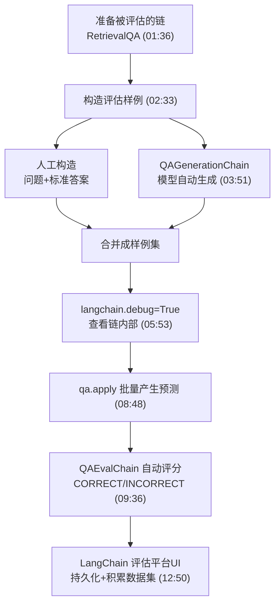
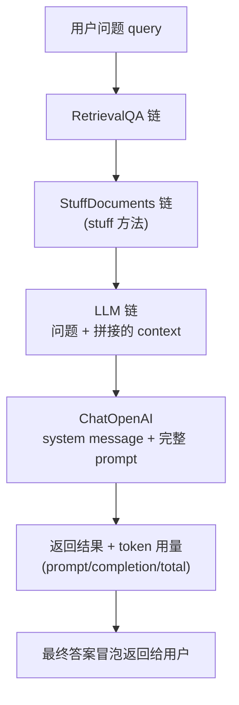

# 第6集：如何评估基于大语言模型的应用（Evaluation）

## 元信息
- 集数: 6
- 时间范围: 00:00:00 --> 00:14:50
- 核心主题: 用「构造样例 → 运行链条 → 语言模型自动评分」的方法，系统评估 LLM 问答应用的效果好坏。
- 学习目标:
  - 学会给 LLM 应用构造评估样例（人工构造 + 用语言模型自动生成）。
  - 学会用 `langchain.debug` 打开调试，看清链条每一步的输入输出。
  - 理解并使用「用语言模型评估语言模型」（QAEvalChain）来自动打分，而不是死板的字符串精确匹配。

## 第一性原理拆解
- 底层本质: LLM 应用是「一连串步骤组成的链条（chain）」。要判断改动是变好还是变坏，必须先能"客观测量"效果，而不是凭感觉。评估的核心难点在于：LLM 的输出是开放式的自然语言，同一个正确答案可以有无数种表达方式，无法用精确字符串比对来判定对错。
- 核心逻辑: 既然人工构造样例、人工逐条判分都太慢、不可规模化，那就"以子之矛攻子之盾"——用语言模型本身来帮我们做这两件事：一是自动生成"问题-标准答案"对，二是自动判断"预测答案"和"标准答案"语义上是否一致。
- 推导过程:
  1. 想评估 → 必须有测试数据（问题 + 标准答案，即 ground truth）。
  2. 人工写样例准确但不可扩展 → 引入 `QAGenerationChain` 让模型读文档自动生成样例。
  3. 有了样例还要看链条内部到底发生了什么 → 用 `langchain.debug=True` 展开每一步（检索→拼上下文→送入 LLM）。
  4. 逐条人工判分又太累 → 引入 `QAEvalChain` 让模型自动判"对/错"。
  5. 因为答案是任意字符串、无唯一正确形态，精确匹配会失效 → 只有语义比对（语言模型）才靠谱。

## 核心知识点详解

- **评估（Evaluation）为什么难**：LLM 被用来做开放式文本生成任务，一个问题没有唯一的"最佳答案字符串"，存在很多语义等价的变体。传统的字符串匹配、正则、精确匹配全都失效。字幕原文举例："yes"（标准答案）和一句很长的预测答案，两个字符串完全不像，但语义都对——所以必须用语言模型来判断语义是否相同。

- **构造样例的两种方式**：
  - **人工构造**：自己翻看文档，手动写出"问题 + 标准答案"。准确，但很花时间、无法规模化（字幕：does the cozy comfort pullover set have side pockets → yes；what collection is this jacket from → the down tech collection）。
  - **模型自动生成（QAGenerationChain）**：把文档喂给这个链，它用语言模型为每篇文档自动生成一个"问题-答案"对。省时省力，可批量生成。

- **`langchain.debug`（调试可视化）**：设 `langchain.debug = True` 后，再次运行会打印出链条内部的全过程：先进入 RetrievalQA 链 → 再进入 stuff documents 链（stuff 方法）→ 再进入 LLM 链。可以看到原始问题、检索拼出的上下文（context）、送入 ChatOpenAI 的完整 prompt（含 system message）、以及返回的 token 用量（prompt tokens / completion tokens / total tokens）和模型名。**关键洞察**：问答出错时，往往不是语言模型本身错了，而是"检索（retrieval）"这一步就取错了文档，所以要重点看问题和上下文。

- **QAEvalChain（用语言模型自动评分）**：导入 QA 评估链，用语言模型创建它，对每条样例调用 `evaluate(examples, predictions)`，返回每条的评分（CORRECT / INCORRECT）。它比较的是"标准答案"和"预测答案"的语义是否一致，而不是字符串是否相同。

- **三类答案的来源要分清**：
  - Real Answer（标准答案）：模型看着完整文档生成，作为 ground truth。
  - Predicted Answer（预测答案）：应用真正跑 QA 链（embedding 检索 → 向量库 → 送入 LLM）得到的结果。
  - Grade（评分）：评估链让语言模型判定预测答案对不对。

- **LangChain 评估平台（Evaluation Platform / UI）**：把 notebook 里做的事持久化并用 UI 展示。可以看到每次运行（run）的输入输出、逐层下钻看链条内部（等价于 debug 模式打印的信息，只是更好看），还能把样例一键"加入数据集（dataset）"，让评估数据集像"飞轮（flywheel）"一样随时间不断积累。

## 实操步骤指南

> 以下代码基于字幕描述还原（字幕未逐字念出全部代码，属流程性重建，非逐字抄录）。

1）加载环境变量与准备被评估的链（沿用上一集的文档问答链）：

```python
import os
from dotenv import load_dotenv, find_dotenv
_ = load_dotenv(find_dotenv())  # read local .env file

# 沿用上一集的文档问答链：加载数据、一行建索引、创建 RetrievalQA
from langchain.chains import RetrievalQA
from langchain.chat_models import ChatOpenAI
from langchain.document_loaders import CSVLoader
from langchain.indexes import VectorstoreIndexCreator

file = 'OutdoorClothingCatalog_1000.csv'
loader = CSVLoader(file_path=file)
data = loader.load()

index = VectorstoreIndexCreator(...).from_loaders([loader])  # 一行建索引

llm = ChatOpenAI(temperature=0.0)
qa = RetrievalQA.from_chain_type(
    llm=llm,
    chain_type="stuff",
    retriever=index.vectorstore.as_retriever(),
    verbose=True,
)
```

2）方式一：人工构造评估样例（问题 + 标准答案）：

```python
examples = [
    {
        "query": "Do the Cozy Comfort Pullover Set have side pockets?",
        "answer": "Yes"
    },
    {
        "query": "What collection is the Ultra-Lofty 850 Stretch Down Hooded Jacket from?",
        "answer": "The DownTek collection"
    },
]
```

3）方式二：用语言模型自动生成样例（QAGenerationChain + apply_and_parse）：

```python
from langchain.evaluation.qa import QAGenerationChain

example_gen_chain = QAGenerationChain.from_llm(ChatOpenAI())

# 每篇文档生成一个"问题-答案"对，用 apply_and_parse 得到 dict（含 query/answer）
new_examples = example_gen_chain.apply_and_parse(
    [{"doc": t} for t in data[:5]]
)

# 把自动生成的样例合并进人工样例
examples += [ex["qa_pairs"] for ex in new_examples]
```

4）打开调试，看清单条输入在链条内部的全过程：

```python
import langchain
langchain.debug = True

qa.run(examples[0]["query"])   # 会打印：RetrievalQA → stuff → LLM 的每一步输入输出、prompt、token 用量

langchain.debug = False        # 评估前关掉，避免刷屏
```

5）对所有样例批量产生预测：

```python
predictions = qa.apply(examples)   # 字幕：约有 7 个样例，循环跑 7 次得到每条预测
```

6）用语言模型自动评分（QAEvalChain）：

```python
from langchain.evaluation.qa import QAEvalChain

eval_chain = QAEvalChain.from_llm(llm)
graded_outputs = eval_chain.evaluate(examples, predictions)

for i, eg in enumerate(examples):
    print(f"Example {i}:")
    print("Question: "        + predictions[i]['query'])
    print("Real Answer: "     + predictions[i]['answer'])
    print("Predicted Answer: "+ predictions[i]['result'])
    print("Predicted Grade: " + graded_outputs[i]['results'])  # CORRECT / INCORRECT
    print()
```

7）纯概念部分（无需代码）：了解 **LangChain 评估平台 UI**——把上面这些运行结果持久化，用界面逐层下钻查看链条内部，并把样例一键加入数据集，随时间积累评估集。

## 配套可视化图（Mermaid）

图1：整体评估流程（对应约 00:01:36 建链 → 02:33 构造样例 → 05:53 debug → 08:48 自动评分 → 12:50 平台UI）



图2：单条输入在链条内部的执行层级（对应 debug 打印，约 06:11-08:04）



## 常见踩坑与避坑

- **不要用字符串精确匹配/正则来判分**：LLM 答案是开放式的，"yes"和一大段解释可能语义相同但字符串完全不同。应改用语言模型做语义评估（QAEvalChain）。字幕明确指出这是评估 LLM 之所以难的根本原因。
- **答错别急着怪模型**：字幕强调，问答返回错误结果时，往往不是语言模型算错，而是"检索（retrieval）"步骤取错了文档。用 `langchain.debug` 重点检查"问题"和"检索出的上下文"。
- **评估前记得关掉 debug**：debug 模式会把每步细节全部打印，批量跑样例时会刷屏。字幕中作者在批量预测前先 `langchain.debug = False`。
- **别只人工构造样例**：人工写样例和人工判分都准确但不可扩展、很枯燥。用 QAGenerationChain 生成样例、用 QAEvalChain 判分，让评估形成可持续积累的"飞轮"。

## 课后练习

1. 用 `QAGenerationChain` 为你自己的一个 CSV/文档数据集自动生成 5 条"问题-答案"对，再用 `QAEvalChain` 对 RetrievalQA 的预测结果自动打分，统计 CORRECT 的比例。
2. 开启 `langchain.debug = True`，跑一条你怀疑答错的问题，观察打印出的"检索上下文（context）"，判断这次错误是"检索取错文档"还是"语言模型生成有误"，并用一句话说明你的依据。
