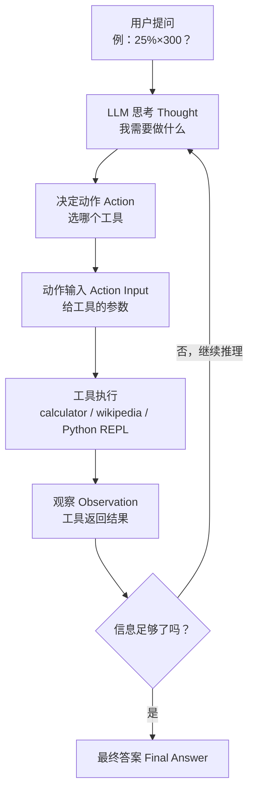
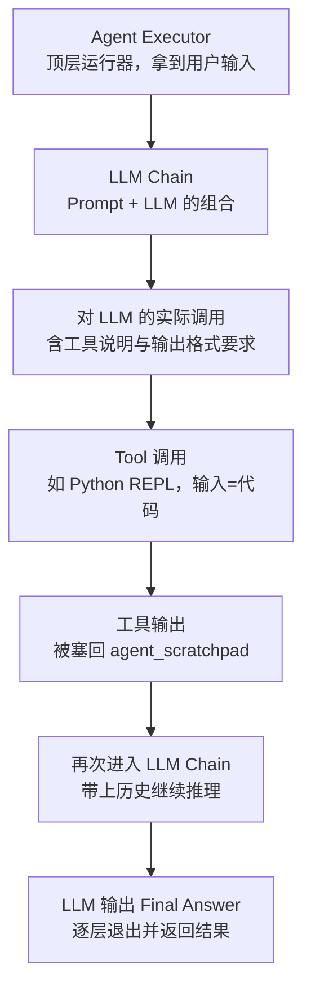

# 第7集：LangChain 智能代理（Agents）——把大模型当作"推理引擎"

## 元信息
- 集数: 7
- 时间范围: 00:00:00 - 00:14:34
- 核心主题: 用 LangChain 的 Agents 框架，把大语言模型当作"推理引擎"，让它调用工具（计算器、维基百科、Python 代码、自定义函数）来完成任务。
- 学习目标:
  - 理解"大模型是推理引擎而非知识库"这一核心视角
  - 学会用内置工具（LLM Math、Wikipedia、Python REPL）初始化并使用 Agent
  - 学会用 `@tool` 装饰器创建自己的自定义工具

## 第一性原理拆解
- 底层本质: 很多人把大语言模型（LLM）当成一个"知识仓库"——好像它背下了互联网上的大量信息，你一问它就答。但更有用的看法是：把 LLM 当作一个**推理引擎（reasoning engine）**。你给它一段文本或其他信息源，它结合自己学到的背景知识 + 你现给的新信息，去回答问题、推理内容、甚至决定下一步该做什么。
- 核心逻辑: 单靠模型"背下来"的知识既不全也可能过时。如果让模型自己去"决定用什么工具、给工具什么输入、看到工具结果后怎么办"，就能把模型的推理能力和外部的实时数据、精确计算、代码执行连接起来。Agent 就是这个"决策—调用工具—观察结果—再决策"的循环。
- 推导过程:
  1. 模型作为推理引擎需要"精确"，所以初始化时把 `temperature=0`，去掉随机性。
  2. 给模型一组工具（tools），并告诉它每个工具的用途（靠工具的文档描述）。
  3. 模型面对问题时，先产生"思考（Thought）"，再决定"动作（Action，即用哪个工具）"和"动作输入（Action Input，给工具的参数）"。
  4. 工具执行后返回"观察（Observation）"，结果被塞回模型继续推理。
  5. 循环往复，直到模型认为信息足够，输出"最终答案（Final Answer）"。

## 核心知识点详解

- **推理引擎 vs 知识库**：不要只把 LLM 当作"记忆库"，而要当作能结合新信息进行推理和决策的引擎。这是理解 Agent 的前提。

- **工具（Tool）**：Agent 能调用的外部能力。本集用到三类内置工具：
  - **LLM Math 工具**：它本身其实是一条 chain（链），把语言模型和计算器结合起来解决数学题。对应的工具名在执行时显示为 `calculator`。
  - **Wikipedia 工具**：一个连接维基百科的 API，可以对维基百科发起搜索查询并拿回结果摘要。
  - **Python REPL 工具**：REPL 是一种与代码交互的方式（可以理解为一个 Jupyter Notebook），Agent 可以用它来执行代码并拿回运行结果。

- **ReAct 提示技术**：本集用的 Agent 类型是 `CHAT_ZERO_SHOT_REACT_DESCRIPTION`。
  - `chat`：这个 Agent 针对聊天模型（chat model）做了优化。
  - `react`：一种专门设计的提示技术，用来激发语言模型最好的推理表现（Thought → Action → Observation 循环）。

- **Action / Action Input / Observation**：Agent 执行时的三要素。Action 是"用哪个工具"，Action Input 是"给这个工具的输入"，Observation 是"工具返回的结果"（在 Notebook 里用不同颜色标注不同工具）。在 chat 类 Agent 里，Action 通常是一个包含 action 和 action input 两个字段的 **JSON 片段（blob）**。

- **agent_scratchpad（代理草稿本）**：一个特殊变量，保存"上一轮模型的生成 + 工具输出"的拼接内容。每一轮都把它传回给模型，让模型知道之前发生了什么，从而推理下一步该做什么。

- **关键参数**：
  - `temperature=0`：让推理引擎尽量精确、无随机。
  - `handle_parsing_errors=True`：当模型输出无法被解析成 action / action input 时，把这段格式错误的文本再传回模型，让它自我纠正。
  - `verbose=True`：打印出中间步骤，方便在 Notebook 里看清过程。
  - `langchain.debug=True`：全局层面打开更详细的调试信息，能看到每一层 chain（agent executor → LLM chain → 对 LLM 的实际调用 → tool 调用）的输入输出。

- **`@tool` 装饰器（自定义工具）**：可以加在任意函数上，把它变成 LangChain 能用的工具。函数的**文档字符串（docstring）非常重要**——Agent 靠它来判断"什么时候用这个工具、该怎么调用"。所以要写得详细（例如明确说明"输入应该始终是空字符串"，或必须传搜索词 / SQL 语句等）。

## 实操步骤指南

以下代码基于字幕描述还原（讲解为口述，代码为按讲解逻辑复原，参数名以字幕提及为准）。

1. 初始化语言模型（作为推理引擎，temperature 设为 0）：
```python
from langchain.chat_models import ChatOpenAI

llm = ChatOpenAI(temperature=0)
```

2. 加载内置工具（LLM Math + Wikipedia）：
```python
from langchain.agents import load_tools

tools = load_tools(["llm-math", "wikipedia"], llm=llm)
```

3. 初始化 Agent（chat + react，打开纠错与详细日志）：
```python
from langchain.agents import initialize_agent, AgentType

agent = initialize_agent(
    tools,
    llm,
    agent=AgentType.CHAT_ZERO_SHOT_REACT_DESCRIPTION,
    handle_parsing_errors=True,
    verbose=True,
)
```

4. 让 Agent 解一道数学题（会走 calculator 工具）：
```python
agent("What is the 25% of 300?")
# Thought -> Action: calculator, Action Input: "300*0.25"
# Observation: Answer: 75.0
# Final Answer: 75.0
```

5. 让 Agent 查维基百科（Tom M. Mitchell 写的书）：
```python
question = "Tom M. Mitchell is an American computer scientist \
and the Founders University Professor at Carnegie Mellon University (CMU). \
What book did he write?"
result = agent(question)
# Action: wikipedia, Action Input: "Tom M. Mitchell"
# Observation: 维基百科返回两个同名结果（计算机科学家 / 澳洲橄榄球运动员）
# 最终答案: Machine Learning
```

6. 创建 Python 代理并执行代码（排序名单）：
```python
from langchain.agents.agent_toolkits import create_python_agent
from langchain.tools.python.tool import PythonREPLTool

agent = create_python_agent(llm, tool=PythonREPLTool(), verbose=True)

customer_list = [
    ["Harrison", "Chase"],
    ["Lang", "Chain"],
    ["Dolly", "Too"],
    ["Elle", "Elem"],
    ["Geoff", "Fusion"],
    ["Trance", "Former"],
    ["Jen", "Ayai"],
]

agent.run(f"""Sort these customers by last name and then first name \
and print the output: {customer_list}""")
# Action: Python REPL
# Action Input: customers = [...]; customers = sorted(...); [print(c) for c in customers]
```

7. 打开全局 debug，查看每一层内部细节：
```python
import langchain
langchain.debug = True
# 逐层看到: agent executor -> LLM chain(prompt+LLM) -> 对 LLM 的实际调用
#           -> tool 调用(Python REPL) -> 结果回填 agent_scratchpad -> Final Answer
langchain.debug = False
```

8. 用 `@tool` 装饰器创建自定义工具（返回今天日期）：
```python
from langchain.agents import tool
from datetime import date

@tool
def time(text: str) -> str:
    """Returns todays date, use this for any \
    questions related to knowing todays date. \
    The input should always be an empty string, \
    and this function will always return todays \
    date - any date mathmatics should occur \
    outside this function."""
    return str(date.today())

agent = initialize_agent(
    tools + [time],
    llm,
    agent=AgentType.CHAT_ZERO_SHOT_REACT_DESCRIPTION,
    handle_parsing_errors=True,
    verbose=True,
)

agent("whats the date today?")
# Action: time, Action Input: ""
# Observation: 2023-05-21
# 回复: Today's date is 2023-05-21
```

## 配套可视化图（Mermaid）

图1：Agent 的"思考—行动—观察"循环（对应 03:38 数学题示例、05:27 维基百科示例）


图2：debug=True 下看到的内部调用层级（对应 09:16-11:53 的逐层拆解）


## 常见踩坑与避坑

- **忘记设置 temperature=0**：Agent 靠模型做精确推理和工具选择，随机性会让它选错工具或格式出错。作为推理引擎务必设为 0。
- **自定义工具的 docstring 写得太随意**：Agent 完全靠函数的文档字符串判断"何时用、怎么用"这个工具。描述要具体（比如输入必须是空字符串 / 必须是搜索词 / 必须是 SQL），否则 Agent 可能不调用或传错参数。
- **Agent 目前并非 100% 可靠**：视频中维基百科示例里，Agent 在已经拿到答案后又多做了一次"查 machine learning book"的多余查询。这是正常现象——出问题时打开 `langchain.debug=True` 逐层排查，能看清哪一步出了偏差。
- **忘记让代码 print 输出**：用 Python REPL 时要显式要求"打印输出"，因为这些打印内容才会被回传给模型，让它据此推理下一步；不打印模型就"看不到"结果。

## 课后练习

1. 用本集的 Agent（含 llm-math 和 wikipedia），向它提出一道你自己的数学题和一个需要查维基百科的问题，打开 `verbose=True`，对照 Thought / Action / Action Input / Observation / Final Answer 五个环节，说明它每一步分别做了什么、调用了哪个工具。
2. 仿照 `time` 工具，用 `@tool` 装饰器自己写一个工具（例如"返回当前星期几"或"把输入字符串反转"），写好详细 docstring，把它加入工具列表新建一个 Agent，并提问验证 Agent 能否正确识别并调用你的工具。
