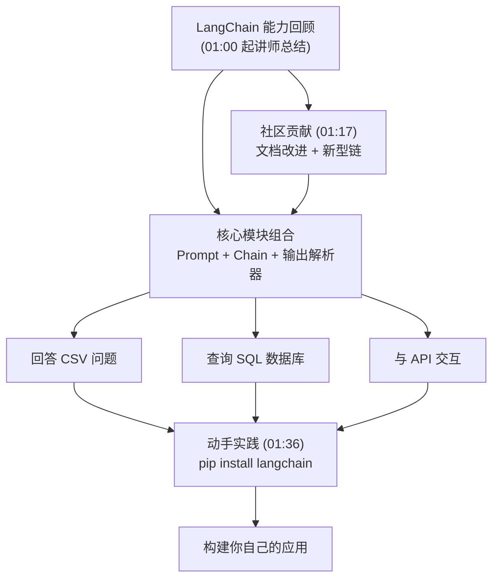

# 第8集：LangChain 课程总结与展望

## 元信息
- 集数: 8
- 时间范围: 00:00:00 - 00:01:44
- 核心主题: 回顾 LangChain 课程内容，感谢社区贡献，并鼓励动手实践开发应用
- 学习目标:
  - 回顾课程覆盖的 LangChain 核心能力（链、Prompt、输出解析器等的组合）
  - 认识 LangChain 社区在文档与新型链上的贡献价值
  - 落地行动：安装并使用 LangChain 构建自己的应用

## 第一性原理拆解
- 底层本质: LangChain 的价值在于把「大语言模型的调用」拆成一个个可复用的模块（链、Prompt、输出解析器），再通过组合这些模块搭建复杂应用；本集把这一思想做收束式回顾。
- 核心逻辑: 单个模块能力有限，但把「Prompt（提问模板）+ Chain（链，把步骤串起来）+ Output Parser（输出解析器，把模型回复变成结构化数据）」组合起来，就能应对回答 CSV 问题、查询 SQL 数据库、调用 API 等各种真实任务。
- 推导过程: 明确任务（如查数据库）→ 选择合适的链与组合方式 → 用 Prompt 引导模型、用输出解析器规范结果 → 把多个链拼接完成整个流程 → 借助社区已有的链和文档降低起步门槛 → 亲自动手实践形成能力闭环。

## 核心知识点详解
- **课程能力总览**：字幕原文提到 LangChain 可以「回答关于 CSV 的问题、查询 SQL 数据库、与 API 交互」，这些都是通过链（Chains）与「Prompt + 输出解析器 + 更多链」的组合来实现的。**链（Chain）** 就是把多个处理步骤串成一条流水线；**Prompt** 是给模型的提问模板；**输出解析器（Output Parser）** 负责把模型返回的自然语言变成程序可用的结构化结果。
- **社区的力量**：讲师特别感谢 LangChain 社区的贡献。贡献分两类：一是**改进文档**，让新手更容易上手（getting started 更简单）；二是**贡献新型的链（new types of chains）**，从而「打开一个全新的可能性世界」。这说明 LangChain 是一个持续演进的开源生态，学会用它也要学会借力社区。
- **行动号召**：本集是全课程的 Conclusion（结论），落点是「行动」。讲师建议学员打开自己的电脑，运行 `pip install langchain`，然后真正去构建一些出色的应用。学习的终点不是看完，而是动手做出来。

## 实操步骤指南
本集为课程总结课，没有新的代码演示，唯一的实操动作是安装 LangChain 环境。

```bash
# 讲师在结尾建议的唯一动作：安装 LangChain
pip install langchain
```

安装后建议的学习路径（基于本集回顾的能力清单）：
1. 回顾前几集学过的模块：Prompt 模板、输出解析器、各种 Chain。
2. 选一个真实场景练手，例如：回答 CSV 数据问题 / 查询 SQL 数据库 / 调用外部 API。
3. 用「Prompt + Chain + 输出解析器」组合搭建流程。
4. 遇到需求时先查 LangChain 社区文档，复用已有的链。

## 配套可视化图（Mermaid）



## 常见踩坑与避坑（学习建议）
- **只看不练**：本集核心诉求就是动手。看完课程若不打开电脑运行 `pip install langchain` 亲自搭一个应用，知识很快就会遗忘，务必做一个小项目落地。
- **忽视社区资源**：不要事事从零造轮子。LangChain 社区已经贡献了大量现成的链和文档，遇到「查数据库、调 API」这类常见需求时，先查社区已有实现，能大幅降低起步成本。

## 课后练习
结合本集回顾的三类能力（CSV 问答 / SQL 查询 / API 调用），任选其一，用「Prompt + Chain + 输出解析器」的组合动手实现一个最小可运行的 LangChain 小应用，并写下你在过程中查阅了哪些社区文档或复用了哪些现成的链。
