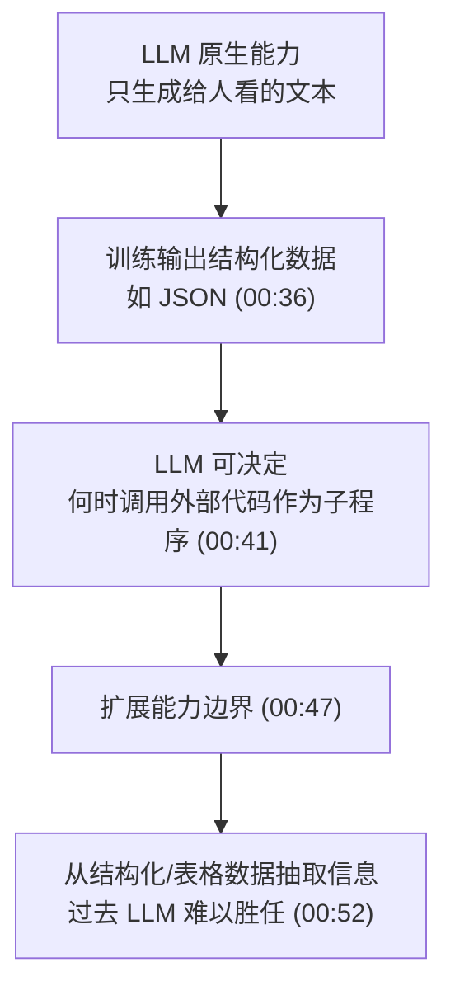
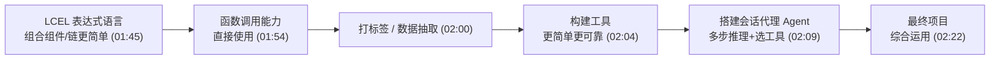

# 第9集：课程导论——用 LangChain 玩转函数、工具与代理

## 元信息
- 集数: 9
- 时间范围: 00:00:00 --> 00:02:50
- 核心主题: 本集是第二门课程《Functions, Tools and Agents with LangChain》的开场介绍，由 Andrew Ng（吴恩达）与 LangChain 联合创始人兼 CEO Harrison Chase 对谈，说明大语言模型（LLM）如何通过"函数调用"与现有软件基础设施打通，并预告本课要讲的 LCEL、函数调用、工具与代理。
- 学习目标:
  - 理解为什么 LLM 需要"函数调用（function calling）"能力，以及它如何扩展 LLM 的用途。
  - 了解本课两大重点更新：LangChain 表达式语言（LCEL）和 OpenAI 函数调用能力。
  - 建立对本课整体路线的认识：从函数调用 → 打标签/抽取 → 构建工具 → 搭建会话代理（Agent）。

## 第一性原理拆解
- 底层本质: LLM 最初被设计成"面向人类生成自然语言文本"。但只会输出给人看的文字，无法直接驱动软件。要让 LLM 真正接入现有软件系统，它必须能输出"机器可读的结构化数据"（例如 JSON），从而让程序知道"何时该调用哪段代码"。
- 核心逻辑: 把 LLM 从"文字生成器"升级为"决策路由器"。当 LLM 能输出格式化数据时，它就能决定"要不要调用某个外部函数（子程序）"、"传什么参数"，进而去获取更多信息或执行动作。这就是 OpenAI 所命名的"函数调用（function calling）"。
- 推导过程:
  1. 问题：LLM 只会跟人聊天，怎么让它跟我们已有的软件基础设施交互？
  2. 手段：训练部分 LLM 输出结构化数据（如以 JSON 存储的值）。
  3. 结果：LLM 可以决定"何时把其他代码当作子程序来调用"。
  4. 收益：显著扩展 LLM 的能力边界，例如从结构化/表格数据中抽取信息（这类任务过去 LLM 一直做得不好）。
  5. 落地：函数调用让"为 LLM 构建工具"变得更简单、更可靠，工具再组合起来就能搭出能做多步推理的代理（Agent）。

## 核心知识点详解
- **LLM（大语言模型）**: 用自然语言与人类交互的模型，催生了大量新应用。但原生设计只面向"给人看的文本输出"，因此在直接对接软件系统上有天然短板。
- **函数调用（Function Calling）**: OpenAI 命名的新能力。让 LLM 能自主决定"何时调用一个不同的程序/函数"，去获取更多信息或采取行动。字幕中 Harrison 明确指出这对使用 LLM 的开发者非常有帮助。
- **结构化数据输出（如 JSON）**: 函数调用的技术基础。部分 LLM 被训练成可以输出格式化数据（如以 JSON 存储的值），这样程序才能明确解析并把"调用其他代码作为子程序"这件事变得容易。
- **LangChain**: 一个开源库，帮助开发者"弥合传统软件与 LLM 之间的鸿沟"。它支持任意多种 LLM，提供 500+ 个集成（语言模型、向量库、工具），同时支持记忆（memory）、链（chains）和代理（agents）。
- **LCEL（LangChain 表达式语言，LangChain Expression Language）**: 本课的第一大变化。让"组合各个组件或链"变得更简单、更直观。
- **工具（Tools）**: 借助函数调用，为 LLM 构建工具变得更简单、更可靠。课程中会先构建一些工具，再用它们来搭建会话代理。
- **代理（Agents）**: 能进行复杂的多步推理，并能自主选择合适的工具来使用与解决问题。是本课与最终项目的核心落地形态。
- **打标签 / 抽取（Tagging / Extracting）**: 函数调用的典型应用。可以用它完成给数据打标签或抽取信息等任务。

## 实操步骤指南
> 本集为课程导论对谈，字幕中未出现具体代码。以下用纯概念方式还原本课后续将要涵盖的学习路线（严格依据字幕描述，不编造代码）。

本课程规划的学习路径（依据字幕）：
1. 理解并直接使用"函数调用"能力（learn how to use that directly）。
2. 用函数调用完成"打标签（tagging）"或"数据抽取（extracting data）"等任务。
3. 利用函数调用构建 LLM 工具（building tools），使其更简单、更可靠。
4. 使用这些工具搭建一个会话代理（conversational agent）。
5. 让代理执行复杂的多步推理，并自主选择工具解决问题。
6. 在最终项目（final project）中综合运用以上所有要素。

本课两大更新（字幕原文要点）：
- LCEL：让组合组件/链更简单、更直观。
- 函数调用：利用 OpenAI 新能力，并展示其在打标签、数据抽取等任务上的用法。

## 配套可视化图（Mermaid）

图1：LLM 从"文字生成器"到"可调用外部代码"的演进逻辑（对应 00:28 - 00:55）

图2：本课程学习路线（对应 01:45 - 02:22）

## 常见踩坑与避坑
- 误以为"函数调用"是 LLM 真的替你执行了代码。实际上 LLM 只负责"决定何时调用、输出结构化参数（如 JSON）"，真正的调用与执行仍由你的程序完成，LLM 扮演的是"决策/路由"角色。
- 直接把结构化/表格数据抽取任务丢给普通文本提示。字幕明确指出这类任务 LLM 历来做得不好；应改用函数调用的结构化输出方式来提升可靠性。
- 把 LCEL 和函数调用当成同一件事。它们是本课两个独立的重点：LCEL 解决"组件/链如何优雅组合"，函数调用解决"LLM 如何与外部代码交互"。

## 课后练习
1. 用自己的话解释：为什么"让 LLM 输出 JSON 等结构化数据"是实现函数调用的关键前提？它相比"只输出自然语言文本"多解决了什么问题？
2. 依据本集介绍的学习路线，画出/写出从"函数调用"到"会话代理"的完整链路，并为每一步举一个可能的现实应用场景（如打标签、数据抽取、工具调用等）。
