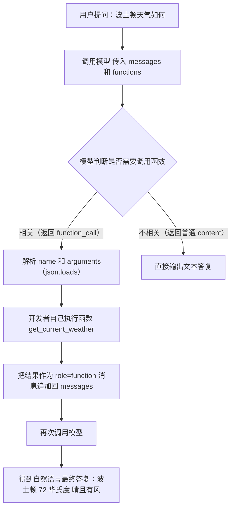
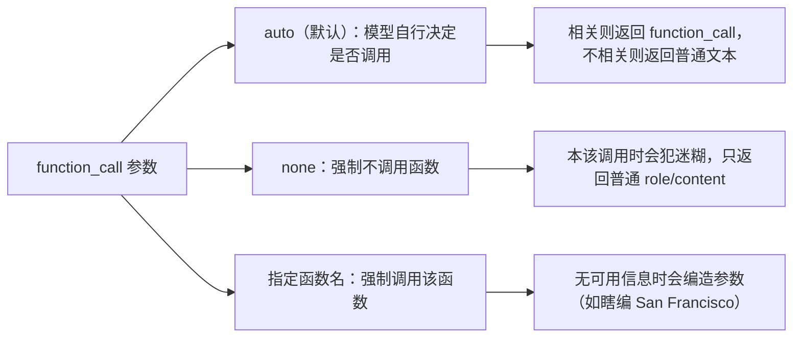

# 第10集：OpenAI 函数调用（Function Calling）

## 元信息
- 集数: 10
- 时间范围: 00:00:00 - 00:13:29
- 核心主题: 讲解 OpenAI API 新增的"函数调用"能力，让语言模型判断是否需要调用外部函数、以及应传入什么参数。
- 学习目标:
  - 理解函数调用是什么、为什么需要它（把语言模型连接到外部函数以补充实时信息）。
  - 掌握如何定义函数、把函数传给模型、解析模型返回的函数调用结果。
  - 学会用 `function_call` 参数控制模型行为（auto / none / 强制指定函数），并把函数执行结果回传给模型得到自然语言回复。

## 第一性原理拆解
- 底层本质: 语言模型本身只会"生成文本"，无法获取实时信息（如当前天气）。函数调用的本质是：OpenAI 对较新的模型做了微调（fine-tune），使模型能够输出"结构化的意图"——判断"要不要调某个函数"以及"该用什么参数调"，从而把模型和外部世界连接起来。
- 核心逻辑: 你把一组函数的"定义"（名字、描述、参数结构）作为新的参数 `functions` 传给模型；模型不会真正执行函数，它只返回"应该调用哪个函数 + 参数是什么"，真正的执行由你自己的代码完成，再把执行结果回传给模型生成最终回答。
- 推导过程:
  1. 模型缺少实时/外部数据 → 需要连接外部函数。
  2. 但模型只能输出文本 → 让它输出"函数名 + JSON 参数"这种结构化文本。
  3. 模型如何知道有哪些函数、何时用 → 靠传入的函数 `description` 和参数 `description`，模型据此判断。
  4. 模型不执行函数 → 开发者拿到结果自己执行函数。
  5. 想得到通顺的自然语言答案 → 把函数执行结果作为一条 `role=function` 的消息再喂给模型。

## 核心知识点详解

- **函数调用（Function Calling）**：OpenAI 几个月前新增的能力。OpenAI 对最近的模型（截图中为 `gpt-3.5-turbo-0613` 和 `gpt-4-0613`）做了微调，使它们能接受额外参数，并判断"是否需要调用某个函数"以及"参数应该是什么"。

- **`functions` 参数**：这是传给模型的新参数，值是一个"函数定义列表"。示例里只传了一个函数，所以列表里只有一个元素。

- **函数定义（Function Definition）**：是一个 JSON 对象，包含：
  - **`name`**：函数名称。
  - **`description`**：对函数的自然语言描述，告诉模型这个函数是干什么的。
  - **`parameters`**：参数对象，里面有 **`properties`**（也是一个对象）。本例中有两个属性：`location`（字符串）和 `unit`。
  - **`unit`** 用 **`enum`（枚举）** 限定只能是 `celsius` 或 `fahrenheit`。
  - **`required`**：本例中唯一必填的是 `location`。

- **`description` 的重要性**：函数的 `description` 和各参数的 `description` 会直接传给模型，模型正是靠这些描述来判断"要不要调用、怎么调用"。因此任何你希望模型据此决策的信息，都应写进描述里。

- **模型的返回结构**：当模型决定调用函数时，返回的消息里 `role` 是 `assistant`，`content` 为 `null`（空），并多出一个 **`function_call`** 对象，里面有两个字段：
  - `name`：要调用的函数名（与传入的函数名一致）。
  - `arguments`：一个 JSON 字符串（可用 `json.loads` 解析成 Python 字典）。

- **模型不真正执行函数**：函数调用只告诉你"调哪个函数、用什么参数"，实际执行仍需你自己完成。

- **JSON 并非严格保证**：模型虽被训练成返回 JSON，但并非严格强制。若用 `json.loads` 解析报错，那属于模型侧的问题，生产中应加保护措施（safeguards）。

- **`function_call` 控制参数**（控制模型是否调用函数）：
  - **`auto`（默认）**：由模型自行决定是否调用函数。
  - **`none`**：强制模型不使用任何函数。此时若消息本该调用函数，模型会"犯迷糊"，只返回普通的 role/content。
  - **指定函数名（如 `{"name": "get_current_weather"}`）**：强制模型调用指定函数。若消息里根本没有可用信息，模型会"编造"参数（例如反复瞎编 San Francisco, California）。

- **Token 消耗**：函数定义和描述会计入你发给 OpenAI 的 token 用量。示例中带函数时 prompt tokens 为 89，注释掉 `functions` 和 `function_call` 后降到 15。因此除了关注消息长度，也要关注函数定义的长度（模型有 token 上限）。

- **把函数结果回传模型**：常见流程是——用模型决定调哪个函数 → 自己执行函数 → 把结果作为一条新消息回传给模型 → 得到自然语言的最终答复。这条回传消息用一种新类型：**`role="function"`**，并带上 `name`（函数名）和 `content`（函数返回的观测结果 observation）。

## 实操步骤指南

> 以下代码基于字幕描述还原（字幕未逐字念出所有代码，属基于讲解的合理复现），核心流程忠实于本集讲解。

```python
import os
import openai
import json

# 1) 加载环境变量中的 OpenAI API Key
openai.api_key = os.environ["OPENAI_API_KEY"]

# 2) 定义一个"有意思"的函数：获取当前天气（OpenAI 官方示例）
#    本例中返回信息是写死的，生产中这里可以调用真实天气 API
def get_current_weather(location, unit="fahrenheit"):
    """Get the current weather in a given location"""
    weather_info = {
        "location": location,
        "temperature": "72",
        "unit": unit,
        "forecast": ["sunny", "windy"],
    }
    return json.dumps(weather_info)

# 3) 定义要传给模型的函数列表（函数定义）
functions = [
    {
        "name": "get_current_weather",
        "description": "Get the current weather in a given location",
        "parameters": {
            "type": "object",
            "properties": {
                "location": {
                    "type": "string",
                    "description": "The city and state, e.g. San Francisco, CA",
                },
                "unit": {
                    "type": "string",
                    "enum": ["celsius", "fahrenheit"],
                },
            },
            "required": ["location"],
        },
    }
]

# 4) 构造消息（与天气相关，触发函数调用）
messages = [
    {"role": "user", "content": "What's the weather like in Boston?"}
]

# 5) 调用 chat completion，传入较新的、支持该能力的模型
response = openai.ChatCompletion.create(
    model="gpt-3.5-turbo-0613",
    messages=messages,
    functions=functions,
)

# 6) 查看返回：content 为 null，多出 function_call（name + arguments）
response_message = response["choices"][0]["message"]

# 7) arguments 是 JSON 字符串，用 json.loads 解析并直接传给真实函数
args = json.loads(response_message["function_call"]["arguments"])
observation = get_current_weather(args)  # 由开发者自己执行
```

控制模型是否调用函数（`function_call` 参数）：

```python
# 默认：auto，由模型决定
openai.ChatCompletion.create(model=..., messages=..., functions=functions,
                             function_call="auto")

# none：强制不调用函数
openai.ChatCompletion.create(model=..., messages=..., functions=functions,
                             function_call="none")

# 强制调用指定函数
openai.ChatCompletion.create(model=..., messages=..., functions=functions,
                             function_call={"name": "get_current_weather"})
```

把函数执行结果回传给模型，得到自然语言答复：

```python
# 1) 先让模型返回带 function_call 的消息，并追加到消息列表
messages.append(response_message)

# 2) 执行函数得到 observation
observation = get_current_weather(args)

# 3) 追加一条 role=function 的新消息，name 为函数名，content 为函数返回结果
messages.append({
    "role": "function",
    "name": "get_current_weather",
    "content": observation,
})

# 4) 再次调用模型，得到通顺的自然语言回答
#    例如："The current weather in Boston is 72 degrees Fahrenheit with a sunny and windy forecast."
final = openai.ChatCompletion.create(model="gpt-3.5-turbo-0613", messages=messages)
```

纯概念要点：
- 模型只"决定"调哪个函数、传什么参数；执行由你自己做。
- 用 `function_call` 三种模式（auto / none / 指定函数名）控制模型行为。
- 用 `role="function"` 的消息把结果回传，形成"提问 → 决定调函数 → 执行 → 回传 → 生成最终答复"的闭环。

## 配套可视化图（Mermaid）

图1：函数调用完整闭环（对应时间点 00:10:38 - 00:12:56，"把函数结果回传模型"部分）



图2：`function_call` 三种控制模式（对应时间点 00:07:05 - 00:09:30）



## 常见踩坑与避坑

- **误以为模型会自动执行函数**：函数调用只返回"函数名 + 参数"，模型不会真正运行函数，执行必须由你自己的代码完成，否则拿不到结果。
- **直接 `json.loads` 不做保护**：模型返回的 arguments 虽通常是 JSON，但并非严格强制。解析可能报错（属模型侧问题），生产中应加异常处理/校验等 safeguards。
- **忽视函数定义占用 token**：`functions` 和描述会计入 prompt token（示例中从 15 涨到 89）。构造请求时要同时留意消息长度和函数定义长度，避免超出模型 token 上限。
- **强制调用/强制不调用用错场景**：用 `none` 时若消息本该调函数会让模型迷糊；强制指定函数但消息里没有信息时，模型会编造参数。要按需选择 auto / none / 指定函数名。

## 课后练习

1. 定义一个你感兴趣的新函数（例如"查询股票价格"或"发送邮件"），写出它的完整函数定义（name、description、parameters、required），传给模型并用不同输入消息测试：分别观察 `function_call` 为 `auto`、`none`、以及强制指定函数名时模型的返回有何不同。
2. 实现完整闭环：让模型决定调用你的函数并给出参数 → 自己执行该函数 → 用 `role="function"` 的消息把结果回传 → 再次调用模型，验证它能否把函数结果转成通顺的自然语言答复。
