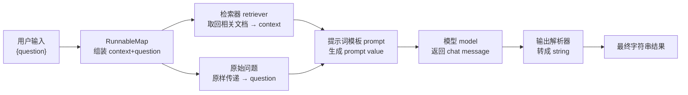
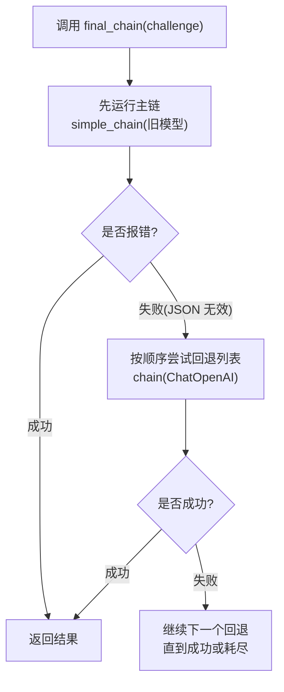

# 第11集：LCEL（LangChain 表达式语言）——用管道符组装链

## 元信息
- 集数: 11
- 时间范围: 00:00:00 --> 00:16:47
- 核心主题: LCEL（LangChain Expression Language）是一种用「管道符 `|`」把不同组件（提示词、模型、解析器等）组合成链和代理的新语法，让构建过程更简单、更透明。
- 学习目标:
  1. 理解 Runnable（可运行对象）协议：统一的输入/输出类型、标准方法（invoke/stream/batch 及其异步版本）与输入/输出 schema。
  2. 掌握用管道符 `|` 组合链的方法，并能搭建「提示词 → 模型 → 输出解析器」和 RAG 检索问答链。
  3. 学会 LCEL 的进阶能力：绑定参数（bind）、添加回退（fallbacks）、以及批处理/流式/异步等开箱即用特性。

## 第一性原理拆解
- 底层本质: LangChain 的强大之处在于「把不同组件组合成链」。LCEL 通过定义一个统一的 **Runnable 协议**，让每个组件都遵守相同的接口约定（同样的输入类型、输出类型和调用方法），于是任意组件都能像乐高一样拼接。
- 核心逻辑: 既然所有组件都暴露相同的标准方法，就可以用一个统一的连接符把它们串起来。LCEL 借用了 **Linux 管道符 `|`** 的语法——前一个组件的输出，自动成为后一个组件的输入。
- 推导过程:
  1. 定义协议：规定「允许的输入类型集合」和「对应的输出类型集合」，再规定所有 Runnable 都暴露的标准方法。
  2. 统一调用：因为方法统一，所以 `invoke`（单条）、`batch`（多条）、`stream`（流式）以及它们的异步版本 `ainvoke` 等，对任何链都能用同样方式调用。
  3. 自由组合：因为接口统一，就能用 `组件A | 组件B | 组件C` 的方式组合，甚至能给单个组件或整条链附加 fallback、绑定运行时参数。
  4. 附赠红利：统一协议后，异步/批处理/流式支持、并行执行、日志记录（含 LangSmith 调试平台）都可以「开箱即用」。

## 核心知识点详解

- **LCEL（LangChain 表达式语言）**：一种新语法，用来更简单、更透明地构建和使用各种链与代理。核心是用管道符 `|` 组合组件。

- **Runnable（可运行对象）协议**：一套约定，规定了组件必须遵守的三件事——(1) 允许的输入类型与对应的输出类型；(2) 一组所有 Runnable 都会暴露的标准方法（因此可以用同样的方式调用）；(3) 支持在运行时修改参数、添加 fallback 等能力。

- **标准方法**（每个 Runnable 都有）：
  - **invoke**：在「单个输入」上调用，同步返回结果。
  - **stream**：在「单个输入」上调用，以流式（一段一段）方式返回响应。
  - **batch**：在「一批输入（列表）」上调用；底层会尽量并行执行。
  - **异步版本**：每个同步方法都有对应的异步方法，如 `ainvoke`、`astream`、`abatch`。

- **输入/输出 schema（结构说明）**：所有 Runnable 都有共同的属性——`input_schema` 和 `output_schema`，用来描述该组件期望的输入结构和产出的输出结构。

- **使用 LCEL 的四大好处**：
  1. **异步、批处理、流式开箱即用**：即使你先用同步版本写代码测试，也能轻松移植到需要批处理/异步/流式的生产服务器。
  2. **回退（fallbacks）机制**：LLM 有时不稳定、不按预期回答，可以给单个 LLM 甚至整条链附加 fallback，作为安全兜底。
  3. **并行（parallelism）**：LLM 调用往往耗时，LCEL 让并行执行变得简单。
  4. **内置日志**：链和代理越复杂，越需要看到每一步的输入输出。LCEL 原生记录这些信息，配合 **LangSmith** 平台做日志与调试。

- **bind（绑定参数）**：可以给 Runnable 预先绑定参数。例如把 OpenAI functions 绑定到模型上（`model.bind(functions=functions)`），当模型被调用时，这些参数会一起传给底层调用。想更换时直接重新绑定即可。

- **with_fallbacks（附加回退）**：从一条主链开始，用 `.with_fallbacks([...])` 传入一个备用 Runnable 列表。先运行主链；若报错，就按顺序尝试列表里的备用链，直到成功为止。

## 实操步骤指南

### 1. 环境准备与组件导入
```python
# 设置环境（同前几集）
# 导入三个要组合的组件
from langchain.prompts import ChatPromptTemplate
from langchain.chat_models import ChatOpenAI
from langchain.schema.output_parser import StrOutputParser
# 输出解析器很简单：把聊天消息（chat message）转换成字符串（string）
```

### 2. 搭建最简单的链：提示词 → 模型 → 输出解析器
```python
# 创建一个让模型讲个短笑话的提示词模板
prompt = ChatPromptTemplate.from_template(
    "tell me a short joke about {topic}"
)
model = ChatOpenAI()
output_parser = StrOutputParser()

# 用管道符把三者组合成一条链
chain = prompt | model | output_parser

# 用 invoke 调用，输入是提示词模板的变量（字典，键为 topic）
chain.invoke({"topic": "bears"})
# 输出示例：Why don't bears ever get caught in traffic?
#           Because they always take the beariest best routes.
```

### 3. 用 LCEL 复现 RAG（检索增强生成）
```python
from langchain.embeddings import OpenAIEmbeddings
from langchain.vectorstores import DocArrayInMemorySearch

# 3.1 用两条文本初始化一个简单向量库，并配置嵌入模型
vectorstore = DocArrayInMemorySearch.from_texts(
    ["harrison worked at kensho", "bears like to eat honey"],
    embedding=OpenAIEmbeddings()
)
retriever = vectorstore.as_retriever()

# 提醒：可以直接调用 retriever 取回相关文档
retriever.get_relevant_documents("where did harrison work")
retriever.get_relevant_documents("what do bears like to eat")

# 3.2 创建 RAG 提示词，含 context 与 question 两个变量
template = """Answer the question based only on the following context:
{context}

Question: {question}
"""
prompt = ChatPromptTemplate.from_template(template)

# 3.3 用 RunnableMap 把「单个问题」转成含 context 和 question 的字典
from langchain.schema.runnable import RunnableMap

chain = RunnableMap({
    # context：调用检索器取相关文档
    "context": lambda x: retriever.get_relevant_documents(x["question"]),
    # question：把原始问题原样传下去
    "question": lambda x: x["question"]
}) | prompt | model | output_parser

chain.invoke({"question": "where did harrison work"})
# 输出：Harrison worked at Kensho.

# 3.4 单独观察 RunnableMap 的中间产物
inputs = RunnableMap({
    "context": lambda x: retriever.get_relevant_documents(x["question"]),
    "question": lambda x: x["question"]
})
inputs.invoke({"question": "where did harrison work"})
# 得到 {"context": [文档列表], "question": "..."}
```

### 4. 绑定参数（bind）——让模型带上 OpenAI functions
```python
functions = [
    {
        "name": "weather_search",
        "description": "Search for weather given an airport code",
        "parameters": {
            "type": "object",
            "properties": {"airport_code": {"type": "string", "description": "The airport code"}},
            "required": ["airport_code"]
        }
    }
]

# 用 bind 把 functions 绑到模型上
runnable = prompt | model.bind(functions=functions)
runnable.invoke({"input": "what is the weather in sf"})
# 返回的 AI message 里带有 additional_kwargs，里面是预期的 function_call

# 想更换/新增函数（如加入 sports_search），重新绑定即可
model = model.bind(functions=functions)  # functions 中已加入 sports_search
runnable = prompt | model
runnable.invoke({"input": "how did the patriots do yesterday"})
# 现在会正确选择使用 sports_search
```

### 5. 添加回退（fallbacks）——旧模型输出 JSON 失败时兜底
```python
import json
from langchain.llms import OpenAI  # 注意：这是旧的 LLM，非 chat 模型

# 5.1 用旧模型故意制造失败：老模型不擅长输出合法 JSON
simple_model = OpenAI(temperature=0, max_tokens=1000, model="text-davinci-001")
simple_chain = simple_model | json.loads  # 若输出非合法 JSON 会报错

challenge = "write three poems in a json blob, where each poem is a json blob of a title, author, and first line"
# simple_model.invoke(challenge) 结果结构接近但 json.loads 会抛 JSONDecodeError

# 5.2 新模型能正确输出合法 JSON
chain = ChatOpenAI(temperature=0) | StrOutputParser() | json.loads

# 5.3 组装带 fallback 的最终链：先跑 simple_chain，失败则回退到 chain
final_chain = simple_chain.with_fallbacks([chain])
final_chain.invoke(challenge)
# 主链失败 → 回退到基于 ChatOpenAI 的好链 → 成功，返回正确格式
```

### 6. Runnable 统一接口的四种调用方式
```python
# 回到讲笑话的 chain：prompt | model | output_parser
chain.invoke({"topic": "bears"})                       # 单条，同步

chain.batch([{"topic": "bears"}, {"topic": "frogs"}])  # 多条，底层尽量并行

for t in chain.stream({"topic": "bears"}):             # 流式，返回可迭代对象
    print(t)

await chain.ainvoke({"topic": "bears"})                # 异步版本，需 await
```

## 配套可视化图（Mermaid）

图1：LCEL 管道链的数据流（对应 00:03:44「组装 prompt|model|output_parser」～00:09:04「最终返回字符串」）


图2：with_fallbacks 回退机制的执行顺序（对应 13:27～14:49）


## 常见踩坑与避坑
1. **旧模型不擅长结构化输出**：`langchain.llms` 里的旧模型（如 text-davinci-001）常常输出「看起来像但其实非法」的 JSON，直接 `json.loads` 会抛 `JSONDecodeError`。新的 chat 模型（ChatOpenAI）对输出合法 JSON 好很多；生产上建议用新模型并配 `with_fallbacks` 兜底。
2. **RunnableMap 的 lambda 取值要对齐字典键**：链的输入是字典（如 `{"question": ...}`），lambda 里必须用 `x["question"]` 取值；键名对不上会导致检索器拿不到问题或提示词变量缺失。
3. **chat 模型与普通 LLM 的输出类型不同**：chat 模型返回的是 chat message（需要输出解析器转成字符串），普通 LLM 直接返回字符串。混用时若忘记加/去掉 `StrOutputParser`，后续 `json.loads` 或字符串处理会报类型错误。

## 课后练习
1. 用管道符搭建一条「讲笑话」的链（prompt | model | output_parser），分别用 `invoke`、`batch`（传入 bears 和 frogs 两个话题）、`stream`、`ainvoke` 四种方式调用，观察返回结果与体验差异。
2. 尝试把 2～4 个语言模型调用串联成更长的链（例如：先让模型生成一个主题，再据此写笑话，再翻译），并给其中一步加上 `with_fallbacks`。观察当某一步失败时，回退是否按顺序生效。
