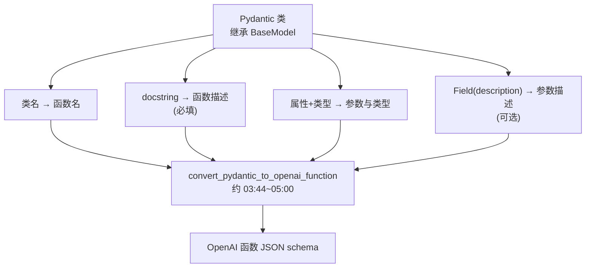
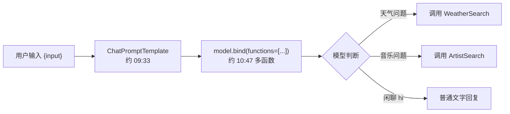

# 第12集：用 Pydantic 生成 OpenAI 函数，并与 LangChain 表达式语言结合

## 元信息
- 集数: 12
- 时间范围: 00:00:00,000 --> 00:12:46,680
- 核心主题: 用 Pydantic 数据校验库定义类，自动转换成 OpenAI 函数的 JSON 描述，并把函数绑定到模型、串进 LangChain 链（LCEL）中使用。
- 学习目标:
  - 理解 Pydantic 是什么，以及它相比普通 Python 类多出的“类型校验”与“导出 JSON schema”能力。
  - 掌握用 `convert_pydantic_to_openai_function` 把 Pydantic 类转成 OpenAI 函数描述。
  - 学会用 `bind` 把函数绑定到模型，并把带函数的模型接入 LCEL 链，让模型在多个函数中自动选择。

## 第一性原理拆解
- 底层本质: OpenAI 函数调用本质上只需要一段“函数描述的 JSON schema”（名字、描述、参数、类型）。这段 JSON 手写又长又容易出错，本课把“写 JSON”变成“写一个带类型标注的 Python 类”，让工具自动生成 JSON。
- 核心逻辑: **类即描述**。Pydantic 类的类名 → 函数名；类的文档字符串（docstring）→ 函数描述；类的属性和类型标注 → 参数及类型；`Field(description=...)` → 参数描述。一次转换即可得到 OpenAI 需要的标准 schema。
- 推导过程: 普通类无类型校验（写错类型也不报错）→ 引入 Pydantic 的 `BaseModel` 获得校验能力 → 发现它还能导出结构化 schema → 于是复用它来“生成”函数描述（类本身不执行任何逻辑，只当描述用）→ 转成函数后绑定到模型 → 再把模型放进链里像普通模型一样调用。

## 核心知识点详解
- **Pydantic**: 一个 Python 数据校验库。它能方便地定义各种数据结构（schema），并且能把 schema 导出成 JSON。本课用它来生成 OpenAI 函数描述。
- **普通 Python 类 vs Pydantic 类**: 普通类靠 `__init__` 接收参数、不做类型检查（把字符串赋给本应是整数的 age 也不报错，这其实是隐患）；Pydantic 类继承 `BaseModel`，直接在类下面列出“属性: 类型”，会自动做类型校验，传错类型会抛出 `ValidationError`。
- **打印友好与嵌套**: Pydantic 对象打印时会清晰列出各字段；还支持**嵌套结构**，例如一个 `Class` 里的 `students` 是 `List[pUser]`（一个 Pydantic 模型的列表）。
- **docstring 作为函数描述（必填）**: LangChain 的转换工具强制要求 Pydantic 类必须有文档字符串，因为它会被填进函数的 `description`。而“函数本质上就是提示词（prompt）”，所以必须给出清晰描述。没有 docstring 会报 `KeyError: 'description'`（见截图 06:14）。
- **Field 与参数描述（可选）**: 用 `Field(description=...)` 给单个参数加描述。参数描述在 LangChain 中是**可选**的，去掉后仍能成功转换，只是生成的 schema 里该参数没有描述。
- **`convert_pydantic_to_openai_function`**: 来自 `langchain.utils.openai_functions`，把 Pydantic 类（传入类本身，不是实例）转成 OpenAI 函数的 JSON schema。
- **`model.bind(functions=...)`**: 把函数“绑定”到模型上，之后直接调用绑定后的模型即可，无需每次都传 `functions` 关键字参数，便于把“模型+函数”当作整体传递。
- **强制调用某函数**: 通过 `bind(functions=..., function_call={"name": "..."})` 强制模型必须调用指定函数（哪怕输入是“hi”也会硬凑参数调用，例如 airport_code=LAX）。
- **多函数自动路由**: 绑定一个函数列表后，模型会根据问题上下文自动选择合适的函数；不强制时，无关输入（如“hi”）会正常文字回复、不调用任何函数。

## 实操步骤指南

1. 加载环境变量并导入 Pydantic 相关类与类型提示。

```python
from pydantic import BaseModel, Field
from typing import List
```

2. 对比普通 Python 类（无校验）：

```python
class User:
    def __init__(self, name, age, email):
        self.name = name
        self.age = age
        self.email = email

# 传入字符串 "bar" 给 age 也不会报错（这是隐患）
foo = User(name="Joe", age="bar", email="joe@gmail.com")
foo.age  # 依然能访问到 "bar"
```

3. 改用 Pydantic 类（带校验）：

```python
class pUser(BaseModel):
    name: str
    age: int
    email: str

foo_p = pUser(name="Jane", age=32, email="jane@gmail.com")
# 传入 age="bar" 会抛出 ValidationError
```

4. 嵌套 Pydantic 模型：

```python
class Class(BaseModel):
    students: List[pUser]

obj = Class(students=[pUser(name="Jane", age=32, email="jane@gmail.com")])
```

5. 定义用于生成函数描述的 Pydantic 类（docstring 必填，参数用 Field 描述）：

```python
class WeatherSearch(BaseModel):
    """Call this with an airport code to get the weather at that airport"""
    airport_code: str = Field(description="airport code to get weather for")
```

6. 转换成 OpenAI 函数描述：

```python
from langchain.utils.openai_functions import convert_pydantic_to_openai_function

weather_function = convert_pydantic_to_openai_function(WeatherSearch)
# 结果是 JSON schema：name=WeatherSearch, description=来自 docstring,
# parameters.properties.airport_code.description=来自 Field, type=string
```

7. 强制校验演示：无 docstring 会报错；无 Field 描述则成功但参数无描述。

```python
class WeatherSearch1(BaseModel):
    airport_code: str = Field(description="airport code to get weather for")
# 缺少 docstring -> KeyError: 'description'

class WeatherSearch2(BaseModel):
    """Call this with an airport code to get the weather at that airport"""
    airport_code: str  # 无 Field 描述 -> 转换成功，但参数没有 description
```

8. 直接调用模型时传入函数，或绑定函数：

```python
from langchain.chat_models import ChatOpenAI

model = ChatOpenAI()
# 方式一：调用时临时传入
model.invoke("what is the weather in SF today?", functions=[weather_function])

# 方式二：绑定后固定携带
model_with_function = model.bind(functions=[weather_function])
model_with_function.invoke("what is the weather in SF?")

# 强制调用指定函数
model_forced = model.bind(
    functions=[weather_function],
    function_call={"name": "WeatherSearch"},
)
```

9. 接入 LCEL 链：

```python
from langchain.prompts import ChatPromptTemplate

prompt = ChatPromptTemplate.from_messages([
    ("system", "You are a helpful assistant"),
    ("user", "{input}"),
])
chain = prompt | model_with_function
chain.invoke({"input": "what is the weather in SF?"})
```

10. 多函数让模型自动选择：

```python
class ArtistSearch(BaseModel):
    """Call this to get the names of songs by a particular artist"""
    artist_name: str = Field(description="name of artist to look up")
    n: int = Field(description="number of results")

functions = [
    convert_pydantic_to_openai_function(WeatherSearch),
    convert_pydantic_to_openai_function(ArtistSearch),
]
model_with_functions = model.bind(functions=functions)

model_with_functions.invoke("what is the weather in SF?")          # -> WeatherSearch
model_with_functions.invoke("what are three songs by Taylor Swift?")  # -> ArtistSearch, n=3
model_with_functions.invoke("hi")                                   # -> 普通文字回复，不调用函数
```

## 配套可视化图（Mermaid）





## 常见踩坑与避坑
- **忘记写 docstring**：转换会抛出 `KeyError: 'description'`（截图 06:14 演示）。任何要转函数的 Pydantic 类都必须有文档字符串，且要写清函数用途（它就是给模型看的提示词）。
- **传实例而不是类**：`convert_pydantic_to_openai_function` 要传入的是类本身（如 `WeatherSearch`），不是初始化后的对象。
- **误以为 Pydantic 类会执行逻辑**：这些类只用来“描述/生成 schema”，本身不做任何计算，真正的函数执行需要你另外实现。
- **普通类的类型陷阱**：普通 Python 类不做类型校验，写错类型不报错；需要校验就用 Pydantic 的 `BaseModel`。

## 课后练习
1. 定义两个 Pydantic 类（如 `WeatherSearch` 和 `ArtistSearch`），分别用 `convert_pydantic_to_openai_function` 转换后 `bind` 到模型；依次输入“旧金山天气如何”“泰勒斯威夫特的三首歌”“hi”，观察模型分别是否调用函数、调用了哪一个、参数是什么。
2. 故意删掉某个 Pydantic 类的 docstring 再执行转换，复现 `KeyError: 'description'`；再删掉 `Field(description=...)`，验证转换仍成功但参数描述为空，体会“函数描述必填、参数描述可选”的规则。
