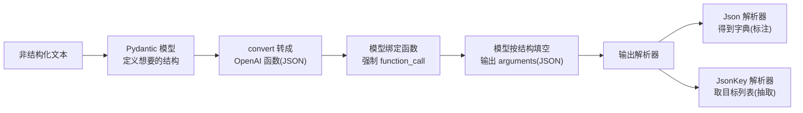
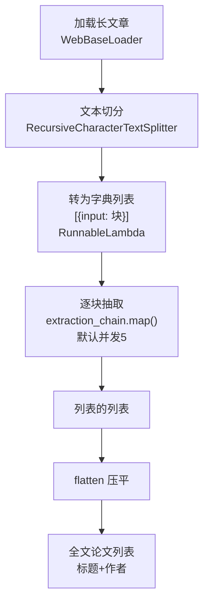

# 第13集：用 OpenAI 函数做标注（Tagging）与抽取（Extraction）

## 元信息
- 集数: 13
- 时间范围: 00:00:00 --> 00:24:14
- 核心主题: 利用 OpenAI 函数（配合 Pydantic 模型）把"非结构化文本"转成"结构化数据"，落地标注与抽取两大典型场景。
- 学习目标:
  - 理解 tagging（标注）与 extraction（抽取）的区别，以及各自适用场景。
  - 掌握"Pydantic 模型 → OpenAI 函数 → 强制函数调用 → 输出解析器"这条完整链路。
  - 能用 LangChain 表达式语言（LCEL）把长文档切分、并行抽取、结果合并，做出一个端到端真实案例。

## 第一性原理拆解
- 底层本质: 大语言模型（LLM）擅长"读懂自然语言"，但它默认吐出的是一段自由文本，程序无法直接使用。OpenAI 函数机制的本质，是给模型一份"结构化的填空表"（JSON schema），逼它把理解结果按固定格式填进去，从而把"人类可读"变成"机器可读"。
- 核心逻辑: 你先用 Pydantic 定义"想要的数据长什么样"（字段名 + 类型 + 描述），把它转成 OpenAI 函数描述传给模型；再通过 `function_call` 强制模型必须调用这个函数，于是模型输出的参数就一定符合你的结构；最后用输出解析器把 JSON 参数剥出来，得到干净的 Python 对象。
- 推导过程:
  1. 想要结构化输出 → 需要告诉模型"结构是什么" → 用 Pydantic 类的字段 `description` 来描述结构（这些描述会被送进模型）。
  2. 模型可能选择不调用函数或答非所问 → 用 `function_call={"name": ...}` 强制它每次都调用指定函数。
  3. 模型返回的结果里包裹了 `function_call / arguments` 等无用外壳 → 用 `JsonOutputFunctionsParser` 把 arguments 解析成字典。
  4. 抽取时结果外层还套了一个容器字段（如 `people`）→ 用 `JsonKeyOutputFunctionsParser` 直接取出目标列表。
  5. 文档太长超出上下文窗口 → 用文本切分器切块，逐块抽取，再把多个列表合并（flatten）。

## 核心知识点详解
- **标注（Tagging）**：给一段文本打上若干"整体性标签"。输入是一段非结构化文本 + 一份结构化描述，模型对全文进行推理，返回**单个**符合该结构的对象。例：判断一句话的情感（sentiment）和语言（language）。
- **抽取（Extraction）**：从文本中找出**多个**具体实体，返回一个**列表**。例：从一篇文章中抽取所有被提到的论文（标题 + 作者）。它和标注很像，区别在于"标注是对全文给一个结论，抽取是找出文中多条条目"。
- **Pydantic 模型作为 schema**：用 `BaseModel` + `Field(description=...)` 定义字段。字段的 `description` 非常关键，它是你与模型沟通"数据形状"的唯一渠道，会被写进函数描述里。例如把情感限定为 `pos/neg/neutral`，语言用 ISO 639-1 代码。
- **convert_pydantic_to_openai_function**：把 Pydantic 类转成 OpenAI 函数所需的 JSON（含 name、description、parameters、properties）。它会自动处理嵌套模型（如 `Information` 里嵌 `Person`），把子模型描述解析进同一个 JSON blob。
- **temperature=0**：标注/抽取希望结果稳定可复现，因此把温度设为 0，让输出尽量确定性（deterministic）。
- **绑定函数并强制调用**：`model.bind(functions=..., function_call={"name": ...})`。因为我们明确知道每次都要走这个函数，所以强制调用它。
- **输出解析器**：
  - `JsonOutputFunctionsParser`：把 AI 消息里的 arguments JSON 解析成字典（content 为 null、function_call 名称等外壳信息我们并不关心）。
  - `JsonKeyOutputFunctionsParser`：进一步只取某个 key（如 `people`、`papers`）对应的列表，得到最纯净的结果。
- **提示词（system message）纠偏**：模型会犯错（如把缺失年龄填成 0、把"文章本身"误当成"文中引用的论文"）。通过更明确的 system message（"没有就别猜，只抽取文中确实存在的，允许返回空列表"）可以显著纠正行为。
- **长文档处理链路**：
  - `WebBaseLoader` 从网页加载文档（来自 langchain document loaders）。
  - `RecursiveCharacterTextSplitter` 递归字符切分，把超长文章切成多块，避免超出 token 窗口。
  - `RunnableLambda` 把普通函数/lambda 包成可在链中拼接的 Runnable；当函数是链的**第一个**元素时必须包装。
  - `.map()`：对上游传来的"列表"逐个套用同一条链，得到"列表的列表"。
  - `flatten`：把列表的列表压平成一维列表。
  - 自动并行：`.map()` 调用抽取链时会自动并行，**默认并发 5 个调用**，加速但非全并行。

## 实操步骤指南

### 一、标注（Tagging）

```python
from typing import List
from pydantic import BaseModel, Field
from langchain.utils.openai_functions import convert_pydantic_to_openai_function

# 1. 定义标注结构：给全文打情感 + 语言两个标签
class Tagging(BaseModel):
    """Tag the piece of text with particular info."""
    sentiment: str = Field(description="sentiment of text, should be pos, neg, or neutral")
    language: str = Field(description="language of text (should be ISO 639-1 code)")

# 转成 OpenAI 函数描述（会得到一个 JSON blob）
tagging_functions = [convert_pydantic_to_openai_function(Tagging)]

from langchain.prompts import ChatPromptTemplate
from langchain.chat_models import ChatOpenAI

# 2. 模型：温度 0，追求确定性
model = ChatOpenAI(temperature=0)

# 3. 提示词：先用一个简单的系统消息
prompt = ChatPromptTemplate.from_messages([
    ("system", "Think carefully, and then tag the text as instructed"),
    ("user", "{input}")
])

# 4. 绑定函数并强制调用 Tagging
model_with_functions = model.bind(
    functions=tagging_functions,
    function_call={"name": "Tagging"}
)

# 5. 组成链并调用
tagging_chain = prompt | model_with_functions
tagging_chain.invoke({"input": "I love LangChain"})
# 结果里 sentiment=positive, language=English，但嵌套在 arguments 外壳里

# 6. 加输出解析器，直接得到干净字典
from langchain.output_parsers.openai_functions import JsonOutputFunctionsParser
tagging_chain = prompt | model_with_functions | JsonOutputFunctionsParser()
tagging_chain.invoke({"input": "non mi piace questo cibo"})
# 意大利语"我不喜欢这食物" -> {"sentiment": "neg", "language": "it"}
```

### 二、抽取（Extraction）

```python
from typing import Optional

# 1. 定义要抽取的实体：一个人
class Person(BaseModel):
    """Information about a person."""
    name: str = Field(description="person's name")
    age: Optional[int] = Field(description="person's age")

# 2. 用一个容器类装"多个人"（抽取要的是列表）
class Information(BaseModel):
    """Information to extract."""
    people: List[Person] = Field(description="List of info about people")

extraction_functions = [convert_pydantic_to_openai_function(Information)]
extraction_model = model.bind(
    functions=extraction_functions,
    function_call={"name": "Information"}
)

# 3. 加提示词纠偏：没提到的不要瞎猜（否则会把缺失年龄填成 0）
prompt = ChatPromptTemplate.from_messages([
    ("system", "Extract the relevant information, if not explicitly provided do not guess. Extract partial info"),
    ("human", "{input}")
])

# 4. 用 JsonKeyOutputFunctionsParser 直接取 people 列表
from langchain.output_parsers.openai_functions import JsonKeyOutputFunctionsParser
extraction_chain = prompt | extraction_model | JsonKeyOutputFunctionsParser(key_name="people")
extraction_chain.invoke({"input": "Joe is 30, his mom is Martha"})
# -> [{"name": "Joe", "age": 30}, {"name": "Martha"}]  # Martha 没年龄就不硬填
```

### 三、真实案例：从长文章抽取所有被提到的论文

```python
from langchain.document_loaders import WebBaseLoader

# 1. 加载真实文章（一篇关于自主 Agent 的博客）
loader = WebBaseLoader("https://lilianweng.github.io/posts/2023-06-23-agent/")
documents = loader.load()
doc = documents[0]
page_content = doc.page_content[:10000]  # 先只取前 1 万字符

# 2. 标注：抽取摘要/语言/关键词
class Overview(BaseModel):
    """Overview of a section of text."""
    summary: str = Field(description="Provide a concise summary of the content.")
    language: str = Field(description="Provide the language that the content is written in.")
    keywords: str = Field(description="Provide keywords related to the content.")

# 3. 抽取论文：标题 + 作者
class Paper(BaseModel):
    """Information about papers mentioned."""
    title: str
    author: Optional[str]

class Info(BaseModel):
    """Information to extract"""
    papers: List[Paper]

# 关键：用明确的 system message，避免把"文章本身"当成"文中引用的论文"
template = """An article will be passed to you. Extract from it all papers that are mentioned by this article.
Do not extract the name of the article itself. If no papers are mentioned that's fine - you don't need to extract any!
Just return an empty list.
Do not make up or guess ANY extra information. Only extract what exactly is in the text."""

# 4. 长文档处理链（LCEL）：切分 -> 逐块抽取(.map) -> flatten 合并
from langchain.text_splitter import RecursiveCharacterTextSplitter
from langchain.schema.runnable import RunnableLambda

text_splitter = RecursiveCharacterTextSplitter(chunk_overlap=0)

def flatten(matrix):
    flat_list = []
    for row in matrix:
        flat_list += row
    return flat_list

# 把长文本切块并转为 [{"input": 块}, ...]
prep = RunnableLambda(
    lambda x: [{"input": doc} for doc in text_splitter.split_text(x)]
)

chain = prep | extraction_chain.map() | flatten
chain.invoke(doc.page_content)  # 得到全文所有论文的合并列表
```

> 说明：`extraction_chain.map()` 会对切分出的每一块自动（默认并发 5）调用抽取链，返回"列表的列表"，再由 `flatten` 压平成一维论文列表。字幕中还提到一个有趣现象：如果文章本身在讲"提示词/RAG"并内含伪造的示例论文，模型可能"正确地"把这些假论文也抽出来。

## 配套可视化图（Mermaid）

图1：标注/抽取通用链路（对应 00:00-00:11 讲解）



图2：长文档端到端抽取（对应 17:00-23:40 真实案例）



## 常见踩坑与避坑
- **模型乱填缺失字段**：不给指令时，模型会把没提到的年龄填成 0。避坑：在 system message 明确写"未明确提供就不要猜（if not explicitly provided do not guess）"，并把该字段设为 `Optional`。
- **抽取目标被"文章本身"污染**：抽取"文中引用的论文"时，模型容易把文章标题和作者当成结果。避坑：用更明确的提示词——"抽取文中提到的论文，不要抽取文章本身；没有就返回空列表；只抽文中确有的，不要编造"。
- **函数作为链首元素未包装**：当一个普通函数是链的**第一个**元素时，必须用 `RunnableLambda` 包装，否则无法用 `|` 正确拼接（后续位置的函数则不强制）。
- **长文档超 token 窗口**：整篇直接喂给模型会超出上下文限制。避坑：先切分，再逐块处理并合并结果。

## 课后练习
1. 定义一个 Pydantic 模型，从一段商品评论中同时标注"情感（pos/neg/neutral）"和"是否包含物流投诉（布尔值）"，用 `temperature=0` + 强制函数调用 + `JsonOutputFunctionsParser` 跑通，并至少测试中文、英文两条输入。
2. 换一个真实网页或一份 PDF，改写抽取 schema（例如抽取"公司名 + 融资金额"），用"切分 → `.map()` 抽取 → `flatten`"的 LCEL 链跑全文，并调整 system message 让模型对缺失信息返回空而不是编造。
