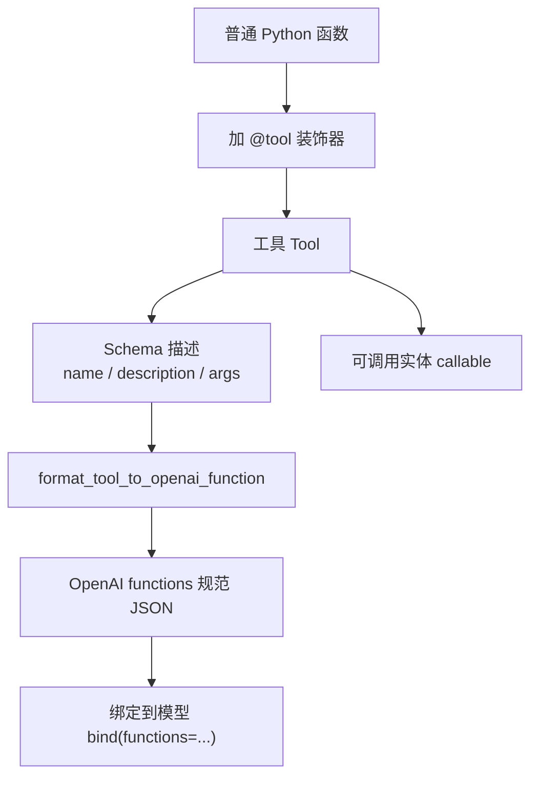
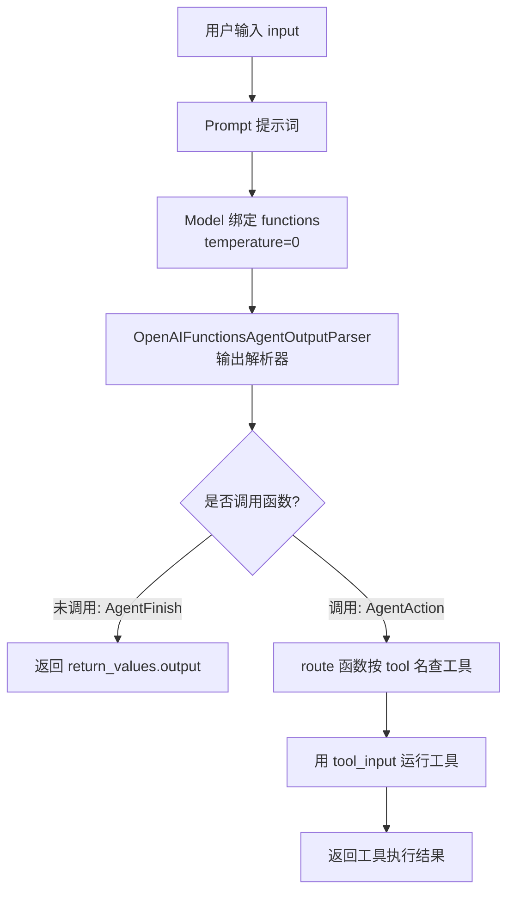

# 第14集：工具（Tools）与路由（Routing）——让大模型选择并调用函数

## 元信息
- 集数: 14
- 时间范围: 00:00:00,000 --> 00:17:15,840
- 核心主题: 用 LangChain 的「工具（Tool）」封装函数，再用大模型自动选择该调用哪个工具并真正执行（路由 Routing）。
- 学习目标:
  1. 理解 LangChain 中「工具（Tool）」的概念——它同时包含「函数的 Schema 描述」和「可被调用的实体」。
  2. 掌握如何用 `@tool` 装饰器把普通 Python 函数变成工具，并用 Pydantic 模型定义清晰的输入 Schema。
  3. 学会用大模型 + 输出解析器 + 路由函数，实现「选择工具 → 解析结果 → 真正执行」的完整链路。

## 第一性原理拆解
- 底层本质: 大模型本身不能执行代码或访问外部世界，它只能「输出文字」。要让它「做事」，必须把「行动能力」拆成两步——先让模型用文字决定「做什么、参数是什么」，再由程序把这个决定翻译成真正的函数调用。
- 核心逻辑: 让语言模型使用函数其实包含两个组件：
  1. 让模型决定「用哪个函数」以及「输入参数应该是什么」；
  2. 真正用这些参数去调用那个函数。
  LangChain 把这两件事合并成一个叫「工具（Tool）」的东西——本质上是「函数的 Schema 定义」（可转成 OpenAI function 规范）加上「一个可调用对象（callable）」。
- 推导过程: 普通函数 → 加 `@tool` 装饰器自动生成 name/description/args → 用 Pydantic 明确输入描述（因为模型正是靠描述来判断参数）→ 转成 OpenAI functions 规范 → 绑定到模型让其选择 → 用输出解析器把结果解析成 AgentAction / AgentFinish → 用 route 函数真正执行对应工具。

## 核心知识点详解
- **工具（Tool）**：LangChain 的核心抽象。它把「函数的 Schema 描述」和「可调用实体」合二为一。Schema 可以转换成 OpenAI function 规范给模型看，callable 则让程序能真正执行。包里内置了搜索、数学、SQL 等工具，但本集重点是「自己创建工具」，因为真实任务往往非常具体，做自己的链和代理时大量依赖自定义工具。
- **`@tool` 装饰器**：从 LangChain 导入，放在函数定义上方，它会自动把函数转成一个 LangChain 工具，让函数拥有 `name`（名称）、`description`（描述）、`args`（参数）。这些信息都会被用来生成 OpenAI functions 定义。
- **输入 Schema（Pydantic 模型 + args_schema）**：可以用 Pydantic 定义一个更明确的输入结构，并在装饰时传入 `args_schema=...`。关键点在于——**模型是靠「输入的描述」来判断参数应该填什么**，所以给参数加上清晰的 `description` 非常重要（比如给 `query` 字段加描述）。
- **`format_tool_to_openai_function`**：来自 `langchain.tools.render`，把一个工具转成 OpenAI functions 期望的 JSON（包含 name、description、parameters/properties）。工具本身仍然是可调用的（callable）。
- **OpenAPI 规范 → OpenAI 函数**：很多功能藏在 API 背后，API 有一套输入输出规范叫 OpenAPI Spec。用 `openapi_spec_to_openai_fn`（配合 `OpenAPISpec` 加载 spec）可以把一份 OpenAPI 规范一次性转成「一组 OpenAI function 定义 + 一组可调用对象」。示例 spec（宠物 API）转出了 3 个函数：`listPets`、`createPets`、`showPetById`。
- **绑定函数（bind functions）与选择**：创建模型时设 `temperature=0`（选函数要尽量确定性），再 `bind` 传入 functions。模型会根据句子自动选函数，例如「what are three pets names」→ 调用 `listPets(limit=3)`；「tell me about pet with id 42」→ 调用 `showPetById(pet_id=42)`。
- **路由（Routing）**：用语言模型决定「走哪条路径」以及「该路径的输入」，然后真正执行那条路径。本集用真实的两个工具（天气 `get_current_temperature` 和维基百科 `search_wikipedia`）来演示。
- **输出解析器 `OpenAIFunctionsAgentOutputParser`**：把模型原始返回（AIMessage，content 为 null、function 信息藏在嵌套字典里）解析成好用的格式，区分「调用函数」还是「普通回复」，并解析出要调用的函数名和输入字典。
- **AgentAction 与 AgentFinish**：解析后结果有两种类型——若模型决定调用工具，结果是 **AgentAction**（有 `result.tool` 和 `result.tool_input`）；若只是普通回复不调工具，结果是 **AgentFinish**（有 `result.return_values`，含 `output`）。判定规则很简单：调用了函数 → AgentAction；没调用只是普通回复 → AgentFinish。
- **route 函数**：作用在模型输出上——若是 AgentFinish，直接返回其 output；若是 AgentAction，则查出对应工具并用 tool_input 真正运行它。

## 实操步骤指南
1. 基础导入与用 `@tool` 定义一个带 Pydantic 输入 Schema 的搜索工具：
```python
from langchain.agents import tool  # 从 LangChain 导入 tool 装饰器
from pydantic import BaseModel, Field

# 用 Pydantic 定义输入 Schema，给参数加清晰描述（模型靠描述判断输入）
class SearchInput(BaseModel):
    query: str = Field(description="Thing to search for")

@tool(args_schema=SearchInput)
def search(query: str) -> str:
    """Search for the weather online."""
    return "42f"

# 装饰后 search 拥有 name / description / args
print(search.name)
print(search.description)
print(search.args)   # 可看到我们传入的参数描述
print(search("sf"))  # 仍然可直接调用，返回 42f（此例底层没真正做事）
```

2. 第一个真实工具——根据经纬度获取当前气温（调用 Open-Meteo API）：
```python
import requests
from pydantic import BaseModel, Field
import datetime

class OpenMeteoInput(BaseModel):
    latitude: float = Field(description="Latitude of the location to fetch weather data for")
    longitude: float = Field(description="Longitude of the location to fetch weather data for")

@tool(args_schema=OpenMeteoInput)
def get_current_temperature(latitude: float, longitude: float) -> dict:
    """Fetch current temperature for given coordinates."""
    # 调用 api.open-meteo.com 的 forecast 接口，取未来 1 天预报的气温
    BASE_URL = "https://api.open-meteo.com/v1/forecast"
    params = {
        'latitude': latitude,
        'longitude': longitude,
        'hourly': 'temperature_2m',
        'forecast_days': 1,
    }
    response = requests.get(BASE_URL, params=params)  # 用 requests 发起请求
    results = response.json()                          # 解析成 JSON
    # 找到预报中最接近当前时间的那个点，取出气温
    # ...（在时间列表中定位最近的时刻，取对应 temperature）
    return f"The current temperature is ... degrees Celsius"

# 查看工具元信息
print(get_current_temperature.name)         # get_current_temperature
print(get_current_temperature.description)  # 含函数签名与 docstring
print(get_current_temperature.args)         # longitude 与 latitude
```

3. 把工具转成 OpenAI functions 定义（截图 05:24 演示的正是此输出）：
```python
from langchain.tools.render import format_tool_to_openai_function

# 转成 OpenAI functions 期望的 JSON：含 name、description、parameters(properties)
format_tool_to_openai_function(get_current_temperature)

# 工具仍可调用，这里会向 Open-Meteo 发真实请求
get_current_temperature({"latitude": 13, "longitude": 14})
```

4. 第二个真实工具——维基百科搜索：
```python
import wikipedia

@tool
def search_wikipedia(query: str) -> str:
    """Run Wikipedia search and get page summaries."""
    page_titles = wikipedia.search(query)     # 搜索得到页面标题列表
    summaries = []
    for page_title in page_titles[:3]:        # 取前三个结果
        wiki_page = wikipedia.page(title=page_title)  # 获取页面详情
        summaries.append(f"Page: {page_title}\nSummary: {wiki_page.summary}")
    return "\n\n".join(summaries)             # 拼接后返回

# 例如查 "langchain"，会返回 LangChain、Prompt engineering、Sentence embeddings 三个页面摘要
```

5. 从 OpenAPI 规范批量生成函数：
```python
from langchain.chains.openai_functions.openapi import openapi_spec_to_openai_fn
from langchain.utilities.openapi import OpenAPISpec

spec = OpenAPISpec.from_text(text)  # 从文本加载 OpenAPI 规范（含 pets 的 get/post、按 id 查询）
pet_openai_functions, pet_callables = openapi_spec_to_openai_fn(spec)
# 得到 3 个函数：listPets、createPets、showPetById（因是虚构 spec，callable 不会真生效）
```

6. 让模型选择函数（绑定 + 温度 0）：
```python
from langchain.chat_models import ChatOpenAI

model = ChatOpenAI(temperature=0).bind(functions=pet_openai_functions)
model.invoke("what are three pets names")     # → 调用 listPets, limit=3
model.invoke("tell me about pet with id 42")  # → 调用 showPetById, pet_id=42
```

7. 用真实工具做路由，并加上解析器 + route 执行：
```python
from langchain.prompts import ChatPromptTemplate
from langchain.agents.output_parsers import OpenAIFunctionsAgentOutputParser
from langchain.schema.agent import AgentFinish

functions = [
    format_tool_to_openai_function(f)
    for f in [search_wikipedia, get_current_temperature]
]
model = ChatOpenAI(temperature=0).bind(functions=functions)

prompt = ChatPromptTemplate.from_messages([
    ("system", "You are helpful but sassy assistant"),
    ("user", "{input}"),
])

# 组合成链：prompt → model → 输出解析器
chain = prompt | model | OpenAIFunctionsAgentOutputParser()

# route 函数：根据结果决定是否真正执行工具
def route(result):
    if isinstance(result, AgentFinish):
        return result.return_values['output']      # 普通回复直接返回
    else:
        tools = {                                   # 名称到工具的映射
            "search_wikipedia": search_wikipedia,
            "get_current_temperature": get_current_temperature,
        }
        return tools[result.tool].run(result.tool_input)  # 查出工具并用输入运行

chain = prompt | model | OpenAIFunctionsAgentOutputParser() | route

chain.invoke({"input": "What is the weather in san francisco right now?"})
# → 'The current temperature is 22.9°C'（见截图 16:27）
chain.invoke({"input": "What is langchain?"})   # → 维基百科摘要大段文本
chain.invoke({"input": "hi!"})                  # → 'hello how can i assist you today'
```

## 配套可视化图（Mermaid）

图1：工具（Tool）的两个组成部分与转换流程（对应 05:24 截图）


图2：选择工具 → 解析 → 路由执行的完整链路（对应 16:27 截图的运行结果）


## 常见踩坑与避坑
1. 输入参数没写清晰描述：模型是靠「输入的描述」来判断参数该填什么，只给类型不给 `description` 会导致取参不准。务必用 Pydantic 的 `Field(description=...)` 把每个参数说明写清楚。
2. 选择函数时用了较高 temperature：选函数应尽量确定性，创建模型时要设 `temperature=0`，否则同样的问题可能路由到不同工具，结果不稳定。
3. 直接拿模型原始输出用：模型返回的是 AIMessage，`content` 可能为 null，函数信息藏在多层嵌套字典里，很难直接用。应加 `OpenAIFunctionsAgentOutputParser` 解析，并区分 AgentAction / AgentFinish 两种情形，否则「没调用工具、只是打招呼」的场景会取不到正常回复。

## 课后练习
1. 参照 `get_current_temperature` 和 `search_wikipedia`，自己再写一个新工具（例如「简单计算器」或「查询某城市时间」），用 `@tool` + Pydantic 输入 Schema，把它加入 `functions` 列表和 `route` 的工具映射中，然后用 `chain.invoke` 测试不同问题能否被正确路由与执行。
2. 分别用「需要工具的问题」（如问天气、问某概念）和「不需要工具的问题」（如打招呼），调用带解析器的链，观察结果类型是 AgentAction 还是 AgentFinish，并打印 `result.tool` / `result.tool_input` 或 `result.return_values` 验证判定规则。
