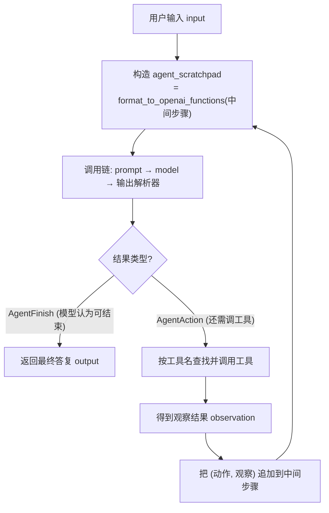
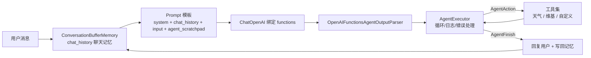

# 第15集：对话代理（Conversational Agent）——把工具与记忆组合成类 ChatGPT 应用

## 元信息
- 集数: 15
- 时间范围: 00:00:00 → 00:16:54
- 核心主题: 把"工具调用（Tool Use）"与"聊天记忆（Chat Memory）"结合，从零手写 Agent 循环，再升级为 LangChain 的 AgentExecutor，最终做出一个能对话、能调工具、带记忆的类 ChatGPT 聊天机器人。
- 学习目标:
  - 理解 Agent 的本质（语言模型 + 代码循环）以及"Agent 循环"和停止条件。
  - 用 LangChain 表达式语言（LCEL）自己搭一个可运行的 Agent 循环，再用 `AgentExecutor` 替代。
  - 加入 `ConversationBufferMemory` 聊天记忆，让机器人记住上下文，并用 panel 做出可交互聊天界面。

## 第一性原理拆解
- 底层本质: **Agent = 语言模型（负责推理"下一步做什么、参数是什么"） + 代码循环（负责真正去执行工具、观察结果）**。语言模型本身不会执行动作，它只输出"意图"；真正的执行、循环、判断何时停止，靠外面的代码。
- 核心逻辑: 一个"决策—执行—观察"的循环：模型选工具 → 代码调用该工具 → 拿回观察结果（observation）→ 把结果再喂回模型 → 重复，直到满足**停止条件**。
- 推导过程:
  1. 单次调用只能选出"该用哪个工具"，无法完成多步任务 → 需要把工具的执行结果再传回模型。
  2. 要传回结果，就得在 prompt 里预留一个位置来放"历史动作 + 观察"→ 引入 `agent_scratchpad`（用 `MessagesPlaceholder` 占位）。
  3. 动作与观察是原始对象，要转成消息列表才能塞回 prompt → 用 `format_to_openai_functions` 把 `(动作, 观察)` 元组列表转成消息。
  4. 把这套逻辑封装进链本身（`RunnablePassthrough.assign`），链只需吃"输入 + 中间步骤"→ 得到可移植的 Agent 链。
  5. 手写循环容易出错、缺日志和错误处理 → 用 LangChain 的 `AgentExecutor` 替代（"加强版"的循环）。
  6. 想要像 ChatGPT 一样多轮对话 → 再加 `chat_history` 占位符 + `ConversationBufferMemory` 记忆。

## 核心知识点详解
- **Agent（代理）**: 语言模型与代码的组合。模型负责推理该走哪一步、输入是什么；代码负责选工具、调工具、看输出，并循环。
- **Agent 循环（Agent Loop）**: 用模型选工具 → 调用工具 → 观察输出 → 重复，直到停止条件满足。
- **停止条件（Stopping Criteria）**: 最常用也最流行的是"让语言模型自己判断何时停"——即上一集讲的 **AgentFinish**（模型直接给出最终答复，就代表结束）。也可以是硬编码规则，比如最大迭代次数。
- **AgentAction vs AgentFinish**: 每轮结果要么是 **AgentAction**（还要继续：包含要调的工具名 + 工具输入 + `message_log`），要么是 **AgentFinish**（结束：包含最终 `output`）。
- **agent_scratchpad（代理草稿区）**: prompt 里的一个 `MessagesPlaceholder`，用来回填"之前调了哪些工具、拿到什么观察结果"的消息列表；第一次调用时传空列表（还没执行过任何动作）。
- **message_log（消息日志）**: 挂在 AgentAction 上的消息列表，记录"如何走到当前这一步"，里面保存了 OpenAI 原始返回的 function_call 消息（含函数名和 JSON 参数），后续可原样放回 scratchpad。
- **FunctionMessage（函数消息）**: 把工具返回的字符串观察结果，包装成"函数消息"（`content` = 观察结果，`name` = 工具名，如 `get_current_temperature`），再传回模型。
- **format_to_openai_functions**: 从 `langchain.agents.format_scratchpad` 导入，把 `[(动作, 观察), ...]` 元组列表转成模型能理解的消息列表；用元组列表是为了支持多步累加。
- **RunnablePassthrough.assign**: 把输入原样透传，同时新增一个字段（这里是 `agent_scratchpad`，其值 = 对 `intermediate_steps` 调用 `format_to_openai_functions`），从而把预处理逻辑塞进链内，让链只需接收 input 和 intermediate_steps，更可移植。
- **AgentExecutor**: LangChain 内置类，是手写 `run_agent` 循环的"加强版"，额外提供：更好的日志、对模型输出非法 JSON 的错误处理、对工具报错的捕获（把错误回传给模型让它纠正）、早停与追踪（tracing）。这套循环与驱动 ChatGPT 的 code interpreter / 插件系统底层非常相似。
- **ConversationBufferMemory（对话缓冲记忆）**: 在内存里维护一份消息列表。设 `return_messages=True` 让它返回"消息列表"（而非字符串），配合 `MessagesPlaceholder`；设 `memory_key="chat_history"` 让返回内容与 prompt 里的 `chat_history` 占位符对齐同步。

## 实操步骤指南

### 1. 准备工具（沿用上一集）
- 导入 `tool` 装饰器；定义"当前天气" `get_current_temperature`、"维基百科搜索" `search_wikipedia` 两个工具；组成工具列表。

```python
from langchain.tools import tool

@tool
def get_current_temperature(...):
    """获取某地当前温度"""
    ...

@tool
def search_wikipedia(query):
    """搜索维基百科"""
    ...

tools = [get_current_temperature, search_wikipedia]
```

### 2. 把工具转成 OpenAI functions 并绑定模型
```python
from langchain.tools.render import format_tool_to_openai_function
from langchain.chat_models import ChatOpenAI
from langchain.prompts import ChatPromptTemplate
from langchain.agents.output_parsers import OpenAIFunctionsAgentOutputParser

functions = [format_tool_to_openai_function(f) for f in tools]
model = ChatOpenAI(temperature=0).bind(functions=functions)

prompt = ChatPromptTemplate.from_messages([
    ("system", "You are helpful but sassy assistant"),
    ("user", "{input}"),
])

chain = prompt | model | OpenAIFunctionsAgentOutputParser()
# 对一个明确指向某工具的输入调用，会返回它推荐使用的工具 + 工具输入
```

### 3. 在 prompt 里加入 agent_scratchpad 占位符
```python
from langchain.prompts import MessagesPlaceholder

prompt = ChatPromptTemplate.from_messages([
    ("system", "You are helpful but sassy assistant"),
    ("user", "{input}"),
    MessagesPlaceholder(variable_name="agent_scratchpad"),
])
```

### 4. 手动跑一轮循环，理解中间过程
```python
# 第一次调用：scratchpad 传空列表（还没有动作）
result1 = chain.invoke({"input": "what is the weather in sf?", "agent_scratchpad": []})
# result1 是 AgentAction：告诉我们要调哪个工具
observation = get_current_temperature(result1.tool_input)  # 得到字符串观察结果

# 把 (动作, 观察) 转成消息列表，回填 scratchpad
from langchain.agents.format_scratchpad import format_to_openai_functions
result2 = chain.invoke({
    "input": "what is the weather in sf?",
    "agent_scratchpad": format_to_openai_functions([(result1, observation)]),
})
# result2 是 AgentFinish：输出 "The current temperature in San Francisco is 22.9 degrees Celsius."
```

### 5. 封装成 run_agent 循环函数
```python
def run_agent(user_input):
    intermediate_steps = []
    while True:
        result = chain.invoke({
            "input": user_input,
            "agent_scratchpad": format_to_openai_functions(intermediate_steps),
        })
        if isinstance(result, AgentFinish):
            return result
        tool = {t.name: t for t in tools}[result.tool]     # 查找对应工具
        observation = tool.run(result.tool_input)          # 调用工具拿观察
        intermediate_steps.append((result, observation))   # 追加后继续循环
```

### 6. 把预处理放进链内，得到"真正的 Agent 链"
```python
from langchain.schema.runnable import RunnablePassthrough

agent_chain = RunnablePassthrough.assign(
    agent_scratchpad=lambda x: format_to_openai_functions(x["intermediate_steps"])
) | chain
# 现在链只需接收 input 和 intermediate_steps，循环里可直接调用 agent_chain
```

### 7. 用 AgentExecutor 替代手写循环
```python
from langchain.agents import AgentExecutor

agent_executor = AgentExecutor(agent=agent_chain, tools=tools, verbose=True)
agent_executor.invoke({"input": "what is langchain?"})
# verbose=True 会打印：调用 search_wikipedia(query="langchain") → 观察 → 模型综合成最终答复
```

### 8. 加入聊天记忆（解决"记不住我叫 Bob"的问题）
```python
from langchain.memory import ConversationBufferMemory

# prompt 中在 system 与 user 之间加入 chat_history 占位符
prompt = ChatPromptTemplate.from_messages([
    ("system", "You are helpful but sassy assistant"),
    MessagesPlaceholder(variable_name="chat_history"),
    ("user", "{input}"),
    MessagesPlaceholder(variable_name="agent_scratchpad"),
])

memory = ConversationBufferMemory(return_messages=True, memory_key="chat_history")

agent_executor = AgentExecutor(agent=agent_chain, tools=tools,
                               verbose=True, memory=memory)
# 先说 "hi, my name is Bob"，再问 "what is my name?" → 会答出 Bob
```

### 9. 做一个 panel 聊天界面（截图 14:50 对应代码）
- 新增一个"自定义工具"（示例：把输入字符串反转的 `create_your_own` 工具），并更新工具列表。
- 用 panel 封装成聊天 UI：内部仍是"functions → model.bind(functions) → memory → prompt(system/chat_history/input/agent_scratchpad) → agent_chain → AgentExecutor"。

```python
import panel as pn
pn.extension()

class cbfs(param.Parameterized):
    def __init__(self, tools, **params):
        super().__init__(**params)
        self.panels = []
        self.functions = [format_tool_to_openai_function(f) for f in tools]
        self.model = ChatOpenAI(temperature=0).bind(functions=self.functions)
        self.memory = ConversationBufferMemory(return_messages=True, memory_key="chat_history")
        self.prompt = ChatPromptTemplate.from_messages([
            ("system", "You are helpful but sassy assistant"),
            MessagesPlaceholder(variable_name="chat_history"),
            ("user", "{input}"),
            MessagesPlaceholder(variable_name="agent_scratchpad"),
        ])
        self.chain = RunnablePassthrough.assign(
            agent_scratchpad=lambda x: format_to_openai_functions(x["intermediate_steps"])
        ) | self.prompt | self.model | OpenAIFunctionsAgentOutputParser()
        self.qa = AgentExecutor(agent=self.chain, tools=tools, verbose=False, memory=self.memory)

    def convchain(self, query):
        if not query:
            return
        result = self.qa.invoke({"input": query})
        self.answer = result["output"]
        self.panels.extend([
            pn.Row("User:", pn.pane.Markdown(query, width=450)),
            pn.Row("ChatBot:", pn.pane.Markdown(self.answer, width=450)),
        ])
        return pn.WidgetBox(*self.panels, scroll=True)
```

## 配套可视化图（Mermaid）

图1：Agent 循环与停止条件（对应 00:00:19 讲 Agent 基础、02:57 讲循环、09:45 讲 run_agent）



图2：类 ChatGPT 完整架构（对应 12:07 加入 chat_history / 记忆、14:50 panel 界面）



## 常见踩坑与避坑
- **忘记加 chat_history 就想多轮对话**: 只有 AgentExecutor + agent_scratchpad 时，机器人记不住"我叫 Bob"。必须在 prompt 中加 `MessagesPlaceholder("chat_history")` 并挂上 `ConversationBufferMemory`，且 `memory_key` 要和占位符名字一致，否则记忆对不上。
- **memory 的 return_messages 设置错误**: 想传"消息列表"给 `MessagesPlaceholder` 就必须 `return_messages=True`；若为 `False` 会返回字符串（那只适合塞进普通字符串模板），与占位符不匹配。
- **手写循环缺少错误处理**: 模型可能输出非法 JSON、工具也可能报错。手写 `run_agent` 不处理这些会直接崩溃；用 `AgentExecutor` 可自动捕获错误并回传模型纠正，还有日志与早停。
- **第一次调用忘了传空的 agent_scratchpad**: 尚未执行任何动作时，`agent_scratchpad` 必须传空列表，否则 prompt 变量缺失会报错。

## 课后练习
1. 在示例基础上新增一个你自己的工具（记得更新工具的 `description` 描述，因为模型靠描述来决定是否调用它），换一个不同的 system prompt（如把"sassy assistant"改成别的人设），观察行为变化。
2. 设计一个需要"多跳（multi-hop）"的问题，让 Agent 连续调用多个工具（例如先搜维基再算/再处理），用 `verbose=True` 观察 AgentExecutor 的日志，验证"决策—执行—观察"循环是否按预期多次迭代。
