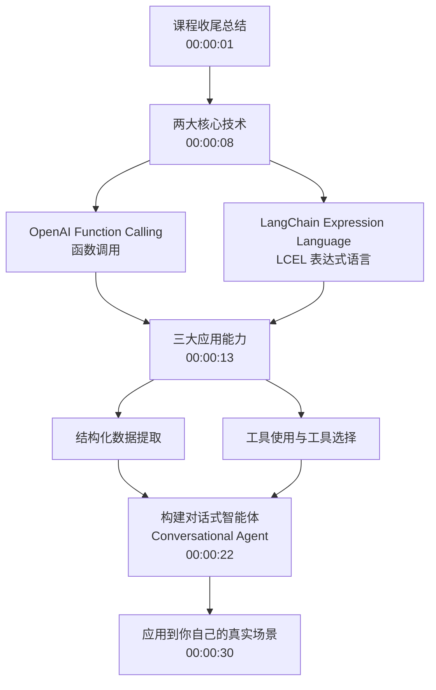

# 第16集：课程总结与回顾（Functions, Tools and Agents with LangChain）

## 元信息
- 集数: 16
- 时间范围: 00:00:00,000 → 00:00:31,840
- 核心主题: 一句话回顾整门课程学到的核心能力，并鼓励把它们应用到真实场景。
- 学习目标:
  - 回顾本课程的两大核心技术：OpenAI Function Calling 与 LangChain Expression Language (LCEL)。
  - 明确这些技术的三大应用：结构化数据提取、工具使用与工具选择、构建对话式智能体（Agent）。
  - 建立"学以致用"的意识，把知识迁移到自己的实际业务场景中。

## 第一性原理拆解
- 底层本质: 本集不是教新知识，而是把前面零散的知识点"收束"成一条主线——大语言模型（LLM）本身只会输出文本，而 Function Calling + LCEL 的价值在于让 LLM 的输出变得**结构化、可调用、可编排**，从而能真正驱动程序。
- 核心逻辑: 能力是层层递进搭建起来的。先有"让模型按格式输出"的基础能力（Function Calling），再有"把各步骤像积木一样拼装"的编排能力（LCEL），二者组合才能实现从"提取数据"到"选工具"再到"自主对话智能体"的完整闭环。
- 推导过程:
  1. Function Calling 让模型输出符合预定义 schema 的结构化结果 → 得到"结构化数据提取"。
  2. 把可调用的函数当作"工具"暴露给模型，模型能自己判断该调用哪个 → 得到"工具使用与工具选择"。
  3. 用 LCEL 把上述能力串成一个带记忆、能循环推理的流程 → 得到"对话式智能体"。
  4. 三步叠加，最终形成一个可落地的完整应用。

## 核心知识点详解
本集为结课总结，讲师用一段话概括了整门课的知识地图，可提炼出以下几个关键概念：

- **OpenAI Function Calling（函数调用）**：让大模型不只是聊天，而是按照你定义好的"函数结构"返回内容。通俗理解：你告诉模型"我这里有几个函数、每个函数需要什么参数"，模型就会帮你判断该用哪个、并把参数填好，输出成机器能直接读取的格式。

- **LangChain Expression Language（LCEL，LangChain 表达式语言）**：一种把多个处理步骤"串起来"的写法。通俗理解：像水管一样，把提示词、模型、输出解析器等一节一节接起来，数据从一头流进去、从另一头流出结果，让复杂流程变得清晰、可组合。

- **结构化数据提取（Structured Data Extraction）**：从一段自由文本里，按你指定的字段把信息抽取成规整的结构（比如从简历里抽出姓名、技能、工作年限）。这是 Function Calling 的典型应用。

- **工具使用与工具选择（Tool Usage and Tool Selection）**：给模型配上一批"工具"（如搜索、计算、查数据库），模型能根据当前问题自主决定"用哪个工具、怎么用"。

- **对话式智能体（Conversational Agent）**：把以上所有能力整合，做出一个能多轮对话、能自主调用工具、能完成任务的智能助手。这是整门课的最终成果。

## 实操步骤指南
本集为纯总结/过渡集，没有新的代码演示。这里以"知识回顾清单"的形式给出复习路径，帮助你把前面各集串起来：

1. 复习 **OpenAI Function Calling**：如何定义函数 schema，如何让模型返回结构化参数。
2. 复习 **LCEL**：如何用管道方式（chain）把 prompt、model、parser 等组件拼接。
3. 复习 **结构化数据提取**：用 Function Calling 从文本抽取字段。
4. 复习 **工具使用与工具选择**：把函数注册为工具，让模型自主选择调用。
5. 复习 **对话式智能体**：整合记忆、工具与循环推理，构建完整 Agent。
6. 收尾行动：选一个你自己的真实场景，动手把这些技术应用上去（讲师原话——"go out into the real world and apply them to your use cases"）。

## 配套可视化图（Mermaid）

## 常见踩坑与避坑
- **学完就忘，不动手实践**：本集讲师反复强调"应用到你的 use case"。总结集最容易被跳过，但真正的收获来自把 Function Calling / LCEL 落到一个自己的小项目里。建议立刻挑一个场景动手做一遍。
- **只记住零散技术点，没建立整体框架**：Function Calling、LCEL、数据提取、工具选择、Agent 是一条递进链，而非孤立知识。复习时应按"基础能力 → 编排能力 → 综合应用"的脉络串联，而不是分开死记。

## 课后练习
结合本集回顾的知识地图，为你熟悉的一个真实场景（例如"从客户邮件中自动提取工单信息并调用相应处理工具"）画一张流程草图：标出①哪一步用到 Function Calling 做结构化提取，②哪一步用到工具选择，③如何用 LCEL 把它们串成一个对话式 Agent。用一两句话说明每一步的作用。
