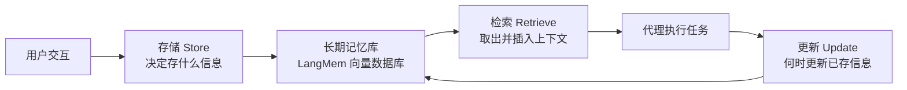
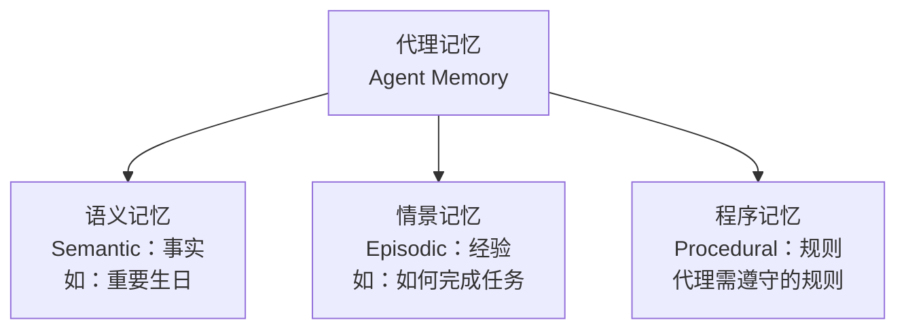

# 第17集：使用 LangGraph 构建长期代理记忆（课程导论）

## 元信息
- 集数: 17
- 时间范围: 00:00:00 --> 00:02:30
- 核心主题: 介绍为什么 AI 代理（Agent）需要长期记忆，以及三种记忆类型与配套工具 LangMem。
- 学习目标:
  - 理解为什么持续运行的 AI 应用需要"长期记忆"，而不仅仅是对话历史。
  - 掌握三种记忆类型（语义记忆、情景记忆、程序记忆）的区别与用途。
  - 了解本课程将用 LangMem 搭建一个邮件助手来实践这些概念。

## 第一性原理拆解
- 底层本质: 智能体要"越用越聪明"，就必须能把过去交互中获得的信息保存下来，并在未来需要时取出使用。记忆的本质就是"存储（store）+ 检索（retrieve）+ 更新（update）"这三个动作的循环。
- 核心逻辑: 越来越多的 AI 应用会长期持续运行（persist over time），例如个人助理，它们服务用户的时间越长、学到的东西越多，未来完成任务的能力就越强。因此记忆是让代理长期变强的关键能力。
- 推导过程:
  1. 早期聊天机器人只在每轮对话中把"对话历史"放进上下文记忆（context memory），对话结束即遗忘。
  2. 但会长期替你办事的代理（如日历代理）需要跨越多次调用、长时间保存信息，这就是长期记忆的需求来源。
  3. 要给代理加记忆，必须先回答两个问题：存什么（what to store）、用的时候取什么（what to retrieve），此外还要决定何时更新已存信息（when to update）。
  4. 为了系统性回答这些问题，把记忆分成三类来管理会很有用。

## 核心知识点详解

- **上下文记忆（Context Memory）与长期记忆（Long-Term Memory）的区别**：聊天机器人最初只是把对话历史存进每轮的上下文里；而长期替用户行动的代理需要长期记忆，能跨多次调用（across multiple invocations）持久保存信息。例如日历代理需要长期记住会议信息。

- **检索（Retrieval）**：检索就是把信息从记忆中取出，并插入到（当前的）上下文中供代理使用。课程会教你如何判断"何时检索、检索什么"。

- **更新（Update）**：除了存和取，还需要决定"何时更新已存储的信息"，让记忆保持准确、最新。

- **三种记忆类型**（本集最核心的心智框架）：
  - **语义记忆（Semantic Memories）**：事实性信息。例如对日历代理来说，重要的生日就是一条语义记忆。
  - **情景记忆（Episodic Memories）**：经历/经验，能帮助代理记住"如何做某类任务"。
  - **程序记忆（Procedural Memories）**：代理需要遵守的规则（rules）。

- **LangMem 库**：LangChain 新推出的记忆管理库，底层支持向量数据库（vector database），提供可搜索（searchable）、可共享（shareable）、持久化（persistent）的存储；记忆既可以由代理即时更新，也可以由一个后台的辅助代理（helper agent）在后台更新。

- **本课程实践项目**：用 LangMem 搭建一个实用的邮件助手（email assistant），把上述所有记忆概念串联演示。

## 实操步骤指南

本集为导论，未涉及具体代码，仅给出概念性的记忆工作流程（纯概念）：

1. 明确"存什么"：判断哪些信息应写入长期记忆（对应三类记忆：事实、经验、规则）。
2. 明确"取什么、何时取"：在需要时进行检索，把记忆内容插入到当前上下文。
3. 明确"何时更新"：决定何时更新已存储的信息，保持记忆最新。
4. 选择记忆载体：使用 LangMem（基于向量数据库），支持即时更新或后台辅助代理更新。
5. 动手实践：在后续课程中用 LangMem 构建邮件助手，逐步落地三类记忆。

## 配套可视化图（Mermaid）

代理记忆的三大动作循环（对应 00:38 - 01:27 讲解的"存储/检索/更新"）：

三种记忆类型分类（对应 01:33 - 01:53 的讲解）：

## 常见踩坑与避坑

1. **误把"对话历史"当成"长期记忆"**：只存单次会话的上下文历史会话结束即遗忘；长期任务代理需要能跨多次调用持久保存的记忆。
2. **只关注"存"，忽略"取"和"更新"**：记忆是"存储 + 检索 + 更新"的完整循环，只存不取等于没用，只存不更新会导致信息过时。
3. **不区分记忆类型，一锅乱存**：事实（语义）、经验（情景）、规则（程序）用途不同，混在一起会让检索变得困难；先分类再管理更清晰。

## 课后练习

1. 以"AI 个人助理"或"日历代理"为例，各举一条语义记忆、一条情景记忆、一条程序记忆，说明它们分别属于哪类以及为什么。
2. 思考并描述：对于一个邮件助手，"何时应该检索记忆"和"何时应该更新记忆"分别可能发生在哪些场景？
