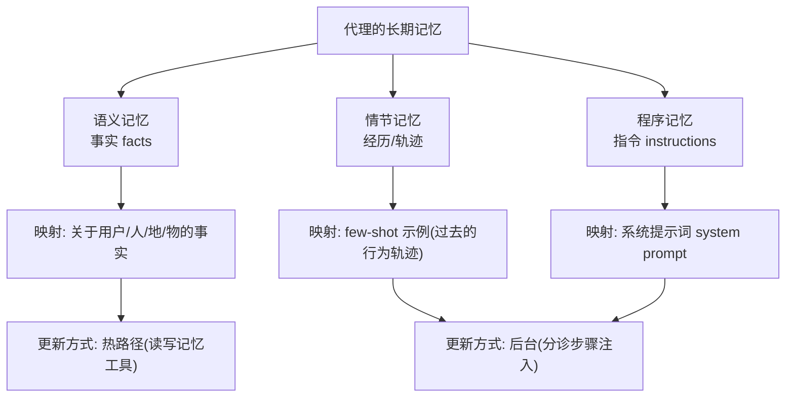
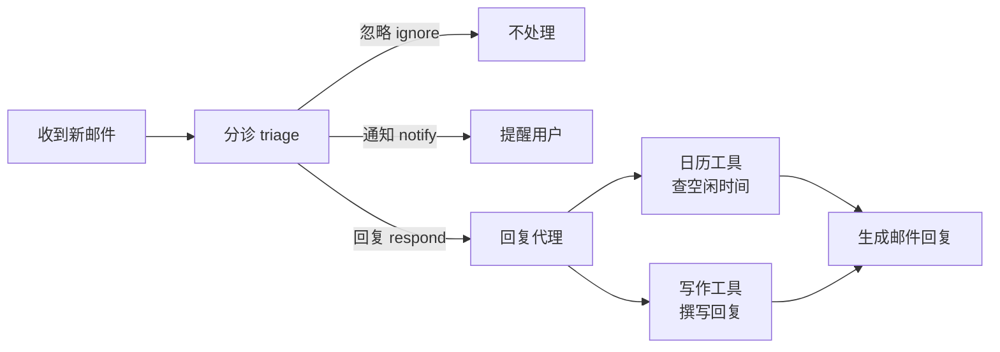

# 第18集：AI 代理的长期记忆与邮件助手示例

## 元信息
- 集数: 18
- 时间范围: 00:00:00 --> 00:08:14
- 核心主题: 用"邮件助手"这个真实场景，引出 AI 代理的三种长期记忆（语义 / 情节 / 程序）及两种记忆更新方式。
- 学习目标:
  1. 理解为什么"长期记忆"是个人助理类代理的核心能力。
  2. 掌握代理的三种记忆类型：语义记忆、情节记忆、程序记忆，以及它们分别对应代理里的什么。
  3. 理解记忆更新的两种范式（热路径 in the hotpath / 后台 in the background）各自的利弊。

## 第一性原理拆解
- 底层本质: 代理要像一个"称职的私人助理"，就必须记住过去说过的话、学过的事实和你的偏好。字幕里说得很直白——如果一个人类助理"忘记了跟你所有的对话，记不住你之前告诉过它的事"，那体验会非常糟糕，"代理也一样"。所以记忆不是锦上添花，而是这类任务的地基。
- 核心逻辑: 把"记忆"这个抽象需求，拆成人类心理学里成熟的三类记忆（语义 / 情节 / 程序），再一一映射到代理的具体实现载体（事实存储 / few-shot 示例 / 系统提示词）。这样"给代理加记忆"就变成了可落地的工程动作。
- 推导过程:
  1. 调研发现开发者认为代理最适合做的任务，第二名是"个人助理与生产力任务"。
  2. 这类任务的核心是记忆，尤其是长期记忆。
  3. 选一个人人都有、人人都头疼的场景——邮件——作为讲解记忆的"试验田(proving ground)"。
  4. 分析一个优秀邮件代理需要什么：像行政助理一样，要能查日历（找空闲时间）、能代你写/回邮件。
  5. 在这个流程里定位出记忆的关键作用点：判断邮件时要参考历史、写回复时要知道你的会议偏好和语气风格、还要记得与相关人过去的交往。
  6. 由此自然引出三类记忆，并说明本课程会依次把它们加到邮件代理上。

## 核心知识点详解

**长期记忆(long-term memory)**：代理跨越多次会话、长期保留的信息。区别于单次对话内的短期上下文。它让代理表现得像一个"记得住事"的助理。

**邮件代理 / 邮件助手(email agent)**：本课程贯穿始终的示例。它像一个行政助理，被赋予两类工具——**日历工具(calendar tool)**（查看你何时有空）和**写邮件工具(writing tool)**（代你撰写或回复邮件）。它是展示"LLM + 记忆能一起做什么"的绝佳舞台。

三种记忆类型（先讲人类版本，再映射到代理）：

- **语义记忆(semantic memory) = 事实(facts)**：人类版本是你在学校、读教科书学到的、能记住的知识点。映射到代理，就是关于用户、以及代理接触过的人 / 地点 / 事物的**事实**。
- **情节记忆(episodic memory) = 经历(experiences)**：人类版本是对具体某次对话、某次经历（比如"去迪士尼乐园"）的回忆，不是关于对话的抽象事实，而是"那段经历本身"。映射到代理，就是**过去的代理行为轨迹(trajectories)**，以 **few-shot 示例(few shot examples)** 的形式存在。
- **程序记忆(procedural memory) = 指令 / 本能 / 肌肉记忆(instructions / instincts / motor skills)**：人类版本是"怎么骑自行车"、或你给自己定的"该怎么回邮件"的规则。映射到代理，这是最直接的——就是**系统提示词(system prompt)**，即你告诉代理该如何行事的指令。

记忆更新的两种范式（各有利弊）：

- **热路径更新(in the hotpath)**：代理在**回应用户的同时**顺手更新记忆，一气呵成。
  - 优点：通常只有一个代理，更简单好维护；更新几乎瞬时完成。
  - 缺点：这个代理要同时干两件事（更新记忆 + 回应用户），更复杂；并且给用户回复增加了额外延迟(latency)。
- **后台更新(in the background)**：记忆更新放到后台或独立进程里进行，与代理的核心工作分开。
  - 优点：把"更新记忆"从热路径里移走，代理回应更快；职责分离更清晰。
  - 缺点：现在有两个代理而不是一个，更复杂；更新可能不是瞬时的，只有当后台更新流程被触发时才发生。

**本课程的实践路线**：先搭一个基线邮件代理（先做邮件**分诊(triage)**，判断"忽略 / 通知 / 回复"，若值得回复则交给第二个用了日历和写作工具的代理）；然后依次加入——语义记忆（用热路径的读/写记忆工具）、情节记忆（在分诊步骤注入 few-shot 示例，后台更新）、程序记忆（更新提示词，用一个独立代理在后台更新）。

## 实操步骤指南
本集为课程引言，只讲概念与整体规划，没有出现代码。按字幕描述，后续要构建的邮件代理逻辑流程如下（纯概念）：

1. **分诊(triage)** 每一封新到的邮件，做三选一决策：`ignore（忽略）` / `notify（通知）` / `respond（回复）`。
2. 若判定为"值得回复"，把邮件**传递给第二个代理**。
3. 第二个代理调用**日历工具**查看空闲时间、调用**写作工具**撰写回复。
4. 分阶段增强记忆：
   - 语义记忆：给回复代理增加"写记忆"和"读记忆"两类工具，在热路径中即时读写事实。
   - 情节记忆：把过去邮件与期望分诊结果作为 few-shot 示例，注入分诊提示词，后台更新。
   - 程序记忆：把提示词本身（关于如何用工具、如何分诊的指令）作为可更新对象，用独立代理在后台更新。
5. 具体的基线邮件代理将在"第二课(lesson two)"动手构建。

## 配套可视化图（Mermaid）

图1：三种记忆类型的映射与更新方式（对应约 02:38 - 07:00 讲解）

图2：邮件助手的处理流程（对应约 05:30 - 05:47 讲解）

## 常见踩坑与避坑
1. **别把三种记忆混为一谈**：三者用途和实现载体完全不同。要"事实"用语义记忆，要"给行动做示范"用情节记忆(few-shot)，要"改变行为规则"用程序记忆(改提示词)。字幕结尾专门强调：到底选哪种，取决于你在构建的应用需求，先问清"我的代理到底需要哪类记忆"。
2. **热路径更新会拖慢响应**：在热路径里边回应边更新记忆虽然简单、即时，但会给用户增加延迟；对延迟敏感的场景应考虑后台更新。
3. **后台更新有"不即时"的代价**：后台更新虽然让回应更快、职责更清晰，但引入了第二个代理（更复杂），且记忆可能不会马上生效，只在后台流程被触发时才更新——设计时要接受这种"最终一致"的延迟。

## 课后练习
1. 以你自己常用的一个代理场景（如客服机器人、日程助手）为例，分别举出一条它需要的语义记忆、情节记忆、程序记忆，并说明各自适合用"热路径"还是"后台"来更新，理由是什么？
2. 请画出/描述本集邮件助手的分诊三分支（ignore / notify / respond）逻辑，并说明如果要给分诊步骤加入情节记忆(few-shot 示例)，示例里应该包含哪两部分内容（提示：字幕提到"邮件"和"期望的分诊结果"）。
