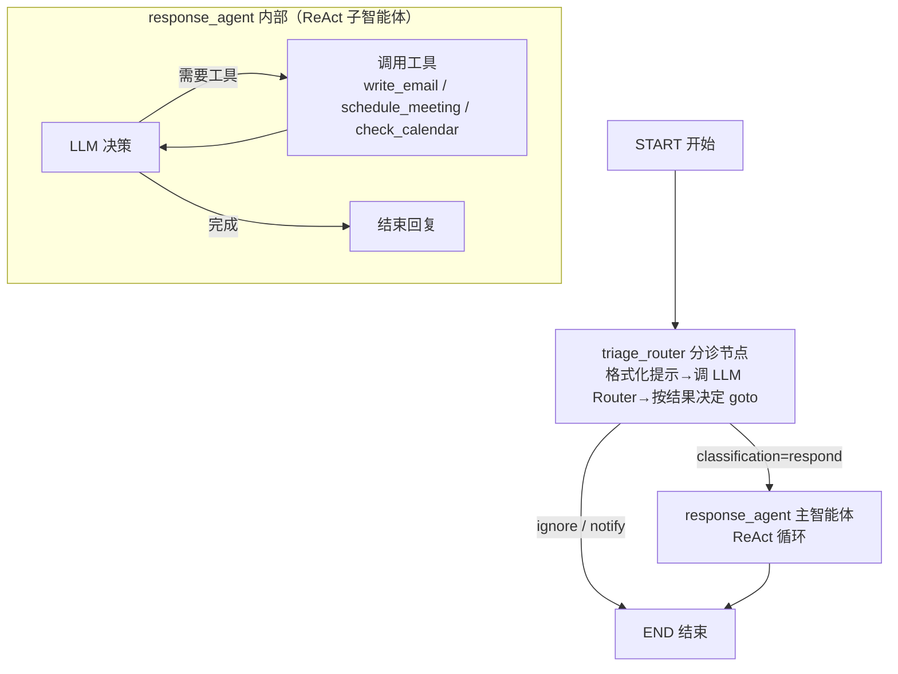
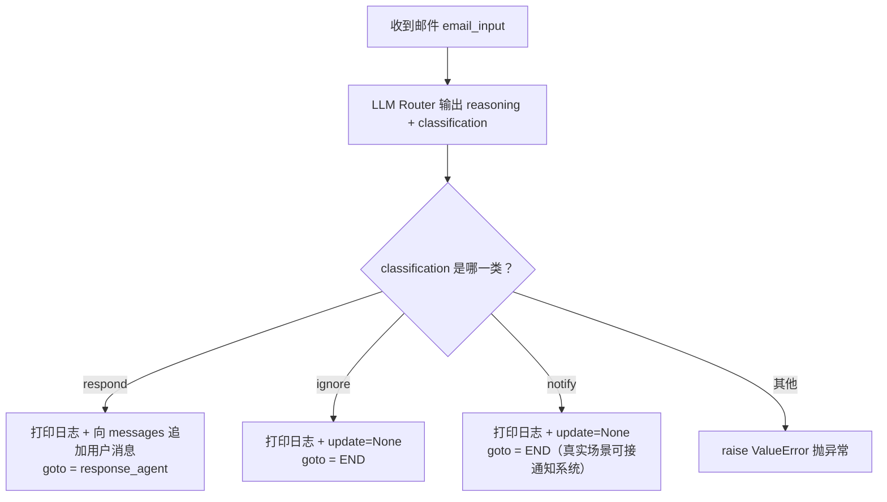

# 第19集：构建无记忆的基线电子邮件助手

## 元信息
- 集数: 19
- 时间范围: 00:00:00 --> 00:16:18
- 核心主题: 用 LangGraph 从零搭建一个"先分诊、再处理"的电子邮件助手（本集尚不加入任何记忆）。
- 学习目标:
  - 理解邮件助手的两大核心环节：分诊（Triage）与主智能体（Main Agent）处理。
  - 学会用 Pydantic + 结构化输出把 LLM 变成一个"分类路由器（LLM Router）"。
  - 掌握用 `StateGraph` 把分诊节点与 ReAct 子智能体组装成完整图，并用 `Command` 控制流程走向。

## 第一性原理拆解
- 底层本质: 邮件助手做的事，本质是"先判断该不该管，再决定怎么管"。这与人类处理收件箱完全一致——大部分邮件应被忽略，少部分需通知，只有真正需要回复的才动手写回信。把"判断"和"执行"拆成两步，是为了省算力、降风险、提升可控性。
- 核心逻辑: 一封邮件进来 → 分诊节点用 LLM 分类为 ignore / notify / respond 三选一 → 只有 respond 时才唤醒带工具的主智能体（写邮件、约会议、查日程）→ 其余情况直接结束。
- 推导过程:
  1. 邮件有固定 schema（from / to / subject / body），可结构化输入。
  2. 分类是个有限集合问题，用带 Pydantic schema 的结构化输出即可让 LLM 稳定返回 `reasoning + classification`。
  3. 分类结果决定"下一步去哪"，这正是 LangGraph `Command`（同时携带 state 更新 + goto 目标）要解决的事。
  4. respond 分支需要真正"干活"，用现成的 `create_react_agent`（LLM + 工具的循环）最省事。
  5. 把分诊节点与 ReAct 子智能体用 `StateGraph` 串起来，就得到完整助手。

## 核心知识点详解

- **Profile（用户画像）**: 关于被服务用户的基本事实，如姓名、背景。它描述"这个助手是在替谁回邮件"。单独抽出来，是为了模块化，也为将来能被记忆机制自动更新。

- **Prompt Instructions（提示指令）**: 分成两部分——**Triage Rules（分诊规则）** 决定什么邮件归入哪一类；**Agent Instructions（主智能体指令）** 决定决定回复后具体该怎么做。把它们从大提示词里抽离，同样是为了模块化，且未来这些内容会作为"记忆"被生成/更新，而提示词的其余骨架保持不变。

- **三分类：ignore / notify / respond**: 分诊的三种结果。忽略（如垃圾邮件）、仅通知（提醒但不回信）、需要回复（唤醒主智能体）。

- **LLM Router（分类路由器）**: 用 `.with_structured_output(Router)` 把一个 Pydantic 模型绑定到 LLM，强制它每次输出固定 schema——`reasoning`（推理过程字符串）+ `classification`（三选一）。注意后续调用一定是 LLM Router 而不是普通 LLM。

- **Prompt Template（提示词模板）**: 系统提示词里带 `{}` 花括号占位符（role、background、instructions、rules、few-shot examples 等区块），调用 `.format(...)` 时用 profile 和 prompt instructions 的变量填充。few-shot 示例本集先设为 None（还没有）。

- **Mock Tools（模拟工具）**: 三个工具都是"假的"占位实现——写邮件 `write_email`、约会议 `schedule_meeting`、查日程 `check_calendar_availability`。真实场景应接 Gmail / Outlook / 日历 API；本集查日程固定返回 9am / 2pm / 4pm。

- **create_react_agent（现成 ReAct 智能体）**: 开箱即用的智能体实现，传入三样东西即可：模型字符串、工具列表、提示词（这里是一个接收 state 返回消息列表的函数）。内部是"LLM 调工具 → 拿结果 → 再调 → 直到完成"的循环。

- **Command（命令对象）**: 分诊节点的返回值。它同时表达两件事——`update`（对 state 的更新）和 `goto`（下一步去哪个节点）。这是 LangGraph 实现"节点内部动态决定路由"的关键。

- **StateGraph（状态图）**: 在某个共享 state 上运行的图。本集 state 有两部分：`email_input`（用户传入的邮件全部信息）和 `messages`（智能体干活的消息列表）。图里加两个节点（triage 节点 + response_agent 子智能体），从 START 连边到 triage。

## 实操步骤指南

以下代码基于字幕描述还原，用于表达结构与流程，字段名按技术上下文合理命名。

1. 导入环境变量、定义 Profile 与 Prompt Instructions（模块化抽离）：

```python
import os
# 载入环境变量（API Key 等）

# 用户画像：这个助手替谁回邮件
profile = {
    "full_name": "John Doe",
    "name": "John",
    "user_profile_background": "关于用户的背景介绍",
}

# 提示指令：分诊规则 + 主智能体指令
prompt_instructions = {
    "triage_rules": {
        "ignore": "什么样的邮件应被忽略",
        "notify": "什么样的邮件仅需通知",
        "respond": "什么样的邮件需要回复",
    },
    "agent_instructions": "决定回复后，主智能体应如何处理",
}
```

2. 定义示例邮件（展示邮件 schema，供后续测试）：

```python
email = {
    "from": "sender@example.com",
    "to": "john@example.com",
    "subject": "邮件主题",
    "body": "邮件正文内容……",
}
```

3. 分诊步骤：选模型 + 定义结构化输出 schema + 绑定为 LLM Router：

```python
from pydantic import BaseModel, Field
from langchain.chat_models import init_chat_model

# 选用 GPT-4o mini（可替换为任意模型）
llm = init_chat_model("openai:gpt-4o-mini")

class Router(BaseModel):
    reasoning: str = Field(description="LLM 为其决策生成的推理过程")
    classification: str = Field(description="分类结果：ignore / respond / notify")

# 绑定 schema，让 LLM 每次都按此结构返回
llm_router = llm.with_structured_output(Router)
```

4. 用 profile 与 prompt instructions 填充提示词模板并测试：

```python
system_prompt = triage_system_prompt.format(
    full_name=profile["full_name"],
    name=profile["name"],
    user_profile_background=profile["user_profile_background"],
    examples=None,  # 目前还没有 few-shot 示例
    triage_no=prompt_instructions["triage_rules"]["ignore"],
    triage_notify=prompt_instructions["triage_rules"]["notify"],
    triage_email=prompt_instructions["triage_rules"]["respond"],
)
user_prompt = triage_user_prompt.format(
    author=email["from"], to=email["to"],
    subject=email["subject"], email_thread=email["body"],
)

result = llm_router.invoke([
    {"role": "system", "content": system_prompt},
    {"role": "user", "content": user_prompt},
])
# result.reasoning       -> LLM 的推理
# result.classification  -> 例如 "respond"
```

5. 定义三个模拟工具：

```python
from langchain_core.tools import tool

@tool
def write_email(to: str, subject: str, content: str) -> str:
    """发送一封邮件（此处为模拟实现）。"""
    return f"Email sent to {to}"

@tool
def schedule_meeting(attendees: list, subject: str, duration: int, preferred_day: str) -> str:
    """安排一场日历会议（模拟）。"""
    return "Meeting scheduled"

@tool
def check_calendar_availability(day: str) -> str:
    """查询某天空闲时段（模拟：固定返回）。"""
    return "9am, 2pm, 4pm"
```

6. 构建主智能体（ReAct）：提示词是一个"接收 state 返回消息列表"的函数：

```python
def create_prompt(state):
    # 系统消息（角色 + 工具说明 + 自定义指令）放最前，再拼接已有消息
    system_msg = {"role": "system", "content": agent_system_prompt.format(
        instructions=prompt_instructions["agent_instructions"],
    )}
    return [system_msg] + state["messages"]

from langgraph.prebuilt import create_react_agent

response_agent = create_react_agent(
    "openai:gpt-4o",
    tools=[write_email, schedule_meeting, check_calendar_availability],
    prompt=create_prompt,
)

# 测试
response = response_agent.invoke({"messages": [{"role": "user", "content": "what's my availability for Tuesday?"}]})
# 最后一条消息 -> "You have the following available time slots on Tuesday: 9am, 2pm, and 4pm."
```

7. 定义 state 与分诊节点（返回 Command）：

```python
from typing import Literal
from langgraph.graph import StateGraph, START, END
from langgraph.types import Command

class State(TypedDict):
    email_input: dict
    messages: list

def triage_router(state) -> Command[Literal["response_agent", "__end__"]]:
    # 1. 拆解 email_input，拼装 system/user 提示词
    author = state["email_input"]["from"]
    # ... 组装 system_prompt / user_prompt（同上）
    # 2. 一定用 llm_router（带分类 schema），不是普通 llm
    result = llm_router.invoke([...])

    if result.classification == "respond":
        print("Classification: respond")
        goto = "response_agent"
        update = {"messages": [{"role": "user",
                    "content": f"Respond to the email: {state['email_input']}"}]}
    elif result.classification == "ignore":
        print("Classification: ignore")
        goto = END
        update = None
    elif result.classification == "notify":
        print("Classification: notify")
        goto = END
        update = None  # 真实场景可接通知系统 / 走另一个节点
    else:
        raise ValueError(f"Unexpected classification: {result.classification}")

    return Command(goto=goto, update=update)
```

8. 组装并编译整体图，可视化查看：

```python
email_agent = (
    StateGraph(State)
    .add_node("triage_router", triage_router)
    .add_node("response_agent", response_agent)  # ReAct 子智能体
    .add_edge(START, "triage_router")
    .compile()
)

# 可视化（xray=True 可展开子智能体内部）
email_agent.get_graph(xray=True).draw_mermaid_png()
```

9. 用不同邮件测试：垃圾/推销邮件 → ignore；需回复邮件 → respond（可看到 messages 里依次是 human 消息、write_email 工具调用、tool 消息、最终 AI 总结消息）。

## 配套可视化图（Mermaid）

图1：整体图结构（约 13:59-14:34，讲解 draw_mermaid_png 可视化时）



图2：分诊三分类决策逻辑（约 11:19-13:06，讲解三种分类处理时）



## 常见踩坑与避坑

- **调用错对象**：分诊时必须调用 `llm_router`（绑定了分类 schema 的那个），而不是普通 `llm`。用错会拿不到 `classification` 字段，路由逻辑直接失效。字幕中作者专门强调了这一点。
- **误以为工具真的在干活**：三个工具全是 mock（写邮件、约会议、查日程都不连真实 API）。查日程永远返回 9am/2pm/4pm 是硬编码的，不要误当成真实结果；上线前需替换为 Gmail/Outlook/日历 API。
- **忘记处理未知分类**：分诊分支只覆盖 respond/ignore/notify 三类，务必对"其他"情况 `raise ValueError`，否则模型偶发返回异常值时会静默出错、难以排查。

## 课后练习

1. 用你自己的 profile（姓名、背景）替换示例，再准备 3 封不同邮件（一封明显垃圾、一封仅需知会、一封需要回复），分别运行分诊，观察 `reasoning` 与 `classification` 是否符合预期；尝试修改 triage_rules 措辞，看分类结果如何变化。
2. 当前 notify 分类和 ignore 一样直接走到 END。请思考并画出改造方案：为图新增一个 `notify` 节点（例如接入某种通知/提醒逻辑），并修改 `triage_router` 中 notify 分支的 `goto` 指向该新节点，而不是 END。
