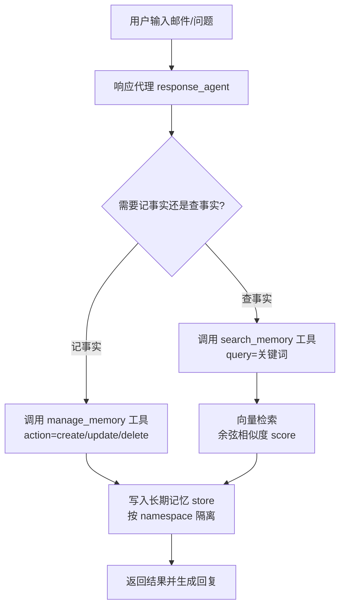
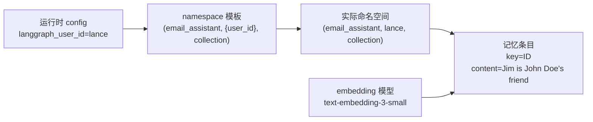

# 第20集：为邮件代理添加语义记忆（Semantic Memory）工具

## 元信息
- 集数: 20
- 时间范围: 00:00:00 - 00:12:32
- 核心主题: 在此前的邮件代理基础上，接入 LangMem 的"管理记忆"和"搜索记忆"两个工具，让代理能够学习、存储并检索关于用户的事实（语义记忆）。
- 学习目标:
  1. 理解语义记忆的作用：存储关于用户的事实，并按用户隔离存储。
  2. 掌握如何用长期记忆 store（含向量索引）+ LangMem 工具，实现记忆的增删改查。
  3. 观察代理如何在跨邮件、跨会话的场景下自动写入并检索历史信息。

## 第一性原理拆解
- 底层本质: 让代理"记住事实"，本质上是把非结构化文本（如"Jim 是 John Doe 的朋友"）写进一个可持久化、可按语义检索的存储中，未来需要时再用相似度检索取回。
- 核心逻辑: 语义记忆 = 事实存储。写入靠"管理记忆工具"（create/update/delete），读取靠"搜索记忆工具"（基于 embedding 的余弦相似度检索）。两个工具共享同一个带向量索引的 store。
- 推导过程:
  1. 事实必须能被存下来 → 需要一个长期记忆 store（本课用内存 store）。
  2. 事实要能按含义查找，而不仅是关键词匹配 → store 初始化时传入 embedding 模型建立索引。
  3. 多用户场景下事实不能混淆 → 用 namespace 命名空间隔离，命名空间中嵌入运行时传入的 `langgraph_user_id`。
  4. 代理要能自主操作记忆 → 把"管理记忆"和"搜索记忆"封装成普通 LangChain 工具挂给代理。

## 核心知识点详解
- **语义记忆（Semantic Memory）**: 通常用来存储关于用户的"事实"。本课用工具来学习用户事实、存入长期记忆 store，并另外提供工具去检索这些事实。
- **长期记忆 store（In-Memory Store）**: 本课使用一个内存 store（把一切存在内存里），从 LangGraph 导入。初始化时传入 `index` 配置，其中包含一个 **embedding 模型**（本课用 OpenAI 的 `text-embedding-3-small`），用于给存入的记忆建立索引。
- **LangMem**: 一个构建在 LangGraph 之上、专门处理记忆的封装库。本课从中导入两个函数：`create_manage_memory_tool` 和 `create_search_memory_tool`。
- **管理记忆工具（manage_memory）**: 用于创建、更新、删除持久化记忆。参数包含 `content`（内容）、`action`（create/update/delete，默认 create）、`id`（记忆的 ID，不传则自动创建）。记忆按 ID 管理。
- **搜索记忆工具（search_memory）**: 描述为"搜索你的长期记忆以获取与当前上下文相关的信息"。参数包含 `query`（查询词）、`limit`（返回条数）、`offset`（偏移）、`filter`（可选过滤）。
- **命名空间（namespace）**: 两个工具都作用在同一个命名空间上，本课定义为三段值：第一段 `email_assistant`，第二段是模板化的 `langgraph_user_id`，第三段 `collection`。运行时通过配置传入 user id，从而为不同用户隔离记忆集合。
- **余弦相似度评分（score）**: 搜索时如果不传 `query`，返回结果的 score 为 `None`；传入 query（如"Jim"）后，score 约为 0.5，它是用建 store 时传入的 embedding 模型计算的余弦相似度。
- **store 传递**: 创建 react 代理时和编译邮件代理时都要传入 `store=store`，确保记忆工具能访问到这个长期记忆存储。

## 实操步骤指南

1. 设置长期记忆 store，并传入 embedding 模型建立索引（基于字幕描述还原，参数名为示意）：
```python
# 从 LangGraph 导入内存 store
from langgraph.store.memory import InMemoryStore

# 初始化时传入 index 配置，指定用于索引记忆的 embedding 模型
store = InMemoryStore(
    index={
        "embed": "openai:text-embedding-3-small",  # OpenAI Text Embedding 3 small 模型
    }
)
```

2. 从 LangMem 导入并创建两个记忆工具，指定命名空间：
```python
from langmem import create_manage_memory_tool, create_search_memory_tool

# 命名空间三段值：应用名、模板化的用户 ID、collection
namespace = ("email_assistant", "{langgraph_user_id}", "collection")

manage_memory_tool = create_manage_memory_tool(namespace=namespace)
search_memory_tool = create_search_memory_tool(namespace=namespace)
```

3. 因为它们是普通 LangChain 工具，可以直接检查属性：
```python
# 查看工具名与描述
print(manage_memory_tool.name)         # manage_memory
print(manage_memory_tool.description)  # 创建/更新/删除持久化记忆的说明
# 查看参数：content, action(create/update/delete), id

print(search_memory_tool.name)         # search_memory
# 查看参数：query, limit, offset, filter
```

4. 构建带记忆工具的响应代理，并把 store 传进去：
```python
from langgraph.prebuilt import create_react_agent

tools = [
    # ...之前的三个工具...
    manage_memory_tool,
    search_memory_tool,
]

response_agent = create_react_agent(
    model,
    tools=tools,
    prompt=create_prompt,   # 在消息列表前追加系统提示
    store=store,            # 关键：把长期记忆 store 传给代理
)
```

5. 调用时通过运行时配置传入 `langgraph_user_id`：
```python
config = {"configurable": {"langgraph_user_id": "lance"}}  # 该值可自定义

# 写入事实
response_agent.invoke(
    {"messages": [{"role": "user", "content": "Jim is my friend"}]},
    config,
)
# 代理会调用 manage_memory 工具，content="Jim is John Doe's friend"
# 未指定 action（默认 create），未指定 id（自动生成）

# 检索事实（同一 config）
response_agent.invoke(
    {"messages": [{"role": "user", "content": "Who is Jim?"}]},
    config,
)
# 代理会调用 search_memory，query="Jim"，返回该条记忆并总结回答
```

6. 直接检查 store 内容：
```python
# 列出命名空间（会看到含 user id "lance" 的命名空间）
store.list_namespaces()

# 在该命名空间下搜索
store.search(namespace)                 # 不传 query，score 为 None
store.search(namespace, query="Jim")    # 传 query，score 约 0.5（余弦相似度）
```

7. 组装完整邮件代理（与上一课基本相同，主要改动）：
   - 状态 State、导入、triage 路由节点均与之前相同。
   - 把原先叫 `agent` 的变量改名为 `response_agent`。
   - 编译邮件代理时传入 `store=store`，让记忆工具可用。
   - 调用 `email_agent` 时记得传入包含 `langgraph_user_id` 的 config。

## 配套可视化图（Mermaid）

图1：语义记忆的写入与检索流程（对应 00:27 代码讲解 - 08:17 store 检查）


图2：命名空间隔离与 store 结构（对应 01:59 namespace 讲解 - 07:31 list_namespaces）


## 常见踩坑与避坑
1. **忘记传 store**：创建 react 代理和编译邮件代理时都必须传 `store=store`，否则记忆工具无法读写长期记忆。
2. **忘记传 config / user id**：每次调用代理都要传入含 `langgraph_user_id` 的运行时配置，否则命名空间无法正确定位，多用户记忆会混淆。
3. **搜索不传 query 导致无相似度**：`store.search` 不传 `query` 时 score 为 `None`（只是列出条目）；要得到相似度排序必须传入 query，score 由建 store 时的 embedding 模型算出（余弦相似度）。

## 课后练习
1. 用 `lance` 之外的另一个 `langgraph_user_id` 重新写入并查询事实，验证不同用户的记忆确实被命名空间隔离，互不可见。
2. 先发一封来自 Alice Smith 的邮件让代理写入"需跟进"的记忆，再发一封同一作者的追问邮件（如"任何进展？"），观察代理是否会先调用 search_memory 取回历史事实，并在回信中体现出来。
