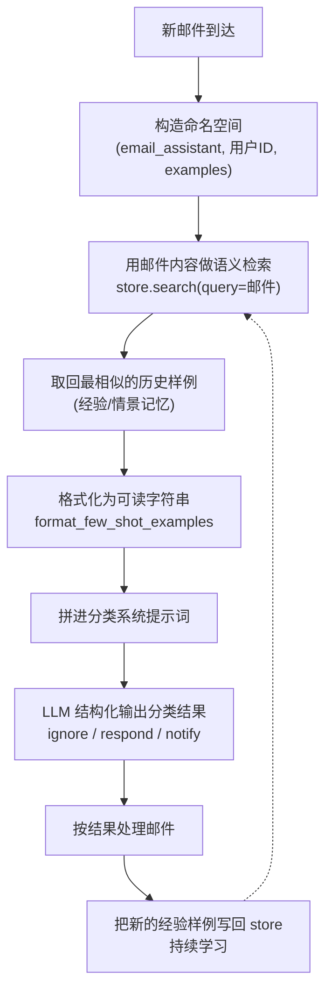
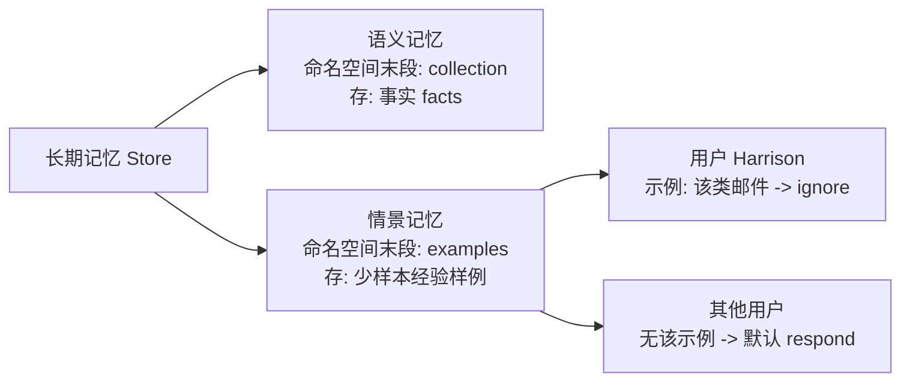

# 第21集：为智能体加入情景记忆（用少样本示例改进邮件分类）

## 元信息
- 集数: 21
- 时间范围: 00:00:00,000 --> 00:09:19,279
- 核心主题: 用「情景记忆（Episodic Memory）」以少样本示例（few-shot examples）的形式，注入到邮件助手的分类（triage）环节，让智能体从过往经验中学习、按用户偏好处理相似邮件。
- 学习目标:
  1. 理解情景记忆的本质：把「过往的智能体行为/经验」作为少样本示例存入长期记忆，再在提示词里复用。
  2. 掌握把示例存入长期记忆库（store）、按语义检索、格式化后拼进系统提示词的完整流程。
  3. 理解示例如何按 user ID 做作用域隔离，从而实现「因人而异」的个性化学习。

## 第一性原理拆解
- 底层本质: 语言模型不会自动记住上一次的判断。要让它「像有经验一样」做决策，最直接的办法不是重新训练模型，而是把过去处理得好的「输入→输出」样例，在推理时塞进提示词。模型天然擅长模仿提示词里给出的范例，这就是少样本学习。情景记忆就是把这些「经验样例」持久化存起来，需要时按相似度取回。
- 核心逻辑: 情景记忆 = 经验（experiences）。在智能体里，经验最好表示为「过往的智能体行为」，并以少样本示例的形式写进提示词。字幕原文：episodic memory is experiences，在 agent 里最佳表示是 past agent actions 和 few shot examples。
- 推导过程:
  1. 上一集加的是「语义记忆」（存事实 facts，命名空间是 collection）。
  2. 本集要加「情景记忆」：存的是「邮件 + 对应的分类结果」这种经验样例，命名空间改为 examples。
  3. 一封新邮件进来时，先用它的内容去 store 里做语义检索，取回最相似的历史样例。
  4. 把取回的样例格式化成人类可读字符串，拼进分类步骤的系统提示词。
  5. 模型看到「这类邮件过去被标成 ignore」，就会把当前相似邮件也判成 ignore —— 行为被样例改变了。

## 核心知识点详解
- **情景记忆（Episodic Memory）**：记录「经历过的事」。与语义记忆（记事实）不同，情景记忆记的是「在什么输入下做了什么动作、结果如何」。本集用它来记住「某封邮件应该被如何分类」。
- **少样本示例（Few-shot Examples）**：在提示词里给模型几个「输入→期望输出」的范例，引导模型模仿。本集的输入是邮件内容，输出是分类标签（label / respond 等）。字幕明确：这些输出也会一起被格式化进少样本示例，用来改变智能体行为。
- **长期记忆库（Long-term Memory Store）**：和第3课（lesson three）用的是同一个 store。通过「命名空间（namespace）+ 唯一 ID（UUID）+ 数据」来存取。
- **命名空间（Namespace）区分记忆类型**：
  - 语义记忆（事实）：`(email_assistant, {用户}, collection)`
  - 情景记忆（少样本示例）：`(email_assistant, {用户}, examples)`
  - 关键区别就在最后一段是 `collection` 还是 `examples`。
- **按 user ID 作用域隔离（scoping）**：命名空间里包含 LangGraph 的 user ID（字幕里被 whisper 转写成 "link ref / length graph user ID"，技术上应为 LangGraph user id，例如 Harrison）。因此同一封邮件，换一个 user ID 检索不到那条 ignore 样例，结果就回到默认的 respond。这实现了「千人千面」。
- **格式化辅助函数（helper function）**：把从 store 取回的原始样例整理成含「邮件主题、发件人 from、收件人 to、triage 分类结果」的模板字符串。字幕强调：格式化后的字符串比原始数据更适合喂给 LLM，也方便人查看检索到了什么。

## 实操步骤指南
> 说明：字幕为课程讲解口述，未逐字念代码。以下代码为「基于字幕描述的概念还原」，用于说明流程，非视频逐字源码，命名以字幕提到的字段为准（namespace / examples / label / respond / UUID / 语义检索 limit=1）。

1. 基础准备（字幕：加载环境变量、定义 profile、prompt instructions、示例邮件）
```python
# 加载环境变量、定义画像、提示词指令、一封示例邮件（与前几集相同的基础设置）
# 定义长期记忆 store（与第3课一致）
from langgraph.store.memory import InMemoryStore
store = InMemoryStore()
```

2. 准备要作为少样本示例存入的数据（输入=邮件，输出=分类结果）
```python
import uuid

# 输入：邮件内容（与上面的示例邮件相同，但这次当作少样本示例使用）
email = {
    "subject": "...",
    "from": "...",
    "to": "...",
    "body": "...",
}

# 组装成更大的数据模型：包含邮件（输入） + 输出（label / respond）
data = {
    "email": email,
    "label": "respond",   # 输出：分类结果，也会进入少样本示例
}

# 存入长期记忆：命名空间最后一段是 examples（区别于语义记忆的 collection）
namespace = ("email_assistant", "harrison", "examples")
store.put(namespace, str(uuid.uuid4()), data)

# 再存第二条（Sarah Chen 发来的另一封邮件），便于后面演示多条中检索最相似的一条
store.put(namespace, str(uuid.uuid4()), data_2)
```

3. 定义格式化辅助函数（把检索结果拼成可读字符串）
```python
def format_few_shot_examples(examples):
    # 每条：取 email（输入）格式化 + triage 结果（label 输出）
    # 模板含 email 主题 / from / to，以及 triage result
    formatted = ""
    for ex in examples:
        formatted += f"邮件主题: {ex.value['email']['subject']}\n"
        formatted += f"发件人: {ex.value['email']['from']}\n"
        formatted += f"收件人: {ex.value['email']['to']}\n"
        formatted += f"分类结果: {ex.value['label']}\n\n"
    return formatted
```

4. 模拟检索（用一封稍作改动的邮件当 query，避免完全精确匹配）
```python
# 传入 email 作为查询，limit=1 只取最相似的一条（store 里已有两条）
results = store.search(namespace, query=str(email), limit=1)
print(format_few_shot_examples(results))
# 结果：取回的是语义上最相似（但不完全相同）的那条样例
```

5. 定义带少样本的分类系统提示词（本集直接写在代码里，方便修改）
```python
triage_system_prompt = """
...（原有分类指令）...

# 少样本示例（Few-shot Examples）
{examples}

请特别注意上面这些示例（pay close attention to these examples）。
"""
```

6. 改造 triage 路由节点：接收 config 和 store，运行时检索并注入示例
```python
def triage_router(state, config, store):
    # 命名空间：email_assistant + config 里的 LangGraph user_id + examples
    namespace = (
        "email_assistant",
        config["configurable"]["langgraph_user_id"],
        "examples",
    )
    # 用当前邮件的字符串形式做语义检索
    examples = store.search(namespace, query=str(state["email"]))
    # 格式化后拼进系统提示词
    examples_str = format_few_shot_examples(examples)
    system_prompt = triage_system_prompt.format(examples=examples_str)
    # ...后续用带结构化输出的模型完成分类...
```

7. 组装并测试整个邮件智能体
```python
# 复用已有 tools、记忆管理工具、response agent；store 只建一次（复用上面的 store）
# 把 store 一路传给 email agent 保证覆盖

# 测试：Tom Jones 的一封邮件，默认分类为 respond
result = email_agent.invoke(
    {"email": tom_email},
    config={"configurable": {"langgraph_user_id": "harrison"}},
)
# -> 默认 requires a response

# 若不希望这样：把一条带 label="ignore" 的样例存入 harrison 的 examples 命名空间
store.put(("email_assistant", "harrison", "examples"),
          str(uuid.uuid4()),
          {"email": tom_email, "label": "ignore"})

# 再次运行：现在被分类为 ignore（模型学到这类邮件该忽略）
# 即使把邮件稍作改动（多加问号、换成 Jim），仍被判为 ignore（相似即相似处理）

# 换一个 user_id：检索不到该样例，结果回到默认 respond
# -> 说明少样本示例按 user_id 作用域隔离
```

## 配套可视化图（Mermaid）

图1：本集核心流程 —— 情景记忆驱动的分类（约 00:44 讲少样本、约 04:21 起组装新 triage、约 05:59 检索注入逻辑）


图2：语义记忆 vs 情景记忆的命名空间区别（约 01:52-02:00 对比 examples 与 collection；约 08:47 讲 user 作用域）


## 常见踩坑与避坑
1. **命名空间用错，记忆串味**：情景记忆的命名空间末段必须是 `examples`，语义记忆是 `collection`。若混用，检索会取到错误类型的数据，导致提示词被污染。
2. **忘记传 config / store 到节点**：改造后的 triage 节点依赖主 agent 透传的 `config`（拿 user_id）和 `store`（做检索）。少传任一个，要么检索不到用户示例，要么直接报错。字幕强调「passing in the store to make sure that it's covered」。
3. **误以为示例全局共享**：少样本示例是按 `langgraph_user_id` 作用域隔离的。同一封邮件换个 user_id 就检索不到别人的示例，结果会回到默认行为。想让某类邮件对所有人生效，需为对应用户各自写入（或统一 user 作用域）。
4. **查询做精确匹配的误区**：检索靠的是语义相似度，不是字符串精确匹配。字幕特意把查询邮件「稍作改动」来演示：即便文字不同，语义相近仍能命中同一条样例。

## 课后练习
1. 为 user_id = "harrison" 存入 2-3 条不同类型的邮件示例（分别标成 ignore / respond / notify），再用一封「介于两类之间」的新邮件测试：观察 `limit=1` 时检索回哪一条、最终分类是否符合预期；把 `limit` 调大看返回集合变化。
2. 同一封「想买文档」的邮件，分别用 user_id="harrison"（已存 ignore 示例）和一个全新 user_id 调用邮件智能体，对比两次分类结果，并用一句话解释为什么会不同（提示：命名空间中的 user 作用域）。
