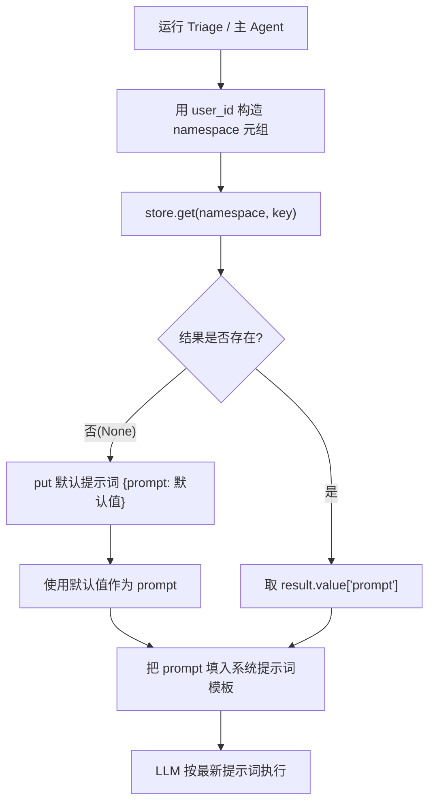
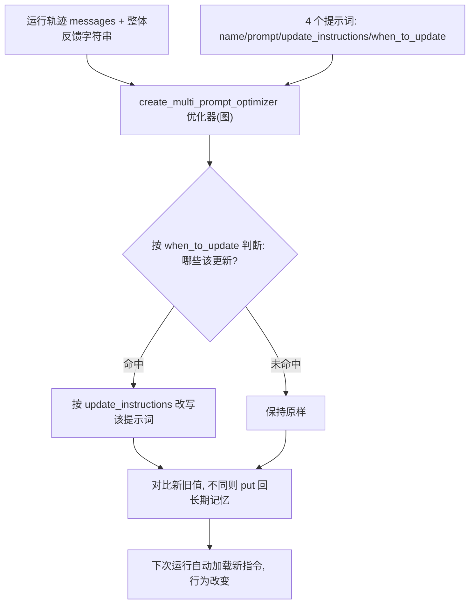

# 第22集：程序记忆（Procedural Memory）——让 Agent 自动更新自己的提示词

## 元信息
- 集数: 22
- 时间范围: 00:00:00 --> 00:15:17
- 核心主题: 把 Agent 与 Triage（分诊）Agent 的系统提示词（System Prompt）存入长期记忆，并借助 LangMem 的多提示词优化器（create_multi_prompt_optimizer），根据用户反馈自动改写提示词。
- 学习目标:
  - 理解第三种记忆类型「程序记忆」，它在 Agent 中的表现形式就是「提示词指令」。
  - 学会把原本硬编码的提示词改为「从长期记忆 Store 中读取」，从而能在 Agent 外部修改并被后续运行自动加载。
  - 掌握用 LangMem 的 create_multi_prompt_optimizer，根据整体反馈自动决定「哪些提示词该更新、以及如何更新」。

## 第一性原理拆解
- 底层本质: Agent 的行为是由「提示词」驱动的。所谓「程序记忆」，就是「怎么做事的指令」（instructions about how to do things），在 LLM Agent 里它天然地表现为提示词。因此「更新程序记忆」本质就是「更新提示词」。
- 核心逻辑: 若提示词是硬编码在代码里的常量，就无法在运行中被 Agent 自己修改。把提示词从代码里「搬」到长期记忆 Store 里（用 namespace + key 定位），提示词就变成了「可读可写的数据」，从而既能被 Agent 读取使用，又能被外部逻辑（或 LLM）改写。
- 推导过程:
  1. 前两集已加入语义记忆（关于事实）与情景记忆（few-shot 示例）；本集补上第三种、也是最后一种——程序记忆。
  2. 第一步：改造读取端。让 Triage 节点与主 Agent 的 create_prompt 不再直接用硬编码的 prompt_instructions，而是先去 Store 里取；取不到就写入一份默认值再用。
  3. 第二步：改造写入端。手动改写提示词不算「记忆」；真正的 Agent 记忆是「LLM 根据用户反馈来更新」。于是引入 LangMem 优化器，把「运行轨迹 + 反馈」喂进去，让它判断并改写提示词。
  4. 结果：外部一更新提示词，Agent 后续运行会自动拉取新指令，行为随之改变（例如学会署名、学会忽略某人的邮件）。

## 核心知识点详解
- **程序记忆（Procedural Memory）**：三种记忆的最后一种。定义是「关于如何做事的指令」，在 Agent 中的载体就是**系统提示词**。本集涉及的提示词有 4 个：主 Agent 指令、以及分诊的三种指令（何时忽略 ignore / 何时通知 notify / 何时回复 respond）。
- **从硬编码到长期记忆**：原本 prompt_instructions 是写死在 notebook 顶部的常量。改造后，这些指令改为存放在内存版长期记忆 Store（in-memory store）中，通过 **namespace + key** 定位。
- **namespace（命名空间）**：用 LangGraph 的 user ID 构造，是一个**元组（tuple）**。视频特别强调：单元素元组「一定要带逗号」，例如 `(langgraph_user_id,)`，漏了逗号就不是元组。
- **取值的「存在则用、不存在则填默认」模式**：`store.get(namespace, key)`。若结果为 None，就把默认提示词以 `{"prompt": 默认值}` 的形式 `put` 进去；若已存在，则取其中的 `prompt` 字段使用。这保证了「新 user ID 首次运行也能自动初始化默认值」。
- **create_multi_prompt_optimizer（多提示词优化器）**：来自 LangMem。因为整个助手有 4 个提示词，但用户**反馈是针对整个 Agent 的整体反馈**，而不是逐条指令的反馈。优化器要做两件事：先判断「哪些提示词（如果有）应该被更新」，再「如何更新」。
- **每个待优化提示词的 4 个键**：`name`（提示词名）、`prompt`（当前值，从长期记忆取最新）、`update_instructions`（如何更新，本集统一用「保持简短、切中要点」）、`when_to_update`（何时更新，例如「当有关于该忽略哪些邮件的反馈时才更新 triage_ignore」）。
- **优化器本身是一个图（graph）**：通过 invoke 传入 `trajectories`（运行轨迹）与 `prompts` 列表，返回更新后的 prompts 列表（键结构不变，但 prompt 值可能被改写）。
- **反馈（feedback）格式**：可有多种，最简单就是一个字符串，例如「always sign your emails, John Doe（邮件永远署名 John Doe）」。
- **优化所用模型**：视频使用 Anthropic 的 Claude 3.5 Sonnet（字幕误写为 Cloud3Sonic），并说明当前对这类提示词优化效果最佳；算法 `kind="prompt_memory"` 是最简单的一种，更复杂用法可查 LangMem API Reference。
- **写回长期记忆**：拿到更新后的 prompts 后，逐条把「新值」与「旧值」对比，只有不同才写回 Store。视频里只实现了 `main_agent` 分支，提醒完整实现应补齐另外三个（ignore/notify/respond）分支。

## 实操步骤指南
整体分两大步：先改「读取端」（提示词从长期记忆读），再做「写入端」（用优化器根据反馈更新）。以下代码为基于字幕描述的合理还原，非逐字誊抄。

1) 改造 Triage 路由节点：从长期记忆读取三种分诊指令

```python
def triage_router(state, config, store):
    # 用 LangGraph user ID 构造 namespace（注意单元素元组的逗号）
    user_id = config["configurable"]["langgraph_user_id"]
    namespace = (user_id,)

    # ignore：存在则用，不存在则写入默认值
    result = store.get(namespace, "triage_ignore")
    if result is None:
        store.put(namespace, "triage_ignore", {"prompt": prompt_instructions["triage_rules"]["ignore"]})
        ignore_prompt = prompt_instructions["triage_rules"]["ignore"]
    else:
        ignore_prompt = result.value["prompt"]

    # notify：同样逻辑，key = "triage_notify"
    result = store.get(namespace, "triage_notify")
    if result is None:
        store.put(namespace, "triage_notify", {"prompt": prompt_instructions["triage_rules"]["notify"]})
        notify_prompt = prompt_instructions["triage_rules"]["notify"]
    else:
        notify_prompt = result.value["prompt"]

    # respond：同样逻辑，key = "triage_respond"
    result = store.get(namespace, "triage_respond")
    if result is None:
        store.put(namespace, "triage_respond", {"prompt": prompt_instructions["triage_rules"]["respond"]})
        respond_prompt = result_default
    else:
        respond_prompt = result.value["prompt"]

    # 把从长期记忆取到的三个 prompt 填入模板，再交给 LLM router
    system_prompt = triage_system_prompt.format(
        triage_ignore=ignore_prompt,
        triage_notify=notify_prompt,
        triage_respond=respond_prompt,
    )
    ...
```

2) 改造主 Agent 的 create_prompt：从长期记忆读取主 Agent 指令

```python
def create_prompt(state, config, store):
    user_id = config["configurable"]["langgraph_user_id"]
    namespace = (user_id,)
    result = store.get(namespace, "agent_instructions")
    if result is None:
        store.put(namespace, "agent_instructions", {"prompt": prompt_instructions["agent_instructions"]})
        prompt = prompt_instructions["agent_instructions"]
    else:
        prompt = result.value["prompt"]

    # 用取到的 prompt 替换原来硬编码的 agent_instructions
    system_message = agent_system_prompt.format(instructions=prompt, ...)
    return [{"role": "system", "content": system_message}] + state["messages"]

# 用 create_react_agent 组装带工具的邮件 Agent
email_agent = create_react_agent(model, tools=tools, prompt=create_prompt, store=store)
```

3) 运行 Agent 并配置 user ID

```python
config = {"configurable": {"langgraph_user_id": "lance"}}
response = email_agent.invoke({"messages": [{"role": "user", "content": example_email}]}, config=config)
# 消息序列：Human -> AI(调用发邮件工具) -> Tool(已发送) -> AI(最终回复)
```

4) 用 LangMem 优化器根据反馈自动更新提示词

```python
from langmem import create_multi_prompt_optimizer

# 轨迹 = 上一次运行的消息 + 一条整体反馈（最简形式为字符串）
conversations = [(response["messages"], "always sign your emails, John Doe")]

# 4 个待优化提示词，每个含 name / prompt(取最新) / update_instructions / when_to_update
prompts = [
    {
        "name": "main_agent",
        "prompt": store.get((user_id,), "agent_instructions").value["prompt"],
        "update_instructions": "keep the instructions short and to the point",
        "when_to_update": "Update this prompt whenever there is feedback on how the agent should write emails or schedule events",
    },
    {
        "name": "triage-ignore",
        "prompt": store.get((user_id,), "triage_ignore").value["prompt"],
        "update_instructions": "keep the instructions short and to the point",
        "when_to_update": "Update this prompt whenever there is feedback on which emails should be ignored",
    },
    {
        "name": "triage-notify",
        "prompt": store.get((user_id,), "triage_notify").value["prompt"],
        "update_instructions": "keep the instructions short and to the point",
        "when_to_update": "Update this prompt whenever there is feedback on when the user should be notified",
    },
    {
        "name": "triage-respond",
        "prompt": store.get((user_id,), "triage_respond").value["prompt"],
        "update_instructions": "keep the instructions short and to the point",
        "when_to_update": "Update this prompt whenever there is feedback on when the agent should respond",
    },
]

# 优化器本身是一个图，用 Claude 3.5 Sonnet，算法 kind="prompt_memory"（最简单）
optimizer = create_multi_prompt_optimizer(
    "anthropic:claude-3-5-sonnet-latest",
    kind="prompt_memory",
)
updated = optimizer.invoke({"trajectories": conversations, "prompts": prompts})
```

5) 对比新旧值，仅在不同处写回长期记忆

```python
for i, updated_prompt in enumerate(updated):
    old_prompt = prompts[i]
    if updated_prompt["prompt"] != old_prompt["prompt"]:
        name = updated_prompt["name"]
        if name == "main_agent":
            store.put((user_id,), "agent_instructions", {"prompt": updated_prompt["prompt"]})
            print("updated main agent prompt")
        # 完整实现还应补齐 triage-ignore / triage-notify / triage-respond 三个分支
```

- 效果验证：
  - 反馈「邮件署名 John Doe」后，重新运行 Agent，写出的邮件末尾会自动署名 John Doe。
  - 第二个例子给反馈「ignore any emails from Alice Jones（忽略 Alice Jones 的邮件）」，优化器判断只需更新 `triage_ignore` 这一条；重跑后 Agent 对该邮件不再回复，长期记忆里 triage_ignore 也变成「ignore all emails from Alice Jones」。

## 配套可视化图（Mermaid）

图1：提示词从「硬编码」搬到「长期记忆」的读取流程（对应 01:35 讲模板位置、02:00~05:40 讲改造读取端）



图2：LangMem 多提示词优化器的反馈更新闭环（对应 08:22~14:59 讲优化与写回）



## 常见踩坑与避坑
- **单元素 namespace 元组漏写逗号**：`(user_id)` 只是括号里的字符串，`(user_id,)` 才是元组。视频特别强调这个逗号，漏了会导致 namespace 定位错误。
- **忘记处理「首次运行 / 新 user ID」的默认值**：Store 里一开始可能没有对应 key，`get` 返回 None。必须写「None 则 put 默认值」的分支，否则新用户跑起来会拿不到指令。
- **优化后用了过期的 prompts 列表**：更新过一次后，本地的 prompts 列表里的值已过时。做第二次优化前要**重新从长期记忆取最新值**再构造 prompts，否则会把旧指令覆盖回去。
- **写回时只实现了部分分支**：视频只写了 main_agent 的写回分支，虽然其他三个不会报错，但为完整性应把 ignore/notify/respond 三个分支都补上。

## 课后练习
1. 传入不同的对话轨迹与不同反馈（例如「Bob 的邮件必须马上通知我」或「会议邀请一律直接回复」），观察优化器会更新哪一条提示词（main_agent / triage_ignore / triage_notify / triage_respond），并打印更新前后的 prompt 值进行对比。
2. 把「写回长期记忆」的循环补全为 4 个分支（main_agent 与三个 triage_*），确保任意一条被优化时都能正确写回 Store；再连续做两轮反馈更新，验证第二轮前是否需要重新拉取最新 prompts。
