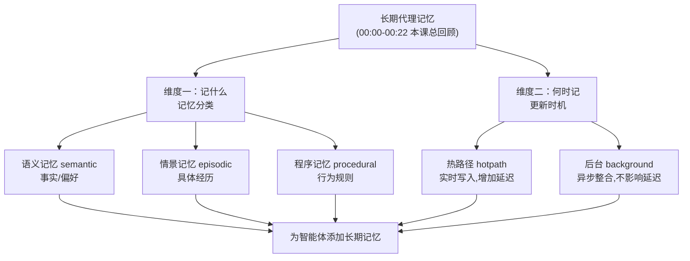

# 第23集：课程收尾——为智能体添加长期记忆的完整回顾

## 元信息
- 集数: 23
- 时间范围: 00:00:00,000 --> 00:00:22,000
- 核心主题: 祝贺你已掌握为智能体添加记忆的能力，回顾三类记忆分类与两种记忆更新时机
- 学习目标:
  - 明确记忆可以按"语义(semantic)/情景(episodic)/程序(procedural)"三类进行分类
  - 明确记忆操作可在"热路径(hotpath)"或"后台(background)"两种时机执行，并理解各自权衡

## 第一性原理拆解
- 底层本质: 智能体要像人一样"越用越懂你"，就必须把交互中的信息沉淀下来，形成可复用的长期记忆；记忆的价值在于"下次能被检索并影响决策"。
- 核心逻辑: 一个完整的记忆系统需要回答两个问题——"记什么类型"(分类)与"什么时候记"(更新时机)。前者决定信息如何组织，后者决定性能与体验如何平衡。
- 推导过程: 因为不同信息用途不同(事实、经历、行为规则) → 所以需要按语义/情景/程序三类划分；因为实时写记忆会拖慢响应 → 所以引入"热路径立即更新"与"后台延迟整合(consolidate)"两条路线，让不影响延迟的信息稍后再合并。

## 核心知识点详解
本集是第三门课"使用 LangGraph 进行长期代理记忆"的收尾总结，字幕仅回顾两大核心框架：

- **三类记忆分类**：字幕原文提到把记忆归类为 **语义记忆(semantic)**、**情景记忆(episodic)** 和 **程序记忆(procedural)**。通俗理解：语义记忆像"知识卡片"，存事实与用户偏好(如"用户喜欢简洁回答")；情景记忆像"日记本"，存具体经历过的对话或事件；程序记忆像"操作手册"，存智能体应遵循的行为方式与流程。
- **两种记忆更新时机**：字幕原文提到可以在 **热路径(hotpath)** 或 **后台(background)** 做记忆操作。通俗理解：热路径 = 在回答用户的当下就顺手把记忆写好，实时但会增加等待时间；后台 = 先快速回复用户，把整理(consolidate)记忆的活儿放到之后异步完成，这样"不影响延迟(latency)"。
- **收尾寄语**：讲师祝贺学员现在已具备为自己的智能体添加记忆的能力，并期待看到大家在未来项目中运用记忆。

## 实操步骤指南
本集为总结课，无实操代码。本门课学习回顾建议：

1. 回看前面各集，把"三类记忆(语义/情景/程序)"各自的存储结构与写入方式串起来，确认每一类你都能对应到一个代码示例。
2. 对比"热路径 vs 后台"两种更新方式的代码差异，理解后台更新如何避免拖慢用户响应。
3. 动手把学到的记忆能力接入一个自己的小项目(如个人助理),完成"分类 + 更新时机"的完整闭环。

## 配套可视化图（Mermaid）

## 常见踩坑与避坑
- 别把"记忆分类"和"更新时机"混为一谈：分类回答"记什么类型"，更新时机回答"什么时候记"，两者正交，需要分别设计。
- 别默认所有记忆都在热路径实时写入：对不影响即时对话的信息，优先放后台整合(consolidate)，避免拖慢响应、影响用户体验。

## 课后练习
- 用一句话分别说明"语义/情景/程序"三类记忆的适用场景，再各举一个例子；然后为每类记忆选择"热路径还是后台"更新，并说明理由——以此整合回顾整门第三门课。
