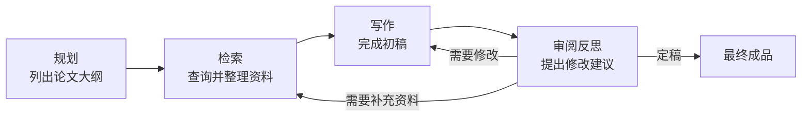
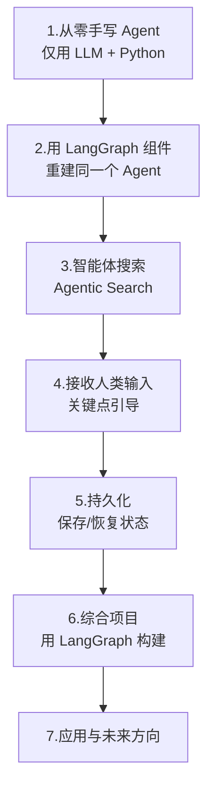

# 第24集：LangGraph AI 代理课程导论——从"一次成稿"到"迭代式智能体工作流"

## 元信息
- 集数: 24
- 时间范围: 00:00:00 --> 00:06:03
- 核心主题: 本集是第四门课《AI Agents in LangGraph》的开篇导论，由 LangChain 联合创始人兼 CEO Harrison Chase 与吴恩达（Andrew Ng）对谈，介绍智能体（Agent）工作流的核心理念与整门课程的学习路线。
- 学习目标:
  - 理解什么是"智能体（agentic）工作流"，以及它相比"一次性生成"为何能产出更好结果。
  - 掌握智能体的几大核心设计模式：规划、工具使用、反思、多智能体协作、记忆。
  - 了解本门课程的整体路线：从零手写 Agent → 用 LangGraph 重建 → 智能体搜索 → 人类介入与持久化 → 综合项目。

## 第一性原理拆解
- 底层本质: 大语言模型（LLM）单次"从第一个字写到最后一个字"（one shot）的能力有限；而人类完成复杂任务靠的是"分步骤、可回头修改的迭代过程"。智能体工作流的本质，就是把这种"迭代、协作、可反复打磨"的人类工作方式赋予 LLM。
- 核心逻辑: 用类比说明——两个人合写一篇论文时，不是一口气写完，而是：一人做规划列大纲 → 一人做检索收集资料 → 一人写初稿 → 再互相审阅、提建议、反复修改。把每个"角色"看作一个带有独特提示词（prompt）的 LLM，整个过程就构成了一个"智能体式工作流"。
- 推导过程:
  1. 观察：让人（或 LLM）不许回退、一次写完，产出质量差。
  2. 改进：允许分步骤、可修改、可反思，产出质量显著提升。
  3. 抽象：把每一步（大纲/检索/写作/审阅）都用一个 LLM 提示来完成，并让它们循环迭代。
  4. 归纳：这些智能体的行为本质上是一张"循环图（cyclical graph）"——正因如此，LangChain 扩展出了 LangGraph 来直接支持这种循环结构。

## 核心知识点详解

- **智能体式工作流（Agentic Workflow）**：不是让 LLM 一次性输出最终答案，而是让它像人一样分步骤、反复迭代地产出结果。相比"写个提示词，一口气生成整篇文章"，迭代式工作流能得到明显更好的成品。

- **过去一年的两个关键进步**：
  1. **函数调用（Function Calling）**：让 LLM 的"工具使用"变得更可预测、更稳定。
  2. **面向智能体的专用工具（如搜索）**：普通搜索引擎返回一堆链接让你自己点开找答案；而**智能体搜索（Agentic Search）**直接返回"答案 + 可引用的链接来源"，并且提供**可预测的结果格式**，正好符合智能体的需要。

- **智能体的五大核心设计模式**：
  1. **规划（Planning）**：先想清楚要走哪些步骤，比如先列大纲、再决定后续做什么。
  2. **工具使用（Tool Use）**：知道有哪些工具可用、以及如何使用它们，例如搜索工具。
  3. **反思（Reflection）**：迭代式地改进结果，可以用多个 LLM 互相批评、提出有用建议，驱动"编辑—修改"的循环。
  4. **多智能体协作（Multi-Agent Communication）**：把每个角色看作一个带独特提示词、扮演独特分工的 LLM，彼此配合完成任务。
  5. **记忆（Memory）**：在多个步骤之间跟踪进度和中间结果。

- **能力的两个来源**：有些能力（如函数调用）源自 LLM 本身；但很多能力（如记忆、工具执行、循环控制）实际上是由**运行它的框架（如 LangChain / LangGraph）在 LLM 之外实现的**。

- **循环图（Cyclical Graph）与 LangGraph**：ReAct（推理+行动）、Self-Refine（自我迭代精修）、AlphaCodium（用"流程工程 flow engineering"构建编码智能体）等范式，其行为都可以用一张**循环图**来定义。为了直接支持构建这类智能体，LangChain 扩展出了 **LangGraph**。

- **两个额外的实用能力**：
  1. **接收人类输入（Human Input / 人在回路）**：在关键节点引导智能体的行为。
  2. **持久化（Persistence）**：保存当前状态信息以便日后返回，对调试和生产化部署都很有帮助。

## 实操步骤指南

本集为整门课程的导览集，未涉及具体代码。字幕中给出的课程路线（后续各集将逐步动手实现）如下：

1. 只用一个 **LLM + Python**，从零手写一个 Agent。
2. 用 **LangGraph 组件**重建同一个 Agent，从而理解 LangGraph 的各个组成部分。
3. 学习**智能体搜索（Agentic Search）**的能力与用法。
4. 学习**接收人类输入**（在关键点引导智能体）。
5. 学习**持久化**（保存/恢复状态，用于调试与生产化）。
6. 用 LangGraph 构建一个综合**项目**（具体是什么要到最后一课才揭晓）。
7. 最后由讲者介绍该技术的一些酷炫应用与未来方向。

> 致谢（字幕提及）：LangChain 的 Lance Martin 与 Nuno Campos；Tavily 的 Asaf Elovic；DeepLearning.AI 的 Geoff Ladwig（whisper 原文转录音近，人名以音译为准）。

## 配套可视化图（Mermaid）

图一：智能体式工作流的"合写论文"类比（约 01:20 - 02:14）

图二：第四门课学习路线图（约 04:41 - 05:45）

## 常见踩坑与避坑

1. **误以为"写好一个提示词让 LLM 一次生成"就是最优解**：字幕明确指出，一次成稿（one shot）质量往往较差；应改用"规划—检索—写作—反思"的迭代式工作流，产出会明显更好。
2. **误以为智能体的所有能力都来自 LLM 本身**：其实记忆、工具执行、循环控制等很多能力是由框架（LangChain / LangGraph）在 LLM 之外实现的；理解这一点才能正确地借助框架搭建智能体，而不是苛求 LLM"什么都自己搞定"。

## 课后练习

回想你最近用 LLM 完成的一个任务（如写一封邮件、一段报告或一段代码）。请把它拆解成智能体的五大设计模式（规划、工具使用、反思、多智能体、记忆），思考：如果把"一次生成"改成"分步骤 + 反思迭代"的工作流，你会设计哪几个步骤？其中哪些步骤需要调用外部工具（如搜索）？
