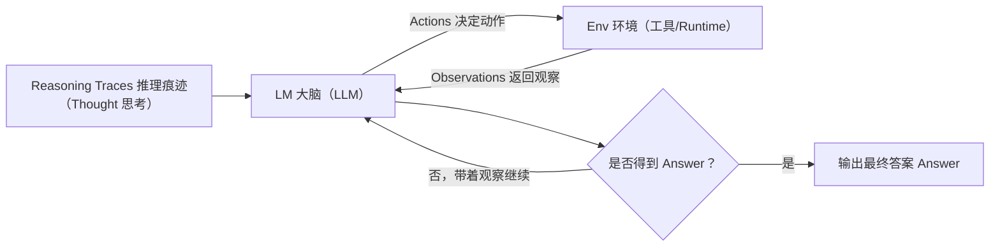
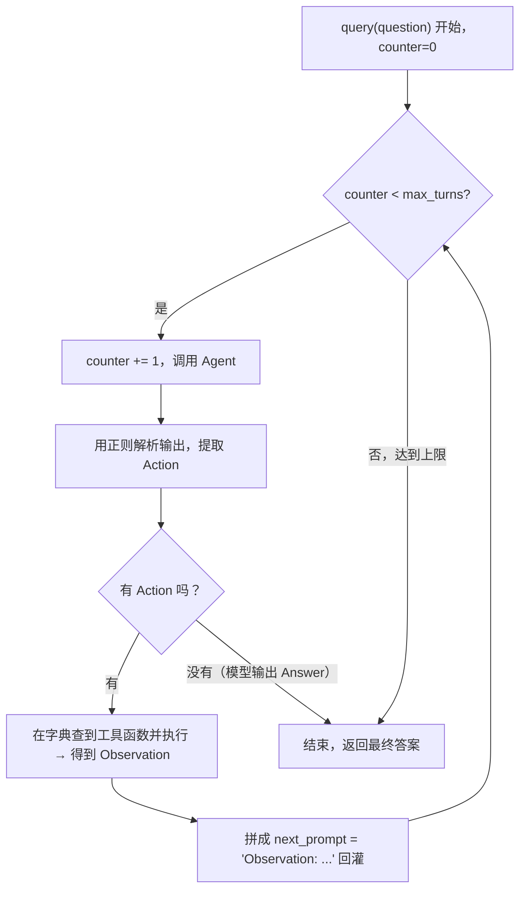

# 第25集：从头构建一个 Agent（手写 ReAct 循环）

## 元信息
- 集数: 25
- 时间范围: 00:00:00 --> 00:07:42
- 核心主题: 不依赖任何框架，仅用原始 LLM API + Python 代码，手写 ReAct（推理 + 行动）循环实现一个能调用工具的 Agent。
- 学习目标:
  - 理解 ReAct 模式的本质：思考（Thought）→ 行动（Action）→ 暂停（PAUSE）→ 观察（Observation）的循环。
  - 分清哪些工作交给 LLM（推理决策），哪些由 LLM 外围的代码（runtime，运行时）负责（执行工具、解析、循环控制）。
  - 亲手把「手动逐步调用」升级为「自动 while 循环」，看清 Agent 并不神秘。

## 第一性原理拆解
- 底层本质: **Agent = LLM（大脑，负责思考和决策下一步）+ Runtime（手脚，负责真正执行动作并把结果喂回给大脑）+ 一个不断重复的循环**。LLM 本身不会执行任何操作，它只会输出文字；真正「做事」的是围绕它写的普通代码。
- 核心逻辑: 通过一段精心设计的 **系统提示词（System Prompt）**，把 LLM 约束在固定输出格式（Thought / Action / PAUSE / Observation / Answer）中。代码负责：解析 LLM 的输出 → 若出现 Action 就调用对应工具 → 把工具结果作为 Observation 拼回消息列表 → 再次调用 LLM，如此往复，直到 LLM 输出 Answer。
- 推导过程:
  1. LLM 只能生成文本，无法自己查数据或算数 → 需要「工具（Tools）」补足能力。
  2. LLM 无法自己调用工具 → 需要外部代码解析它「想调哪个工具、传什么参数」。
  3. 一次调用往往不够（多步任务）→ 需要把「观察结果」再回灌给 LLM 让它继续思考 → 于是产生「循环」。
  4. 循环需要停止条件 → 用「Answer」作为终止信号，同时用 `max_turns` 兜底防止死循环。

## 核心知识点详解
- **ReAct 模式（Reasoning + Acting，推理 + 行动）**：论文来自 ICLR 2023《ReAct: Synergizing Reasoning and Acting in Language Models》。LLM 先思考要做什么，再决定采取一个动作，动作在环境中执行后返回一个观察结果；带着这个观察，LLM 再次思考，如此循环直到它认为完成。本集代码参考了 Simon Willison 的博客对该模式在 Python 中的实现。
- **LLM 与 Runtime 的分工**：这是本集最重要的观察点。LLM 负责「思考、决定下一步动作」；Runtime（LLM 外面的普通代码）负责「初始化模型、维护消息历史、解析输出、真正执行工具、控制循环」。
- **系统提示词是 Agent 的灵魂**：ReAct Agent 需要一段非常具体的系统提示词，它规定了循环格式（Thought、Action、PAUSE、Observation、Answer），列出可用动作（`calculate`、`average_dog_weight`），并给出一个完整的示例轨迹（example trace）。示例能显著帮助 LLM 理解到底该怎么按格式输出。
- **消息列表（messages）作为记忆**：Agent 用一个 `messages` 列表累积整个循环里发生的一切（system / user / assistant 各角色消息）。每轮把新内容 append 进去，再整体传给模型，这就是 Agent 的「上下文记忆」。
- **工具（Tools）**：本集用两个玩具工具演示——`calculate`（对字符串做 eval 计算）和 `average_dog_weight`（写死几个狗品种的平均体重，属于 mock 假数据）。真实场景中工具会更贴合你要解决的具体问题。
- **PAUSE 与 Observation**：LLM 输出 `Action ... PAUSE` 表示「我要调用工具，先停下来等结果」；代码执行工具后把结果格式化成 `Observation: ...` 再喂回去。
- **用正则表达式解析输出**：自动化循环时，用一个正则（regex）匹配 `Action:` 行，判断 LLM 这次是要「执行动作」还是「已经给出最终 Answer」。
- **temperature=0**：调用模型时把温度设为 0，让输出尽量确定（deterministic），保证格式稳定、结果可复现。

## 实操步骤指南

### 1. 初始化模型并冒烟测试
```python
# 导入所需内容，初始化语言模型（使用 OpenAI）
from openai import OpenAI
client = OpenAI()

# 测试一下确保能用：传入 "Hello World"
# 得到类似 "Hello, how can I assist you today?" 的回复
```

### 2. 定义 Agent 类
```python
class Agent:
    def __init__(self, system=""):
        # 用系统消息参数化这个 Agent，允许用户传入
        self.system = system
        # 维护一个消息列表，随时间累积 ReAct 循环中发生的一切
        self.messages = []
        if self.system:
            # 一开始就把系统消息放进列表
            self.messages.append({"role": "system", "content": system})

    def __call__(self, message):
        # 传入一条字符串消息，追加到已有消息数组
        self.messages.append({"role": "user", "content": message})
        # 执行一次模型调用
        result = self.execute()
        # 把结果作为 assistant 消息追加回列表
        self.messages.append({"role": "assistant", "content": result})
        return result

    def execute(self):
        # 调用上面初始化的 OpenAI 客户端，用 GPT-4 模型
        # temperature=0 让输出非常确定
        completion = client.chat.completions.create(
            model="gpt-4",
            temperature=0,
            messages=self.messages,
        )
        # 返回模型回复的文本内容
        return completion.choices[0].message.content
```

### 3. 编写 ReAct 系统提示词（要点，基于字幕描述）
```python
prompt = """
You run in a loop of Thought, Action, PAUSE, Observation.
At the end of the loop you output an Answer.
Use Thought to describe your thoughts about the question you have been asked.
Use Action to run one of the actions available to you - then return PAUSE.
Observation will be the result of running those actions.

Your available actions are:
calculate:
average_dog_weight:

（后面附上一个完整的 example trace 示例：
 Question -> Thought -> Action -> PAUSE -> Observation -> Answer，
 这个例子能帮助模型更精确地理解该如何按格式输出）
"""
```

### 4. 提供两个工具函数
```python
def calculate(what):
    # 直接对传入字符串求值
    return eval(what)

def average_dog_weight(name):
    # 用假数据 mock 几个狗品种
    if name in "Scottish Terrier":
        return "Scottish Terriers average 20 lbs"
    elif name in "Border Collie":
        return "a Border Collies average weight is 37 lbs"
    elif name in "Toy Poodle":
        return "a toy poodles average weight is 7 lbs"
    else:
        return "An average dog weights 50 lbs"

# 一个字典，把函数名映射到函数本身
known_actions = {
    "calculate": calculate,
    "average_dog_weight": average_dog_weight,
}
```

### 5. 手动跑一遍（体会循环本质）
```python
abot = Agent(prompt)
# 第一次提问
result = abot("How much does a toy poodle weigh?")
# 输出里包含 Thought / Action: average_dog_weight: Toy Poodle / PAUSE

# 手动执行工具
result = average_dog_weight("Toy Poodle")  # -> mock 返回 7 lbs

# 把结果格式化成下一个提示，再喂回 Agent
next_prompt = "Observation: {}".format(result)
abot(next_prompt)
# -> Answer: a toy poodle weighs 7 lbs

# 想看全过程，可以查看 abot.messages（system / user / assistant 交替）
```

### 6. 自动化：放进 while 循环
```python
import re
# 用正则匹配 Action 行，判断是执行动作还是最终答案
action_re = re.compile(r'^Action: (\w+): (.*)$')

def query(question, max_turns=5):
    i = 0
    bot = Agent(prompt)                 # 用默认系统提示词新建 Agent
    next_prompt = question              # 初始下一个提示 = 原始问题
    while i < max_turns:               # 计数器兜底，防止死循环
        i += 1
        result = bot(next_prompt)
        print(result)
        # 解析出所有 Action
        actions = [action_re.match(a) for a in result.split('\n') if action_re.match(a)]
        if actions:
            # 取出动作名和动作输入
            action, action_input = actions[0].groups()
            if action not in known_actions:
                # 理论上不该发生，但做个防御性检查
                raise Exception("Unknown action: {}: {}".format(action, action_input))
            print(" -- running {} {}".format(action, action_input))
            # 在字典里查到函数并对输入调用，得到观察结果
            observation = known_actions[action](action_input)
            print("Observation:", observation)
            # 拼成下一个提示回灌给模型
            next_prompt = "Observation: {}".format(observation)
        else:
            # 没有 Action，说明模型输出了 Answer，结束
            return
```

对复杂问题跑自动循环：
```python
query("I have 2 dogs, a border collie and a scottish terrier. What is their combined weight")
# 模型自动：思考 -> Action(border collie=37) -> 观察 -> 思考 ->
#          Action(scottish terrier=20) -> 观察 -> 思考 ->
#          Action(calculate 37 + 20=57) -> 观察 -> Answer: 57 lbs
```

## 配套可视化图（Mermaid）

### 图1：ReAct 模式总览（对应 00:24 - 00:57 讲解 + scene_001 截图）


### 图2：自动化 while 循环执行流程（对应 08:36 - 12:24 讲解 + scene_002 截图的运行轨迹）


## 常见踩坑与避坑
- **忘记重置消息历史**：想换新问题时必须重新初始化 Agent（`Agent(prompt)`），否则上一轮累积的 `messages` 还在，会污染新对话。字幕明确提到「reinitialize the agent 以清空已累积的消息」。
- **没有循环上限导致死循环**：一定要设置 `max_turns` 计数器兜底。如果模型迟迟不输出 Answer，循环会一直跑，浪费 token 甚至无限执行。
- **输出格式不稳定使解析失败**：Agent 高度依赖固定格式（Thought/Action/PAUSE/Answer）。务必写好系统提示词并附示例，同时把 `temperature=0` 让输出确定，否则正则可能匹配不到 Action。
- **`calculate` 用 eval 有安全风险**：本集用 `eval` 只是玩具演示；生产环境不要直接对模型输出的字符串做 eval，应换成安全的计算/沙箱方案。

## 课后练习
1. 给 Agent 新增一个真实工具（例如查天气或做单位换算），在系统提示词的「available actions」里登记它、在 `known_actions` 字典里注册函数，然后用一个需要多步推理的问题验证自动循环能否正确调用它。
2. 分别用「手动逐步调用」和「自动 while 循环」跑同一个复杂问题（如两只狗的合计体重），打印并对比两者的 `messages` 轨迹，指出：在整个过程中，哪几步是 LLM 完成的（思考/决策），哪几步是 Runtime 代码完成的（解析/执行工具/拼观察/控制循环）。
