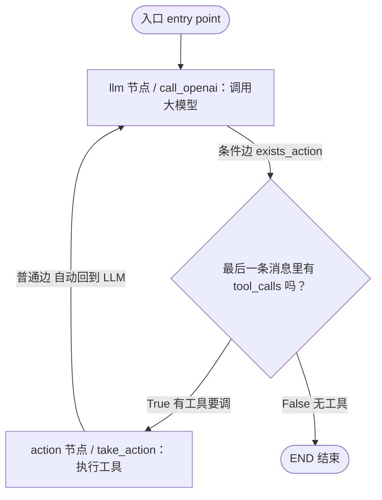
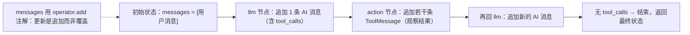

# 第26集：用 LangGraph 实现 Agent（把手写循环改写成图）

## 元信息
- 集数: 26
- 时间范围: 00:00:00 --> 00:19:24
- 核心主题: 把上一集从零手写的 Agent 循环，用 LangGraph 的图结构（StateGraph / 节点 / 边 / 条件边 / 状态）重新实现。
- 学习目标:
  1. 理解 LangChain 的核心组件（Prompt 模板、工具 Tools）以及 LangGraph 的核心概念（节点 node、边 edge、条件边 conditional edge、状态 state）。
  2. 掌握用 `StateGraph` 把「调用 LLM → 判断是否要调工具 → 执行工具 → 回到 LLM」这个循环声明成一张可编排的循环图。
  3. 能够运行并可视化这张图，观察它处理简单问题、并行工具调用、串行依赖工具调用的完整行为。

## 第一性原理拆解
- 底层本质：上一集手写的 Agent，本质是「一个带循环的控制流」——反复在「思考（调 LLM）」和「行动（调工具）」之间跳转，直到得到最终答案。这个控制流可以抽象成一张**有环的图（cyclic graph）**：LLM 是一个节点，工具执行是另一个节点，它们之间用边连接，能回到原点形成循环。
- 核心逻辑：LangGraph 的作用就是「描述并编排（describe and orchestrate）这个控制流」。它不发明新逻辑，而是把原本散落在 `while` 循环和 `if/else` 里的箭头，显式地声明成节点与边。这样带来三个好处：可控的流转（每一步去哪儿都有明确的箭头）、内置持久化（persistence，可保存/恢复状态、支持多会话、支持人在环路 human-in-the-loop）、以及自动可视化。
- 推导过程：
  1. 观察上一集：用户消息 → 系统提示 → 调 LLM → 输出「思考 + 行动」→ 决策（返回 or 调工具）→ 调工具得到观察结果 → 把观察结果作为新消息塞回提示 → 循环。
  2. 发现学术论文里的各种 Agent 图，本质都是「带明确箭头的图」，这个洞察催生了 LangGraph（LangChain 的扩展，专为 Agent 与多 Agent 流程设计）。
  3. 于是把手写循环映射成图：`call_openai` 节点（调 LLM）→ `exists_action` 条件边（判断有没有工具要调）→ 若有则去 `take_action` 节点执行工具并**自动回到** LLM 节点；若没有则去 END 结束。
  4. 状态（一个会不断累加的消息列表）在所有节点和边之间共享，串起整个循环。

## 核心知识点详解

- **Prompt 模板（Prompt Template）**：可复用的提示。就是一段带占位变量的字符串（例如 `{tools}`、`{tool_names}`、`{input}`、`{agent_scratchpad}`），根据用户内容动态替换。社区里现成的模板可在 **LangChain Hub** 里查看和复用，其中就有和上一集 ReAct 提示几乎一样的模板（"Answer the following questions as best you can. You have access to the following tools..."）。

- **工具（Tools）**：从 `langchain_community` 包里导入，该包含有上百个现成工具。本集用的是 **Tavily** 搜索工具（真实的联网搜索，替代上一集的假工具），从此以后都用它。

- **LangGraph 是什么**：LangChain 的扩展，专门帮你**描述并编排控制流**。关键能力是创建**循环图（cyclic graph）**（这正是 Agent 需要的），并自带**持久化（persistence）**——能同时进行多个会话、记住之前的迭代与动作，还能启用「人在环路」等高级功能。

- **三大核心概念**：
  - **节点（Node）**：就是 Agent 或函数（一段会执行的逻辑），比如「调 LLM」或「执行工具」。
  - **边（Edge）**：连接节点，表示执行完一个节点后固定走到下一个节点。
  - **条件边（Conditional Edge）**：当需要「根据结果做决策、决定下一步去哪个节点」时使用。比如 LLM 输出后，判断有没有工具要调，来决定去「执行工具」还是「结束」。

- **状态（State / Agent State）**：LangGraph 里最重要的概念之一，是随时间被追踪的数据。它在图的**每个节点、每条边**都可访问，是「图的局部数据」，并且可被存进持久化层，从而**日后能从任意时刻恢复继续执行**。
  - **简单状态**：只有一个 `messages` 字段，类型是 `Annotated[Sequence[BaseMessage], operator.add]`。这里的 `operator.add` 注解很关键：状态更新时**不是覆盖，而是把新消息追加**到已有列表里。
  - **复杂状态示例**：可能含 `input`、`chat_history`、`agent_outcome`、`intermediate_steps` 等字段，各有类型。没有注解的字段更新时会**覆盖**旧值；`intermediate_steps` 用 `operator.add` 注解，所以是**累加**（因为它要持续记录 Agent 每一步的动作和观察结果）。

- **`bind_tools`（绑定工具）**：对模型调用 `bind_tools(tools)`，作用是**让模型知道它有哪些工具可以调用**。

- **`compile`（编译）与 Runnable**：所有节点、边、入口设置好后，调用 `graph.compile()` 把图变成一个 **LangChain Runnable**（可运行对象），它暴露统一的调用/invoke 接口。

- **并行 vs 串行工具调用**：现代模型支持**并行工具调用（parallel tool calling）**——一次返回多个 tool_calls，在回到模型前就一起执行（例：同时查 SF 和 LA 天气）。而当第二个查询**依赖第一个查询的结果**时（例：先查「2024 超级碗冠军」得到球队→再查「该州 GDP」），只能**串行**：调一个工具 → 回模型 → 再调下一个工具。

## 实操步骤指南

> 以下代码基于字幕对代码讲解的还原（whisper 转录中把 LangGraph 误听成 "link graph / lane graph"，Tavily 误听成 "Taville / to Ville"，均已修正）。

### 1. 加载环境变量、导入依赖
```python
# 加载环境变量（例如 OpenAI API Key）
from dotenv import load_dotenv
load_dotenv()

# LangGraph：状态图 与 END 结束节点
from langgraph.graph import StateGraph, END

# 构造 agent state 需要的类型工具
from typing import TypedDict, Annotated
import operator

# LangChain 的消息类型（人类 / AI / 系统 / 工具消息）
from langchain_core.messages import (
    AnyMessage, SystemMessage, HumanMessage, ToolMessage,
)

# LangChain 对 OpenAI 的封装：统一接口，可无缝换成其它模型供应商
from langchain_openai import ChatOpenAI

# 搜索工具 Tavily
from langchain_community.tools.tavily_search import TavilySearchResults
```

### 2. 创建工具（Tavily 搜索，最多返回 2 条结果）
```python
tool = TavilySearchResults(max_results=2)
# tool.name 为 "tavily_search_results_json"，模型会用这个名字来调用工具
```

### 3. 定义 Agent 状态（只有一个会累加的消息列表）
```python
class AgentState(TypedDict):
    # operator.add 注解：新消息是“追加”而非“覆盖”
    messages: Annotated[list[AnyMessage], operator.add]
```

### 4. 构建 Agent 类（在构造函数里搭图）
```python
class Agent:
    def __init__(self, model, tools, system=""):
        self.system = system

        # 用 AgentState 初始化状态图（此时图是空的，没有节点和边）
        graph = StateGraph(AgentState)

        # 添加两个节点：LLM 节点 与 action（执行工具）节点
        graph.add_node("llm", self.call_openai)
        graph.add_node("action", self.take_action)

        # 添加条件边：LLM 之后，用 exists_action 判断是否要调工具
        # True -> 去 action 节点；False -> 去 END 结束
        graph.add_conditional_edges(
            "llm",                       # 边的起点节点
            self.exists_action,          # 决定下一步去哪的函数
            {True: "action", False: END} # 返回值 -> 下一节点 的映射
        )

        # 添加普通边：action 执行完自动回到 llm 节点，形成循环
        graph.add_edge("action", "llm")

        # 设置入口：从 llm 节点开始
        graph.set_entry_point("llm")

        # 编译成 LangChain Runnable
        self.graph = graph.compile()

        # 保存工具（用字典：名字 -> 工具）和绑定了工具的模型
        self.tools = {t.name: t for t in tools}
        self.model = model.bind_tools(tools)
```

### 5. 三个函数：LLM 节点 / 条件边 / action 节点
```python
    # LLM 节点：取出消息，加上系统消息，调用模型
    def call_openai(self, state: AgentState):
        messages = state["messages"]
        if self.system:
            messages = [SystemMessage(content=self.system)] + messages
        message = self.model.invoke(messages)
        # 返回只含 1 条消息的字典；因 messages 用 operator.add 注解，会“追加”进状态
        return {"messages": [message]}

    # 条件边：看最后一条消息里有没有 tool_calls，有则 True（要执行工具）
    def exists_action(self, state: AgentState):
        result = state["messages"][-1]
        return len(result.tool_calls) > 0

    # action 节点：执行模型请求的（可能是多个）工具调用
    def take_action(self, state: AgentState):
        tool_calls = state["messages"][-1].tool_calls  # 可能是并行的多个
        results = []
        for t in tool_calls:
            tool = self.tools[t["name"]]          # 按名字找到工具
            observation = tool.invoke(t["args"])  # 传入参数执行
            results.append(
                ToolMessage(tool_call_id=t["id"], name=t["name"], content=str(observation))
            )
        # 返回新增的工具消息，LangGraph 会在迭代之间把它们加进状态
        return {"messages": results}
```

### 6. 实例化并可视化
```python
prompt = """You are a smart research assistant. Use the search engine to look up information. \
You are allowed to make multiple calls (either together or in sequence). \
Only look up information when you are sure of what you want."""

model = ChatOpenAI(model="gpt-4-turbo")
abot = Agent(model, [tool], system=prompt)

# 自动可视化这张图
from IPython.display import Image
Image(abot.graph.get_graph().draw_png())
```

### 7. 调用 Agent（把用户输入包成符合状态的消息列表）
```python
# 简单问题
messages = [HumanMessage(content="What is the weather in sf?")]
result = abot.graph.invoke({"messages": messages})
# result 是 Agent 结束时的最终状态；取最后一条消息内容
print(result["messages"][-1].content)   # 见截图：result['messages'][-1].content

# 并行工具调用：一次同时查两地
result = abot.graph.invoke({"messages": [HumanMessage(content="What is the weather in SF and LA?")]})

# 串行依赖：第二步依赖第一步结果
query = "Who won the Super Bowl in 2024? What is the GDP of that state?"
result = abot.graph.invoke({"messages": [HumanMessage(content=query)]})
# 结果：2024 超级碗冠军=堪萨斯城酋长；所在州 Missouri，2023 Q3 GDP 约 4000 多亿美元
```

## 配套可视化图（Mermaid）

图1：LangGraph 的 Agent 循环图结构（约 06:15–07:00 讲到把上一集映射成图，07:04 起写代码）


图2：状态如何随迭代累加（约 04:30–06:04 讲状态，00:53 起讲 operator.add）


## 常见踩坑与避坑

1. **状态字段忘记加 `operator.add` 注解**：不加注解的字段，每次更新会**覆盖**旧值；`messages`/`intermediate_steps` 这类需要累积历史的字段必须用 `Annotated[..., operator.add]`，否则消息会被覆盖，Agent 记不住上下文。

2. **调用图时输入结构没对齐状态**：`invoke` 必须传入符合状态定义的字典（这里是 `{"messages": [HumanMessage(...)]}`），不能直接传一个字符串或裸消息，否则和 `AgentState` 的 `messages` 字段对不上。

3. **忘记 `bind_tools` 或忘记 `compile`**：不 `model.bind_tools(tools)`，模型不知道有工具可调、永远不会产生 tool_calls；不 `graph.compile()`，图只是声明还不能运行（编译后才变成可 invoke 的 Runnable）。另外条件边的返回值要和映射字典（如 `{True: "action", False: END}`）严格对应。

## 课后练习

1. 用本集的 `Agent` 类和 Tavily 工具，分别提三类问题各一个：单工具问题、需要并行查询的问题（如"对比两地天气"）、需要串行依赖的问题（如"先查某事实、再基于结果查另一事实"）。运行后打印每次的 `result["messages"]`，观察消息列表如何累加，并指出哪几步是并行、哪几步是串行，为什么。

2. 修改 `AgentState`：新增一个不带 `operator.add` 注解的字段（如 `input: str`）和一个带 `operator.add` 注解的字段，分别在节点里更新它们，验证「无注解=覆盖、有注解=累加」的行为差异；再画出对应的 Mermaid 流程图说明状态在各节点间如何流转。
