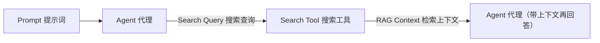
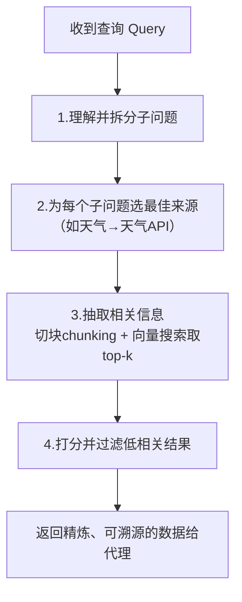

# 第27集：Agentic 搜索——为什么 AI 代理需要专门的搜索工具

## 元信息
- 集数: 27
- 时间范围: 00:00:00,000 --> 00:05:29,879
- 核心主题: 讲解「代理式搜索（Agentic Search）」与普通网页搜索的本质区别，并用 Tavily 工具演示：代理需要的是结构化、精炼、可溯源的数据，而不是给人看的网页。
- 学习目标:
  - 理解为什么纯靠模型静态权重（zero-shot）回答会有局限，需要搜索工具补足动态信息与来源。
  - 掌握一个搜索工具内部要做的四步：拆分子问题 → 选最佳来源 → 抽取相关片段 → 打分过滤。
  - 通过对比「普通搜索 + 手工抓取」和「Tavily 代理搜索」，体会「给人看的结果」与「给代理用的结构化数据」的差别。

## 第一性原理拆解
- 底层本质: 大模型的知识被「冻结」在训练时的静态权重里，而真实世界的信息是动态变化的（比如昨晚的比赛比分、此刻的天气）。要让代理回答这类问题，就必须把「外部实时信息」以模型能高效消化的形式喂进去。
- 核心逻辑: 搜索不是目的，而是「为代理准备燃料」。代理不需要一整个网页（HTML、广告、导航栏），它只需要与子问题精确相关、且带来源的最小信息集，这样才能减少幻觉、提高准确率。
- 推导过程:
  1. 模型静态权重 → 无法覆盖动态数据、无法给出来源。
  2. 于是引入搜索工具：代理收到 prompt，自己决定是否调用搜索工具，把结果作为 RAG 上下文（RAG Context）回填给代理。
  3. 普通搜索返回「一堆链接 / 整张网页」→ 需要人再去点、去读、去筛，代理处理成本高。
  4. 代理搜索直接返回「结构化 JSON（如天气的温度、湿度、风速）」→ 代理拿来即用。
  5. 结论：面向代理的搜索要专门优化，Tavily 这类工具就是干这个的。

## 核心知识点详解
- **Zero-shot 的局限**：代理只凭模型的静态权重（static weights）回答，有两大问题——(1) 数据是动态的，问不了「昨晚比赛的比分」；(2) 拿不到信息来源，难以减少幻觉、也不利于人机信任。
- **Agentic Search（代理式搜索）**：一种为代理服务的搜索方式。流程是：prompt 到达代理 → 代理决定调用搜索工具 → 工具把找到的信息作为上下文返回给代理。
- **搜索工具内部的四步（本集核心）**：
  1. **理解并拆分子问题（sub-questions）**：把复杂查询拆成若干小问题，这样才能处理复杂需求。
  2. **为每个子问题选最佳来源**：从多个集成（integrations）中挑选，比如「旧金山天气如何」就该走天气 API 才有最好结果。
  3. **抽取相关信息**：找到来源还不够，要只提取与子问题相关的内容。基础做法是把来源「切块（chunking）」，再用向量搜索（vector search）取出最相关的前几块（top-k chunks）。
  4. **打分与过滤**：对取回的结果打分，过滤掉相关性低的信息。
- **RAG Context（检索增强上下文）**：搜索工具返回的信息作为上下文回填给代理，这就是 RAG 的思路（截图中标注为 "RAG Context"）。
- **Tavily**：本集使用的代理搜索服务。通过环境变量加载 API key，创建 Tavily 客户端后即可发起搜索，直接返回精炼、准确、结构化的答案。
- **「给人看的」vs「给代理用的」**：Google 搜天气，人得到的是一张漂亮的天气卡片（温度/湿度/风，图文并茂）；而代理需要的是结构化 JSON——对人不友好，但对代理正是理想输入。

## 实操步骤指南
本集为演示讲解，字幕未逐字念出完整代码。以下按字幕描述「概念性还原」流程（变量/细节以字幕为准，未念出的部分不臆造）：

1. 初始化 Tavily 客户端（字幕：从环境变量加载 Tavily API key，再从 Tavily 库导入并创建客户端）：
```python
# 概念性还原：从环境变量读取 Tavily API key，创建客户端
import os
from tavily import TavilyClient

client = TavilyClient(api_key=os.environ["TAVILY_API_KEY"])
```

2. 用 Tavily 做一次搜索测试（字幕：搜索「英伟达新的 GPU（口误转录为 black hole，技术上应指 Nvidia Blackwell GPU）」，得到简单但准确的答案）：
```python
# 概念性还原：发起一次搜索并查看结果
result = client.search("Nvidia Blackwell GPU")
print(result)
```

3. 对比实验——先用「普通搜索」（字幕：导入 DuckDuckGo 搜索，转录为 "Dr. Go search"，先拿到一堆链接）：
```python
# 概念性还原：普通搜索只返回链接，代理还没法直接用
# 查询：What is the current weather in San Francisco?
# 用 DuckDuckGo 搜索拿到候选链接列表
```

4. 手工从第一个链接抓网页（字幕：用 BeautifulSoup 抓取并解析 HTML）：
```python
# 概念性还原：抓取第一个 URL 的网页并用 BeautifulSoup 清洗
import requests
from bs4 import BeautifulSoup

html = requests.get(first_url).text
soup = BeautifulSoup(html, "html.parser")
# 提取标题(headers)与正文内容，strip 去空白，join 拼成纯文本
text = "\n".join(t.get_text().strip() for t in soup.find_all(["h1", "h2", "p"]))
```
   - 字幕结论：直接输出是杂乱的 HTML（截图可见大量 `<meta ...>` 标签）；解析后好一些，但仍然不够精炼。

5. 换成「Tavily 代理搜索」跑同一个查询（字幕：得到一个简单的 JSON，包含旧金山天气的大量信息，再美化打印）：
```python
# 概念性还原：同样的天气查询，Tavily 直接返回结构化 JSON
result = client.search("What is the current weather in San Francisco?")
# 解析并高亮 JSON，代理可直接消费其中的结构化字段
```
   - 字幕结论：这个 JSON 对人不好看，但正是代理想要的结构化数据。

6. 最后对照 Google 搜索的结果（截图 scene_004：一张 16°C、降水 90%、湿度 67%、风 31 km/h 的天气卡片）——说明人要的是这种图文卡片，代理要的是结构化数据，二者需求不同。

## 配套可视化图（Mermaid）

图 1：代理调用搜索工具的整体流程（对应 00:51–01:00「Why Search Tool」示意图，scene_001 @ 00:12）


图 2：搜索工具内部四步（对应 01:10–02:07 的分步讲解）


## 常见踩坑与避坑
- **误把「给人看的搜索」当「给代理用的搜索」**：普通搜索返回链接和整页 HTML，代理还得自己抓取、清洗、筛选，成本高且易出错。给代理用的搜索应直接产出结构化、精炼、带来源的数据。
- **忽视来源（sources）导致幻觉**：字幕强调很多场景需要知道信息来源，这样能减少幻觉、增进人机信任。别只要答案不要出处。
- **复杂问题不拆分**：一步到位地把复杂查询丢给搜索，效果差。正确做法是先拆成子问题，再分别选最合适的来源（例如天气问题走天气 API 而不是通用网页搜索）。
- **（转录小误差提醒）**：字幕由 whisper 自动转录，"black hole GPU" 实为 Nvidia Blackwell GPU，"Dr. Go search" 实为 DuckDuckGo Search，理解时按技术上下文推断即可。

## 课后练习
1. 用同一个问题（比如「你所在城市今天的天气」）分别跑「普通搜索 + BeautifulSoup 手工清洗」和「Tavily 代理搜索」，对比两者的输出：哪个更适合直接喂给代理？为什么？
2. 结合本集「搜索工具内部四步」，为「比较 A、B 两款手机的电池续航」这个复杂问题，写出你会拆成哪些子问题、每个子问题应选择什么类型的来源。
