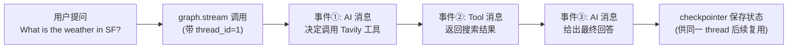
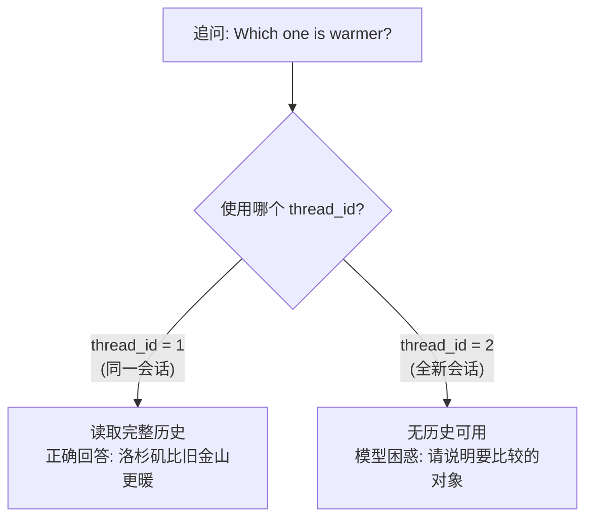

# 第28集：持久化(Persistence)与流式输出(Streaming)

## 元信息
- 集数: 28
- 时间范围: 00:00:00 --> 00:09:10
- 核心主题: 给智能体加上"记忆"(持久化)和"实时可见"(流式输出)两大能力，让它能支撑长时间运行的生产级应用。
- 学习目标:
  1. 理解持久化(checkpointer)如何在节点之间保存智能体状态，并用 thread_id 区分多个独立会话。
  2. 掌握两种流式输出：流式返回中间消息(messages)与流式返回逐个 token。
  3. 会用同步/异步两种 SQLite saver，并知道异步方法为何要配异步 checkpointer。

## 第一性原理拆解
- 底层本质: 智能体本质是"一次性函数调用"，跑完就忘、跑的过程不可见。要把它变成能陪用户长期对话的产品，就必须解决两个物理问题——"状态存哪里"(持久化)和"过程怎么看"(流式)。
- 核心逻辑:
  - 持久化 = 在图(graph)的每个节点执行前后拍快照(checkpoint)存进数据库，用 thread_id 当"会话档案编号"，下次带同一个编号就能接着上次继续。
  - 流式 = 不等最终答案一次性返回，而是把执行过程中每一步(AI 决策消息、工具结果消息、乃至每个 token)实时"吐"出来。
- 推导过程: 长任务 → 需要中断后恢复 → 引入 checkpointer 存状态；多用户并发 → 需要隔离对话 → 引入 thread_id；用户等待久 → 需要过程反馈 → 引入 stream(消息级)与 astream_events(token 级)。持久化又是下一课"人在回路(human-in-the-loop)"的基础。

## 核心知识点详解

- **持久化(Persistence)**：把智能体在"某一时刻"的状态保留下来，之后可以回到该状态并继续。这是长时间运行应用的刚需。

- **检查点器(Checkpointer)**：LangGraph 中实现持久化的组件。它会在"每个节点执行之后、以及节点之间"对状态进行检查点(checkpoint，即拍快照)保存。

- **SQLite Saver**：官方提供的一个最简单的 checkpointer，底层用内置数据库 SQLite。课程用的是"内存版(in-memory)"——刷新 notebook 数据就消失；生产中可轻松换成外部数据库，也有基于 Redis、Postgres 等更持久数据库的 checkpointer。

- **graph.compile 传入 checkpointer**：使用方式是在编译图时把 checkpointer 传进去(代码里给 agent 增加一个 `checkpointer` 参数，再 `checkpointer=checkpointer` 传给 `graph.compile`)。

- **线程配置与 thread_id(Thread Config)**：一个带 `configurable` 键的字典，里面放 `thread_id`(可为任意字符串)。它用于在持久化的 checkpointer 里区分不同的"对话线程"，从而支持同时进行多个会话——这对通常有很多用户的生产应用至关重要。**同一个 thread_id 才能延续历史；换一个 thread_id 就是全新的、没有历史的对话。**

- **流式消息(Streaming messages)**：用 `graph.stream` 代替 `graph.invoke`，返回一串事件(events)，每个事件代表状态随时间的更新。一次天气查询会依次流出：第①条 AI 消息(决定调用工具)→ 第②条 Tool 消息(工具返回的搜索结果)→ 第③条 AI 消息(最终回答)。好处是对内部过程有极佳的可见性。

- **流式 token(Streaming tokens)**：想看 LLM 逐字输出，用 `astream_events` 方法(所有 LangChain/LangGraph 对象都带)。它是异步方法，因此必须搭配**异步 checkpointer(AsyncSqliteSaver)**。要筛选类型为 `on_chat_model_stream` 的事件，取出其中的 content 逐个打印。注意：纯工具调用阶段没有文本内容，所以不会流出 token；只有到最终回答时才会一个个 token 地流出。

## 实操步骤指南

以下代码基于字幕与截图还原(变量名 `abot` 为课程中的智能体对象，`memory` 为初始化好的 checkpointer 对象)：

```python
# 1) 引入并初始化同步 SQLite checkpointer（内存版）
from langgraph.checkpoint.sqlite import SqliteSaver
memory = SqliteSaver.from_conn_string(":memory:")

# 2) 智能体在 compile 时接收 checkpointer 参数
#    class Agent 的 __init__ 内部：
#    self.graph = graph.compile(checkpointer=checkpointer)
abot = Agent(model, [tool], system=prompt, checkpointer=memory)

# 3) 流式返回“消息”：用 stream，并传入 thread 配置
messages = [HumanMessage(content="What is the weather in SF?")]
thread = {"configurable": {"thread_id": "1"}}
for event in abot.graph.stream({"messages": messages}, thread):
    for v in event.values():
        print(v['messages'])

# 4) 追问（同一 thread_id，延续上下文）
messages = [HumanMessage(content="What about in la?")]
thread = {"configurable": {"thread_id": "1"}}
for event in abot.graph.stream({"messages": messages}, thread):
    for v in event.values():
        print(v)

# 5) 再追问“哪个更暖”（同一 thread_id，能利用完整历史正确回答）
messages = [HumanMessage(content="Which one is warmer?")]
thread = {"configurable": {"thread_id": "1"}}
for event in abot.graph.stream({"messages": messages}, thread):
    for v in event.values():
        print(v)

# 6) 换成 thread_id "2" —— 无历史，模型会困惑（要求你说明比较对象）
```

流式返回 token（异步）：

```python
from langgraph.checkpoint.aiosqlite import AsyncSqliteSaver

memory = AsyncSqliteSaver.from_conn_string(":memory:")
abot = Agent(model, [tool], system=prompt, checkpointer=memory)

messages = [HumanMessage(content="What is the weather in SF?")]
thread = {"configurable": {"thread_id": "4"}}  # 新 thread_id，从头开始
async for event in abot.graph.astream_events({"messages": messages}, thread, version="v1"):
    kind = event["event"]
    if kind == "on_chat_model_stream":
        content = event["data"]["chunk"].content
        if content:
            # 用 | 作为分隔符，便于观察逐 token 输出
            print(content, end="|")
```

## 配套可视化图（Mermaid）

图1：一次带持久化的流式调用中，事件依次流出的顺序（对应 04:17-06:11 的运行演示）



图2：thread_id 决定"记不记得住"（对应 04:53-06:36 的对比演示）



## 常见踩坑与避坑

1. **换了 thread_id 就"失忆"**：追问(如"哪个更暖")时若不带上原来的 thread_id，模型拿不到历史会直接懵。要延续对话，必须传同一个 `thread_id`；要开新对话，才换新的。
2. **异步方法却用了同步 checkpointer**：`astream_events` 是异步方法，必须搭配 `AsyncSqliteSaver`，否则跑不通。改动很小，就是把同步 saver 换成异步 saver。
3. **内存版数据库会丢数据**：`:memory:` 版 SQLite 一刷新 notebook 就清空，只适合演示。生产环境要连外部数据库(或改用 Redis/Postgres 版 checkpointer)才能真正持久保存。
4. **工具调用阶段没有 token 流出别慌**：流式 token 时，纯函数/工具调用阶段本就没有文本内容，不会输出；只有到最终回答才会逐 token 出现，属正常现象。

## 课后练习

1. 用同一个 checkpointer，先以 `thread_id="1"` 问"旧金山天气"，再以 `thread_id="1"` 追问"洛杉矶呢"和"哪个更暖"；然后把最后一问改成 `thread_id="2"` 重跑，观察并解释两次回答为何不同。
2. 把同步 `SqliteSaver` 换成 `AsyncSqliteSaver`，用 `astream_events` 实现逐 token 打印，并去掉演示用的 `|` 分隔符，思考在真实前端里你会如何把这些 token 实时渲染给用户。
