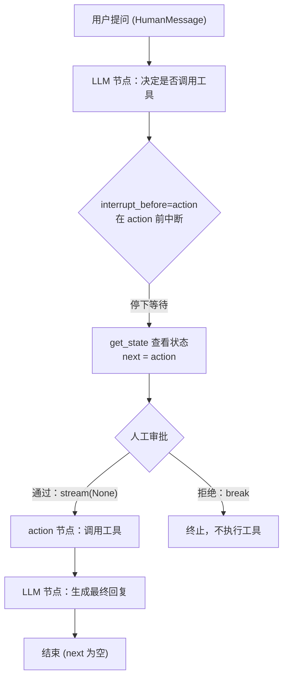
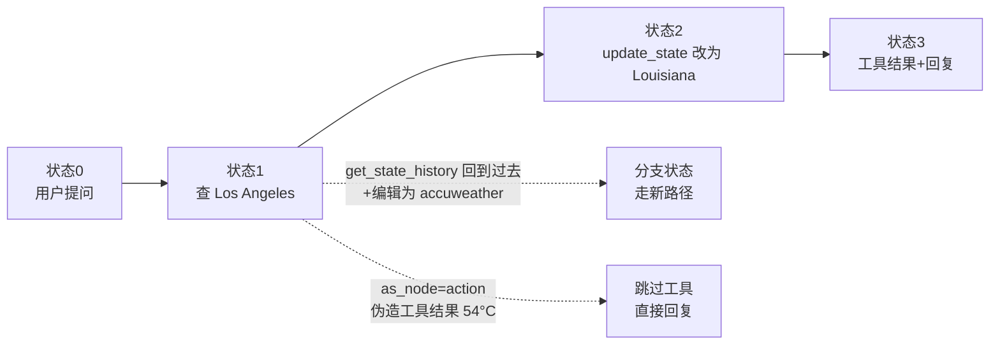

# 第29集：人类介入（Human in the Loop）与状态时间旅行

## 元信息
- 集数: 29
- 时间范围: 00:00:00,000 --> 00:14:42,800
- 核心主题: 在 LangGraph 智能体中加入"人类介入"机制，通过在节点执行前中断、查看/修改状态、时间旅行等手段控制智能体行为。
- 学习目标:
  1. 掌握用 `interrupt_before` 在调用工具（action 节点）前暂停智能体，实现人工审批。
  2. 学会用 `get_state` / `get_state_history` / `update_state` 查看、修改、回放智能体状态。
  3. 理解"状态快照 + 时间旅行"的原理，能回到历史状态、编辑分支、手动伪造工具结果。

## 第一性原理拆解
- 底层本质: 智能体本质上是"图（Graph）在不同节点之间流转，每一步都会产生一份状态快照并存入内存"。既然每一步都可被保存，那么执行流就可以被"暂停、检查、修改、回退、重放"，人类因此获得了对自动化流程的控制权。
- 核心逻辑: 有了 checkpointer（检查点存储）后，图的每次状态更新都会保存成带唯一标识的快照。只要能定位到某个快照，就能从那个点继续、修改后继续、或分叉出新路径。中断（interrupt）只是"在特定节点前主动停下等待人类"的一种应用。
- 推导过程:
  1. 智能体运行 = 状态在节点间流动 → 每个状态都被快照保存（thread + thread_ts 唯一标识）。
  2. 既然状态可被读取（`get_state`）→ 就能在工具执行前停下让人检查（`interrupt_before=["action"]`）。
  3. 既然状态可被写回（`update_state`）→ 就能修改智能体即将执行的动作（改工具参数）。
  4. 既然历史快照全部保留（`get_state_history`）→ 就能回到过去某个状态重放（时间旅行），甚至从过去分叉编辑。
  5. 既然可以按"某个节点身份"写入状态（`as_node`）→ 就能伪造工具返回结果，跳过真实工具调用。

## 核心知识点详解

- **人类介入（Human in the Loop）**: 让人类"盯着"智能体在做什么，在关键动作发生前介入审批或纠正。字幕原话：很多场景下你希望把人放进循环里，监督智能体的行为。

- **自定义 reducer（reduce_messages）**: 之前用 `operator.add` 把新消息追加到消息列表末尾。但人类介入时我们可能想"替换"已有消息，而不是一味追加。于是自定义一个 reduce 函数：如果新消息的 ID 与已有某条消息相同，就替换掉那一条；否则才追加。这样才能"修改"历史消息。

- **`interrupt_before`（节点前中断）**: 编译图时除了传入 checkpointer，再传 `interrupt_before=["action"]`。`action` 节点就是调用工具的地方。加了中断后，当 LLM 决定要调用工具时，图会在真正调用工具前停下，等待人工批准。字幕提到：也可以只在调用某个特定工具时才中断（文档另有说明）。

- **状态快照（snapshot）与 thread_ts**: 图执行时，每个状态都会被存入内存。快照里包含你定义的 agent state（消息列表等），还包含 `thread`（线程 ID）和 `thread_ts`（每个快照的唯一标识）。用 thread ID 能拿到"当前状态"，用 thread_ts 能精确定位到"某个历史状态"。

- **`get_state` / `next` 参数**: `get_state(thread)` 返回当前状态配置对象，其中最大的内容是消息列表；`next` 参数表示"下一个将要执行的节点"。中断停下时 `next` 会显示 `action`，说明马上要进 action 节点；执行完毕后 `next` 为空，表示无事可做。

- **用 None 恢复执行**: 中断后想继续，只需再次 `stream`，传入相同的 thread 配置、输入传 `None`，图就会从中断点继续，先返回工具消息（ToolMessage），再返回最终 AI 消息。

- **修改状态（update_state）纠正动作**: 保存 `current_values = graph.get_state(...)`，取到最后一条 AI 消息里的 `tool_calls`，改掉其中的查询参数（例如把"Los Angeles"改成"Louisiana"），再调用 `update_state`。因为工具调用的 ID 相同，reducer 会"替换"原消息，从而纠正智能体接下来的搜索。

- **时间旅行（Time Travel）**: 每次修改/更新都会创建"新状态"，历史状态全部保留成一个链表。用 `get_state_history` 拿到所有历史快照，选中过去某个快照的 config，`stream(None, config)` 就能从那个点重放执行。

- **从过去分叉编辑（branching）**: 回到过去某状态后再修改它（例如把搜索源改成 "accu weather"），`update_state` 会返回一个"分支状态（branch state）"，从这个分支继续 stream，就走出了一条与原始路径不同的新分支。

- **`as_node` 手动伪造工具结果**: 想不真正调用工具、直接给智能体喂一个假的工具结果时，追加一条新的 ToolMessage（带对应的 tool_call_id、工具名、伪造内容如 "54 degrees Celsius"）。因为是新消息会被追加。关键是 `update_state` 时要加 `as_node="action"`，表示"这次更新是以 action 节点的身份完成的"——这样图就认为工具已执行，不会再进 action 节点，而是直接调用模型返回 AI 回复。

## 实操步骤指南

以下代码依据字幕描述还原，变量名与 API 以字幕/截图为准，可能与你本地版本略有出入。

### 1. 自定义 reducer：支持替换同 ID 的消息
```python
from uuid import uuid4
from langchain_core.messages import AnyMessage

def reduce_messages(left: list[AnyMessage], right: list[AnyMessage]) -> list[AnyMessage]:
    # 给没有 ID 的新消息补一个 ID
    for message in right:
        if not message.id:
            message.id = str(uuid4())
    merged = left.copy()
    for message in right:
        for i, existing in enumerate(merged):
            # 找到同 ID 的就替换
            if existing.id == message.id:
                merged[i] = message
                break
        else:
            # 否则追加
            merged.append(message)
    return merged

class AgentState(TypedDict):
    messages: Annotated[list[AnyMessage], reduce_messages]
```

### 2. 编译图时加上"工具执行前中断"
```python
graph = builder.compile(
    checkpointer=checkpointer,
    interrupt_before=["action"],   # 在调用工具的 action 节点前中断
)
```

### 3. 运行到中断点，并查看当前状态
```python
messages = [HumanMessage(content="What is the weather in SF?")]
thread = {"configurable": {"thread_id": "1"}}

for event in abot.graph.stream({"messages": messages}, thread):
    for v in event.values():
        print(v)
# 停在 AI 消息（要求调用工具），因为 interrupt_before 拦住了 action 节点

abot.graph.get_state(thread)          # 查看当前状态
abot.graph.get_state(thread).next     # 输出 ('action',) 表示下一步要进 action 节点
```

### 4. 人工批准后继续（输入 None）
```python
for event in abot.graph.stream(None, thread):  # 传 None 表示从中断处继续
    for v in event.values():
        print(v)
# 依次得到 ToolMessage 与最终 AI 消息；action 到 LLM 之间没有再中断
```

### 5. 加一个"是否继续"的人工确认循环
```python
thread = {"configurable": {"thread_id": "2"}}  # 新线程，从头开始
for event in abot.graph.stream({"messages": messages}, thread):
    for v in event.values():
        print(v)

while abot.graph.get_state(thread).next:
    proceed = input("proceed? (y/n): ")   # 弹出输入框询问是否继续
    if proceed != "y":
        break
    for event in abot.graph.stream(None, thread):
        for v in event.values():
            print(v)
```

### 6. 修改状态以纠正智能体动作（改工具参数）
```python
current_values = abot.graph.get_state(thread)
last_message = current_values.values["messages"][-1]   # 最后一条 AI 消息
_id = last_message.tool_calls[0]["id"]                  # 取工具调用 ID

# 用相同 ID 覆盖，从而"替换"这次工具调用
last_message.tool_calls = [{
    "name": "tavily_search_results_json",
    "args": {"query": "current weather in Louisiana"},
    "id": _id,
}]

abot.graph.update_state(thread, {"messages": [last_message]})
abot.graph.get_state(thread)   # 确认 query 已变为 Louisiana
```

### 7. 时间旅行：回放历史状态
```python
states = []
for state in abot.graph.get_state_history(thread):
    states.append(state)

to_replay = states[-1]         # 列表最后一个是最早的状态（查 Los Angeles 那次）
for event in abot.graph.stream(None, to_replay.config):  # 从该历史点重放
    for k, v in event.items():
        print(v)
```

### 8. 回到过去并编辑，产生分支
```python
_id = to_replay.values["messages"][-1].tool_calls[0]["id"]
to_replay.values["messages"][-1].tool_calls = [{
    "name": "tavily_search_results_json",
    "args": {"query": "current weather in LA, accuweather"},
    "id": _id,
}]

branch_state = abot.graph.update_state(to_replay.config, to_replay.values)
for event in abot.graph.stream(None, branch_state):   # 走出新分支
    for k, v in event.items():
        if k != "__end__":
            print(v)
```

### 9. 手动伪造工具结果（as_node）
```python
_id = to_replay.values["messages"][-1].tool_calls[0]["id"]

state_update = {"messages": [ToolMessage(
    tool_call_id=_id,
    name="tavily_search_results_json",
    content="54 degree celsius",   # 伪造的工具返回
)]}

# as_node="action"：以 action 节点身份写入，图便认为工具已执行，不再进 action 节点
branch_and_add = abot.graph.update_state(
    to_replay.config, state_update, as_node="action"
)

for event in abot.graph.stream(None, branch_and_add):
    for k, v in event.items():
        print(v)
# 智能体不再调用工具，直接用伪造结果生成 AI 回复：54 度
```

## 配套可视化图（Mermaid）

### 图1：interrupt_before 人工审批流程（对应 00:01:30 - 00:03:38）


### 图2：时间旅行与状态分支（对应 00:08:57 - 00:13:33）


## 常见踩坑与避坑

1. **想"替换"消息却仍在"追加"**: 默认 `operator.add` 只会追加。要想修改历史消息，必须自定义 reducer 并让"相同 ID 的消息被替换"。修改 tool_calls 时务必沿用原来的 tool_call `id`，否则会变成新增而非覆盖。

2. **中断后忘记用 None 恢复**: `interrupt_before` 停下后，继续执行要 `stream(None, thread)`（输入传 None）。如果重新传入完整消息，会被当成新一轮输入，逻辑就乱了。

3. **伪造工具结果忘记加 as_node**: 手动追加 ToolMessage 时若不加 `as_node="action"`，图仍认为还没执行工具、会再次进入 action 节点，导致重复调用真实工具，伪造结果失效。字幕特别强调这一点。

## 课后练习

1. 把 `interrupt_before` 改到不同的节点（如 LLM 节点前，或同时中断多个节点），运行并观察 `get_state().next` 的变化，说明中断点位置如何影响审批时机。（对应字幕 00:04:24 建议自行尝试）

2. 用 `get_state_history` 取出某个历史状态，先修改其中的搜索查询词，用 `update_state` 生成分支状态并 `stream(None, ...)`；再另写一段用 `as_node="action"` 伪造一个工具返回结果。对比两种做法：一个是"改动作后真正执行工具"，一个是"跳过工具直接喂结果"，总结它们分别适合什么场景。
