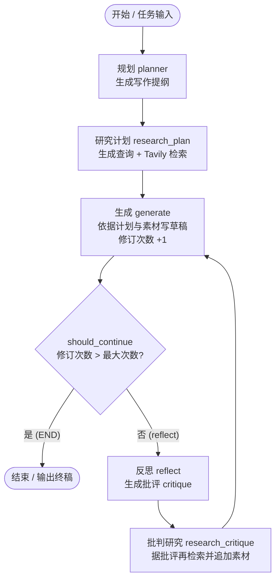
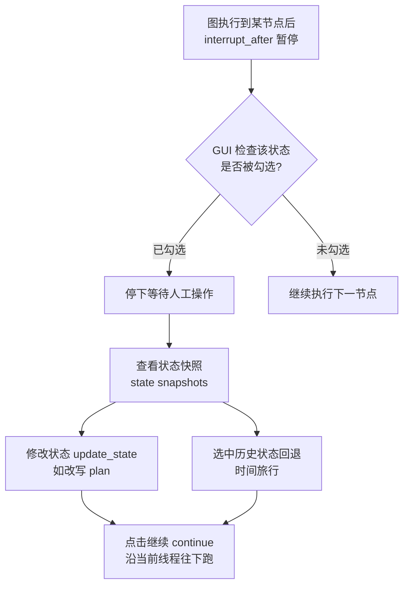

# 第30集：构建"作文写手"多智能体项目与人机协作（Essay Writer + Human in the Loop）

## 元信息
- 集数: 30
- 时间范围: 00:00:00 --> 00:18:08
- 核心主题: 用 LangGraph 搭建一个"规划-研究-写作-反思-再研究"循环的作文写手智能体，并通过图形界面（GUI）演示人机协作：中途暂停、查看/修改状态、时间回溯。
- 学习目标:
  1. 掌握用多个节点（规划/研究/生成/反思/批判研究）组合成一个更复杂、更有实用范围的智能体图。
  2. 理解如何用更丰富的 `AgentState` 记录任务、计划、草稿、批评、检索内容以及修订次数。
  3. 学会用 `interrupt_after`（每步后中断）+ `update_state`（更新状态）实现人机协作与状态时间旅行。

## 第一性原理拆解
- 底层本质: 复杂的写作任务本质上是"分解 + 循环迭代"。把"写一篇好文章"拆成若干可独立执行的小步骤（先谋篇、再取材、后成文、再挑刺、再补料），每一步都是一个节点，用图把它们连起来，就能让 LLM 分工完成人类作家的工作流程。
- 核心逻辑: LangGraph 用一个共享的状态字典（`AgentState`）在节点之间传递信息，用普通边（固定流程）和条件边（`should_continue` 判断是否继续修订）控制流转；用 `revision_number` 与 `max_revisions` 两个计数器作为循环的"刹车"，避免无限打磨。
- 推导过程:
  1. 一篇文章需要结构 → 先做 `plan`（规划节点只运行一次）。
  2. 有了结构还需要事实素材 → `research_plan` 节点让 LLM 根据任务生成查询语句，调用 Tavily 检索文档存入 `content`。
  3. 有素材就能成文 → `generate` 节点结合任务、计划、检索内容写出草稿 `draft`，并把 `revision_number` 加 1。
  4. 初稿往往不够好 → `reflect` 节点生成批评 `critique`。
  5. 批评指出了缺口 → `research_critique` 节点针对批评再生成查询、再检索、追加到 `content`，回到 `generate` 重写。
  6. 何时停止？→ 条件函数 `should_continue`：当 `revision_number > max_revisions` 就结束，否则进入 `reflect` 继续循环。

## 核心知识点详解

- **子任务分解（Sub-steps）**：整个作文写手被拆成 5 类节点 + 1 个条件判断——规划（plan）、研究计划（research_plan）、生成（generate）、反思（reflect）、批判研究（research_critique）、以及决定去留的 `should_continue`。这是把"大而模糊的目标"变成"小而明确的步骤"的典型做法。

- **更复杂的 AgentState（智能体状态）**：本集的状态比之前丰富很多，包含多个键：
  - `task`：人类输入，也就是要写的作文主题。
  - `plan`：规划智能体生成的写作提纲。
  - `draft`：作文草稿。
  - `critique`：批判智能体给出的评价意见。
  - `content`：Tavily 检索回来的文档列表（会不断累积）。
  - `revision_number`：已经修订了多少次。
  - `max_revisions`：最多允许修订多少次。
  后两个用于停止条件的判断。

- **面向不同角色的提示词（Prompts）**：每个节点配一段专用提示词——规划提示词（planning prompt）、写作提示词（writer prompt）、反思提示词（reflection prompt）、研究规划提示词（research plan prompt，把计划变成检索查询）、以及研究批判提示词（research critique prompt，把批评变成检索查询）。研究批判提示词与研究规划提示词作用相似，只是输入从"计划"换成了"批评"。

- **结构化输出 / 函数调用（Structured Output / Function Calling）**：为了确保 LLM 稳定返回"一个字符串列表"（即多条检索查询），课程定义了一个 Pydantic 模型 `Queries`（内含 `list[str]`），并用 `model.with_structured_output(Queries)` 强制模型按该结构返回。

- **直接使用 Tavily Client**：这里没有用封装好的工具（tool），而是直接导入 `TavilyClient`，因为使用方式比较"非常规"——需要循环遍历生成的多条查询，逐条检索并把结果追加进 `content`。

- **条件边与循环刹车（Conditional Edge）**：`should_continue` 在 `generate` 之后运行，比较 `revision_number` 与 `max_revisions`：超过上限返回 `END`（结束），否则返回 `reflect`（进入批评-再研究-再生成的循环）。

- **人机协作与中断（Human in the Loop / interrupt_after）**：编译图时对每个节点设置 `interrupt_after`，让图每执行完一个节点就暂停。GUI 端据此检查"该状态是否被勾选"，勾选则停下等人操作，取消勾选则一路跑到底。

- **状态查看、修改与时间旅行（Update State / State Snapshots / Time Travel）**：在暂停点可以查看当前内存里的状态快照（state snapshots，含 task、当前所在节点、各状态值）；可以点"修改（modify）"调用 `update_state` 改写计划（例如把"披萨店介绍"改成"果冻甜甜圈在披萨制作中的重要性"）；还能选中某个历史状态回退（把旧状态重新压回内存），然后从那里继续，实现"时间旅行"。

## 实操步骤指南

以下代码依据字幕描述还原，用于示意整体结构（非逐字复制原课件）。

### 1. 环境与检查点、状态定义
```python
from dotenv import load_dotenv
_ = load_dotenv()

from langgraph.graph import StateGraph, END
from typing import TypedDict, List
from langchain_core.messages import SystemMessage, HumanMessage
from langgraph.checkpoint.sqlite import SqliteSaver
from pydantic import BaseModel

# 内存中的 SQLite 检查点（checkpointer）
memory = SqliteSaver.from_conn_string(":memory:")

class AgentState(TypedDict):
    task: str            # 人类输入：作文主题
    plan: str            # 规划提纲
    draft: str           # 作文草稿
    critique: str        # 批评意见
    content: List[str]   # Tavily 检索到的文档
    revision_number: int # 已修订次数
    max_revisions: int   # 最大修订次数
```

### 2. 模型与结构化输出对象
```python
from langchain_openai import ChatOpenAI
model = ChatOpenAI(model="gpt-3.5-turbo", temperature=0)

# 强制模型返回一个字符串列表（多条检索查询）
class Queries(BaseModel):
    queries: List[str]

from tavily import TavilyClient
import os
tavily = TavilyClient(api_key=os.environ["TAVILY_API_KEY"])
```

### 3. 各节点（智能体）
```python
def plan_node(state: AgentState):
    messages = [
        SystemMessage(content=PLAN_PROMPT),
        HumanMessage(content=state['task']),
    ]
    response = model.invoke(messages)
    return {"plan": response.content}

def research_plan_node(state: AgentState):
    # 根据任务生成查询，并强制结构化输出
    queries = model.with_structured_output(Queries).invoke([
        SystemMessage(content=RESEARCH_PLAN_PROMPT),
        HumanMessage(content=state['task']),
    ])
    content = state.get('content', [])  # 已有内容，或空列表
    for q in queries.queries:
        response = tavily.search(query=q, max_results=2)
        for r in response['results']:
            content.append(r['content'])
    return {"content": content}

def generation_node(state: AgentState):
    content = "\n\n".join(state.get('content', []))
    user_message = HumanMessage(
        content=f"{state['task']}\n\nHere is my plan:\n\n{state['plan']}")
    messages = [
        SystemMessage(content=WRITER_PROMPT.format(content=content)),
        user_message,
    ]
    response = model.invoke(messages)
    return {
        "draft": response.content,
        "revision_number": state.get("revision_number", 1) + 1,
    }

def reflection_node(state: AgentState):
    messages = [
        SystemMessage(content=REFLECTION_PROMPT),
        HumanMessage(content=state['draft']),
    ]
    response = model.invoke(messages)
    return {"critique": response.content}

def research_critique_node(state: AgentState):
    queries = model.with_structured_output(Queries).invoke([
        SystemMessage(content=RESEARCH_CRITIQUE_PROMPT),
        HumanMessage(content=state['critique']),
    ])
    content = state.get('content', [])
    for q in queries.queries:
        response = tavily.search(query=q, max_results=2)
        for r in response['results']:
            content.append(r['content'])
    return {"content": content}

def should_continue(state):
    if state["revision_number"] > state["max_revisions"]:
        return END
    return "reflect"
```

### 4. 组装并编译图
```python
builder = StateGraph(AgentState)
builder.add_node("planner", plan_node)
builder.add_node("research_plan", research_plan_node)
builder.add_node("generate", generation_node)
builder.add_node("reflect", reflection_node)
builder.add_node("research_critique", research_critique_node)

builder.set_entry_point("planner")

# 生成之后：条件判断结束还是反思
builder.add_conditional_edges(
    "generate",
    should_continue,
    {END: END, "reflect": "reflect"},
)

# 基础固定边
builder.add_edge("planner", "research_plan")
builder.add_edge("research_plan", "generate")
builder.add_edge("reflect", "research_critique")
builder.add_edge("research_critique", "generate")

graph = builder.compile(checkpointer=memory)
```

### 5. 流式运行观察每一步
```python
thread = {"configurable": {"thread_id": "1"}}
for s in graph.stream({
    "task": "What is the difference between LangChain and LangSmith?",
    "max_revisions": 2,
    "revision_number": 1,
}, thread):
    print(s)
```
运行过程可见：先生成计划 → 研究检索到一批文档 → 写出第一稿（标题如"Unveiling the distinctions: LangChain vs LangSmith"）→ 反思批评（如"建议加深对优缺点的分析"）→ 基于批评再研究 → 生成第二稿。因为设置了 `max_revisions=2`，两稿后结束。

### 6. GUI 中的人机协作（概念说明）
- 编译时对每个节点设置 `interrupt_after`，让图每步后暂停；GUI 逻辑检查该状态是否勾选，勾选则停、取消则继续。
- 暂停时可看"状态快照（state snapshots）"，其中记录了 task、当前所在节点、各状态当前值。
- 点"修改（modify）"会触发 `update_state`，可改写计划（例如把介绍改成"讨论果冻甜甜圈在披萨制作中的重要性"）。
- 点"继续（continue）"会沿已开始的线程继续；也可选中某个历史状态回退后再继续，实现时间旅行。
- 更换主题（如"New England IPAs"）并点"生成"会开启新线程（thread），可在多个线程间切换查看。
- 完整前端逻辑在 `helper.py`（课程中称 GUI 逻辑）里，可作为自己项目的基础。

## 配套可视化图（Mermaid）

图1：作文写手的完整流程图（约 00:00:16 ~ 00:01:19 讲解，约 09:43 展示编译后的图）


图2：人机协作与状态时间旅行（约 12:23 ~ 16:20 讲解）


## 常见踩坑与避坑
- **忘记设置修订上限导致死循环**：`generate → reflect → research_critique → generate` 是一个环。必须在初始输入里给 `revision_number` 和 `max_revisions`，并让 `should_continue` 正确比较，否则会无限打磨。
- **查询输出不结构化导致后续崩溃**：如果不用 `with_structured_output(Queries)`（Pydantic 强约束），LLM 返回的查询格式可能不是干净的字符串列表，遍历检索时会出错。
- **content 被覆盖而不是累积**：研究节点应"读取已有 content → 追加新结果 → 返回"，若每次都用新列表覆盖，前几轮检索的素材会丢失。字幕强调了"append 到已有内容"。
- **人机协作时误解 interrupt 行为**：`interrupt_after` 是"每步之后"暂停；GUI 靠勾选决定停不停。若全部取消勾选，图会一路跑到底，不会给你插手的机会。

## 课后练习
1. 换不同的问题运行这个写手智能体（例如某个模型不了解的新概念），把 `max_revisions` 从 2 调到 3~4，观察多轮"批评-再研究-重写"后文章质量的变化，并对比修改各段提示词（plan / writer / reflection）带来的差异。
2. 在 GUI（或用 `update_state`）里做一次"时间旅行"：先跑到 `generate` 得到草稿，回退到 `planner` 状态，修改计划后重新从该点继续生成；观察不同线程（thread）在内存快照中的记录，说明 `update_state` 与 checkpointer 如何配合实现回退与分叉。
