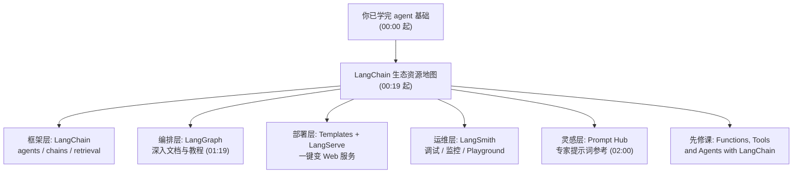

# 第31集：课程收尾与 LangChain 生态学习资源指引

## 元信息
- 集数: 31
- 时间范围: 00:00:00 --> 00:02:00
- 核心主题: 本课只覆盖了智能体的基础，本集集中指引 LangChain 生态的官方文档与延伸学习资源，帮你继续深入 agent 的进阶之路。
- 学习目标:
  - 认识 LangChain 生态的整体版图（核心包、社区包、合作伙伴包及各配套服务的分工）。
  - 知道遇到问题该去哪里查资料：官方文档、GitHub 仓库、LangSmith、Prompt Hub、往期课程。

## 第一性原理拆解
- 底层本质: 一门课程的时长有限，只能带你入门；真正的能力增长来自“会查、会用官方资料”。因此收尾课的价值不是新知识，而是给你一张可靠的“资源地图”。
- 核心逻辑: LangChain 生态被拆成分层的几块——**框架层**（LangChain 写逻辑）、**编排层**（LangGraph 控制智能体流程）、**部署层**（LangServe 变 Web 服务）、**运维层**（LangSmith 调试与监控）、**灵感层**（Prompt Hub 参考提示词）。理解这个分层，就知道每个需求去哪块找答案。
- 推导过程: 你已经学会“怎么搭一个 agent” → 下一步会遇到“怎么调试 / 怎么上线 / 怎么写好提示词 / 有没有现成模板” → 每个问题都对应生态里的一个模块或一份官方文档 → 于是老师把这些入口一次性列出来。

## 核心知识点详解

- **LangChain 官方文档（起点）**：提供整个生态的高层总览，把 **core 核心包** 和 **community 社区包** 分门别类讲清楚。例如课程里用到的 **Tavily**（搜索工具）属于 community 社区包，而 **langchain-openai** 是单独的 **partner 合作伙伴包**；此外还有大量其他集成可供探索。
- **LangChain（框架本身）**：偏“高层封装”，覆盖 agents（智能体）、各种 chains（链）和不同的 retrieval 检索策略。如果只想快速上手，这里是最好的入口。
- **Templates + LangServe（模板与部署）**：官方提供一批可以直接部署的**模板**；**LangServe** 是把你的 LangChain 应用一键变成 **Web 服务器（Web Server）** 的最简单方式。
- **LangSmith（贯穿全流程的助手）**：从开发第一步就能帮忙**调试（debugging）**，上线后还能做**生产环境监控（monitoring）**，并自带一个 **Playground 试验场**（课程前面演示过）。
- **GitHub 仓库**：**LangChain 仓库**里有大量 cookbook（实战食谱）和入门模板；**LangGraph 仓库**则有关于本课所有内容的深入文档、教程和 how-to 操作指南，是权威参考。
- **往期 DeepLearning.AI 课程**：老师强烈推荐先修课 **《Functions, Tools, and Agents with LangChain》**（函数、工具与智能体），它是学好本课的极佳前置铺垫。
- **Prompt Hub（提示词中心）**：一个获取灵感的好地方，可以看其他专家提示词工程师是怎么写 prompt 的（截图中可见 agent、summarization、QA 等各类现成模板）。

## 实操步骤指南

本集为纯总结/资源指引课，无代码演示。可按“遇到什么问题 → 去哪个资源”的思路查阅：

- 想搞清生态全貌、找某个集成 → 看 **LangChain 官方文档（python.langchain.com）**。
- 想快速搭原型、用现成模板 → 看 **Templates**，用 **LangServe** 部署成 Web 服务。
- 调试 / 上线监控 / 试提示词 → 用 **LangSmith**（含 Playground）。
- 要深入 LangGraph 细节、找教程 → 看 **LangGraph GitHub 仓库文档**。
- 需要提示词灵感 → 逛 **Prompt Hub（smith.langchain.com/hub）**。
- 打基础 → 先修《Functions, Tools, and Agents with LangChain》。

## 配套可视化图（Mermaid）

## 常见踩坑与避坑

- 踩坑：把 Tavily、OpenAI 等集成都当成“LangChain 自带”。避坑：记住生态是分包的——Tavily 属 **community 社区包**、langchain-openai 是 **partner 合作伙伴包**，安装和查文档时要按对应的包去找，不要混在一起。
- 踩坑：课程学完就停，遇到进阶问题无从下手。避坑：把本集列的“资源地图”收藏起来（官方文档 / LangGraph 仓库 / LangSmith / Prompt Hub），按需求分层去查，而不是死记单个 API。

## 课后练习

打开 LangChain 官方文档的生态总览页，找出你在本课项目中用到的每一个组件（如搜索工具、模型接入等），并标注它各自属于哪一类：**core 核心包 / community 社区包 / partner 合作伙伴包**。
