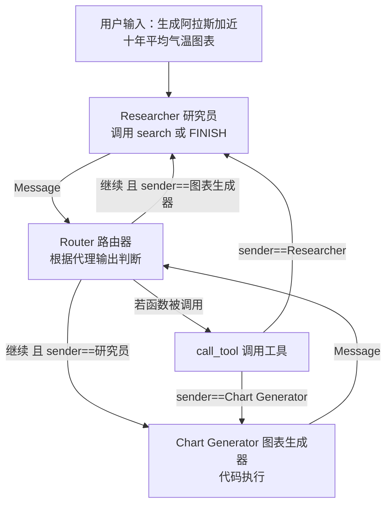
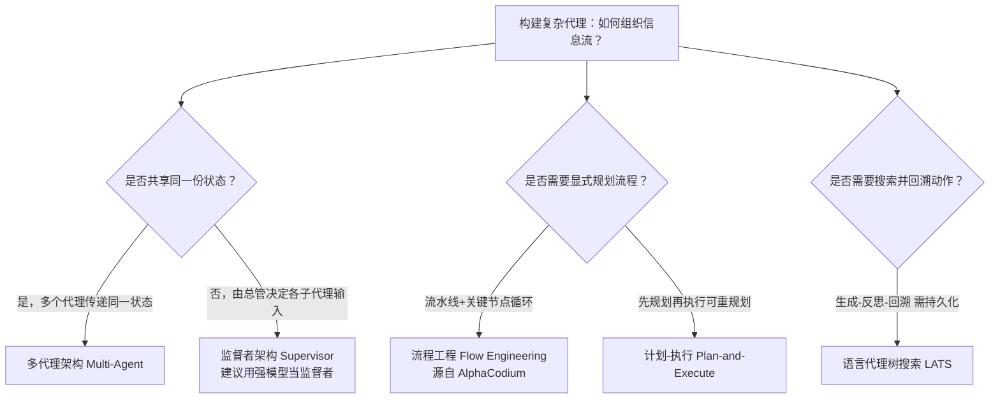

# 第32集：进阶代理架构综述与课程收尾

## 元信息
- 集数: 32
- 时间范围: 00:00:00 --> 00:04:44
- 核心主题: 课程收尾，快速纵览本课未能动手实现、但值得了解的几种复杂代理（Agent）架构，并说明 LangGraph 的核心优势——高度可控性。
- 学习目标:
  - 理解“多代理”“监督者代理”“流程工程”“计划-执行”“语言代理树搜索”这几种进阶架构的区别与适用场景。
  - 明白“共享状态”与“独立状态+监督者”这两种协作模式的本质差异。
  - 认识 LangGraph 为什么能通过“可控的环状/非环状流程”支撑这些复杂范式。

## 第一性原理拆解
- 底层本质: 一个代理系统的能力，取决于“信息如何在各个环节之间流动”（information flow）。所谓构建复杂代理，本质就是设计一张“信息流动的图”——谁先跑、跑完把什么交给谁、什么时候循环、什么时候回到用户。
- 核心逻辑: 单个代理 = 提示词 + 大语言模型（+可选的工具 + 可选的内部循环）。把多个这样的单元用不同的“连接方式”组合起来，就得到不同架构。区别的关键只有两点：(1) 大家是否共用同一份状态；(2) 是否存在一个“大脑”负责统筹调度。
- 推导过程:
  - 若多个代理传递同一份“共享状态”→ 多代理架构（Multi-Agent）。
  - 若引入一个“监督者”决定每个子代理的输入、子代理各自持有独立状态 → 监督者架构（Supervisor）。
  - 若进一步刻意设计“先规划、再执行、可复盘重规划”的流程 → 流程工程（Flow Engineering）/ 计划-执行（Plan-and-Execute）。
  - 若把“可能的动作”展开成一棵树并做搜索、反思、回溯 → 语言代理树搜索（Language Agent Tree Search），此时“状态持久化/回到过去”成为刚需。

## 核心知识点详解

- **多代理架构（Multi-Agent）**：多个不同的代理在“同一份共享状态”上工作，把状态从一个代理传给下一个代理。每个代理可以只是“提示词 + 模型”（就像本课的写作代理 Writer），也可以带上自己的工具，甚至内部还有自己的循环。判别特征就一句话——它们全都读写同一份共享状态。截图示例：用户输入“生成阿拉斯加过去十年平均气温的图表”，先到 Researcher（研究员，调用 search 或 FINISH），经 Router（路由器，根据代理输出判断）流转到 Chart Generator（图表生成器，负责代码执行），中间还有 call_tool 节点。

- **监督者架构（Supervisor）**：有一个“监督者”去调用若干“子代理”。与多代理最大的不同是：监督者会决定“喂给每个子代理的输入是什么”，而各个子代理本身就是一张独立的图、可以有各自内部的状态，因此没有“共享状态”这个概念。它强调“只有一个总管在负责路由与协调”。适用场景：当你可以用一个非常强大的模型来当监督者时最合适，因为“做规划、做调度”本身需要很强的智能。

- **流程工程（Flow Engineering）**：近期流行的术语，来自 AlphaCodium（字幕作 alpha-coding）论文，它靠一个“图状”方案拿到了当时最先进的编码表现。它整体像一条流水线（pipeline），但在几个关键节点上带有循环：初始代码方案上的循环、在公开测试（public tests）上迭代的循环、在 AI 生成测试（AI tests）上迭代的循环。它是为特定编码问题定制（bespoke）的架构，但“流程工程”这一理念更普适——就是去思考“对你的代理而言，怎样的信息流才能最好地支撑它去行动和思考”。

- **计划-执行（Plan-and-Execute）**：流程工程下的一种常见范式。先做一个显式的“规划”步骤（列出几个子代理应完成的步骤），然后开始执行：子代理去做一步、回来、可能更新计划也可能不更新（这里有不同变体），再做下一步……直到计划完成；随后检查计划是否成功达成，若不行就“重规划”（replan），一切正常则把结果返回给用户。

- **语言代理树搜索（Language Agent Tree Search, LATS）**：一篇很有意思的论文，它在“可能动作的状态”上做树搜索。流程为：先生成一个动作（Generate/Act）→ 反思（Reflect）打分 → 基于该动作往下生成子动作、再反思……在所有反思中，它能判断要跳回动作状态树中的哪个节点，从而“反向传播（back propagate）”更新父节点，让父节点携带更多信息以指导后续方向。截图给出循环步骤：1) 选择节点；2) 生成新候选；3) 行动、反思、打分；4) 反向传播（更新父节点），重复直到问题解决。对这种架构而言，**状态持久化（persistence）尤其重要**，因为你必须能“回到过去”、回退到之前的状态。

- **LangGraph 的定位**：以上都是构建更复杂“代理式流程”的新兴范式。LangGraph 的目标是“高度可控”，允许你自由创建“环状（cyclical）或非环状”的流程。这种可控程度正是它区别于其他框架的地方，也被认为是“打造真正能用的代理”的关键。

## 实操步骤指南
本集为概念综述，字幕中没有出现具体代码。以下用“伪流程”还原字幕描述的“计划-执行”思路（仅为示意，非字幕原文代码）：

```text
# 计划-执行（Plan-and-Execute）思路，来自字幕描述
1. 规划：由规划器产出若干步骤（steps）
2. 执行：子代理执行第一步 -> 返回结果
3. 判断：更新计划 or 不更新（不同变体）
4. 循环执行剩余步骤，直到计划完成
5. 校验：检查计划是否成功达成
   - 未达成 -> 重规划（replan），回到步骤 2
   - 已达成 -> 返回结果给用户
```

理解要点（纯概念）：
- 选架构先问两件事：是否需要“共享状态”？是否需要一个“监督者大脑”统筹？
- 需要回溯/搜索的任务（如 LATS），务必启用状态持久化，才能回到历史状态。

## 配套可视化图（Mermaid）

图1：多代理架构（对应截图 scene_001，时间点 00:18）——所有节点共享同一份状态。



图2：五种进阶架构的选择脉络（对应全集讲解，时间点 00:19-04:03）。



## 常见踩坑与避坑
- 混淆“多代理”与“监督者”：判别关键不是“有几个代理”，而是“是否共享同一份状态”。多代理=共享状态传递；监督者=各子代理独立状态、由监督者决定输入并统筹路由。
- 监督者用弱模型：字幕强调“规划/调度非常吃智能”，监督者建议使用强大的语言模型，否则协调质量会崩。
- 树搜索类架构忘记持久化：LATS 需要“回到过去的状态”，若不开启状态持久化就无法回溯与反向传播，架构会失效。

## 课后练习
1. 用一句话分别说明“多代理架构”与“监督者架构”的本质区别，并各举一个更适合它的任务场景。
2. 为什么“语言代理树搜索（LATS）”比“计划-执行”更依赖状态持久化？请从“回溯/反向传播”的角度解释。
